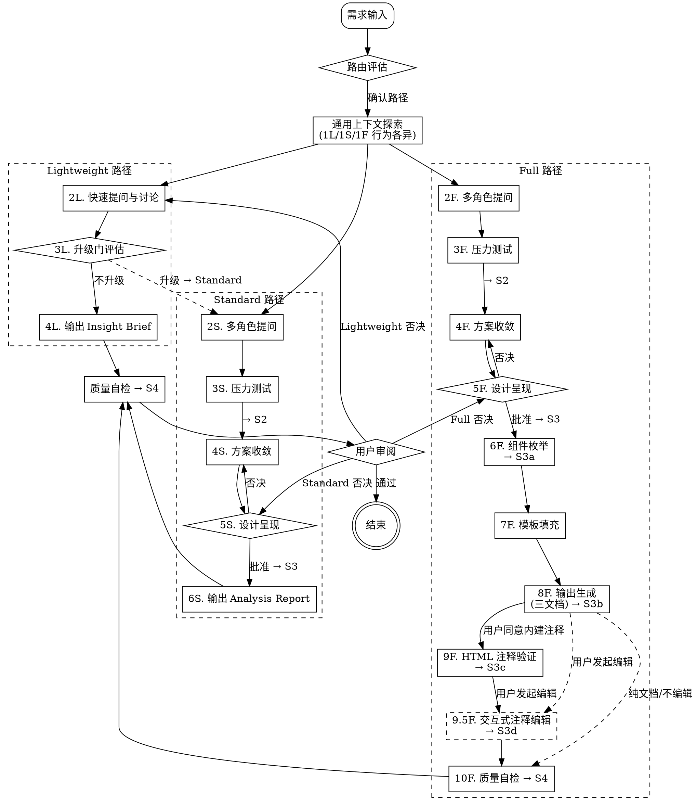

# Spec Analyze — 需求分析与带注释方案输出

将模糊的产品需求，通过多视角分析、压力测试、方案收敛，最终输出为**带研发注释**的 proposal / design / tasks 规范文档，让研发和 AI Agent 拿到文档即可开发。

<HARD-GATE>
在获得用户设计确认之前，不得调用任何实现 skill、编写代码或搭建项目。
</HARD-GATE>

---

## 闭环协议（v3.0 核心契约）

v3.0 起，spec-analyze 升级为**可恢复、有证据、有门禁**的闭环分析引擎（闭环：从摄入、定界、发现、综合到验证完成的完整状态机流程）。原有标注流程（Step 0 → 11F / A1-A5）作为 **Specify 轨道的领域实现** 运行在闭环之内；S1–S4 阶段门禁管标注产物质量，G1/G2/G3 闭环门禁管流程与证据。

### 操作契约

1. 先给出当前最好的结论或下一个决策。
2. 只问会实质改变路线或结果的信息；安全推进时给出标注假设（labeled assumptions）。
3. 始终区分：用户事实 / 已查验本地证据 / 外部事实 / 推理。
4. 完成门禁（G3）通过之前，绝不宣称完成。
5. 重复失败后换策略；同一方法最多重试两次。
6. 缺授权 / 来源矛盾 / 预算耗尽 / 不可消解不确定性 → 诚实停止，给出精确解除条件。
7. 重大建议不得被先前讨论锚定；从当前目标重建标准与备选（反锚定检查）。
8. 分析/Spec 批准不等于执行授权；实施或外部副作用属下游宿主流程。
9. 检测并应用项目 Constitution（若有），离开 Intake 前完成评估。

### 输出语言（强制）

- 默认全部输出为**中文**；除非用户明确要求其他语言。
- 机器契约保留英文：命令名、CLI 参数、JSON 键、状态名、Gate ID、文件名。

### 路由

- **Explore（探索）** / **Analyze（分析）** / **Specify（规格化）**——spec-analyze 的主路径是 Specify：输出带三层研发注释的 proposal / design / tasks 三文档。
- 低杠杆任务（快速问答、简单澄清）直接回答，不强制初始化 run。
- 复杂、高杠杆、多因素、需可恢复的任务：进入闭环状态机。

### 闭环状态机（复杂/高杠杆任务）

```bash
node <skill-dir>/scripts/run-state.cjs init --root . --track specify --goal "<goal>"
```

状态：`intake → scoped → discovering → synthesizing → verifying → repairing → completed | stopped | blocked`

核心命令：`transition` / `gate` / `evidence` / `checkpoint` / `validate` / `budget` / `recall`（完整协议见 `references/closed-loop.md`）。

### 门禁

- 闭环门禁：**G1 目标契约 / G2 证据-综合 / G3 完成**，及条件门禁 G-Decompose、G-Explore、G-Architecture、G-Spec、G-Section、G-Human（见 `references/gates.md`）。
- 标注流程门禁：**S1–S4**（见下文「质量门禁与 Definition of Done」）。
- G* 管流程与证据，S* 管产物质量；两者作用域不同，均需记录。

### 证据协议

- `evidence.jsonl` 追加式记录，每条含 kind / source / claim / confidence / status；入库前运行 `--auto-detect` 检查矛盾。

### 检查点与恢复

- `transition` 后自动同步 checkpoint；恢复从最近已验证检查点开始，**不重新 init**（见 `references/closed-loop.md`）。

### 交接（Handoff）

- Specify 完成后可导出版本绑定交接包（`export-handoff.cjs` / `verify-handoff.cjs`），包不构成执行授权；下游 Plan → Execute → Verify 由 workflow 控制器编排（`references/handoff-format.md`、`references/workflow-orchestration.md`）。

### 与标注流程的衔接

- **何时进入闭环**：Full 路径与复杂 Standard 任务在 Step 0 前执行 `run-state.cjs init`（`--track specify`）；Lightweight 快速问答直接回答，不强制。
- **S1–S4 记录**：每个标注阶段门禁的通过/跳过情况，建议用 `evidence`（`--kind validation`）或 `check` 记录到 run 状态，便于恢复与追溯；不强制，但记录增强可审计性。
- **产出与交接**：三文档（proposal/design/tasks）生成后，如用户要求实施交接，按「交接（Handoff）」小节导出版本绑定交接包。
- **恢复**：会话中断后，先查 `.analyze/runs/` 与 checkpoint，从最近已验证检查点恢复，不要重新 init。

### 参考地图（v3.0 新增）

| 需求 | 阅读 |
|---|---|
| 路由、风险、反锚定 | `references/router.md` |
| 状态机、恢复、停止 | `references/closed-loop.md` |
| 门禁标准与降级输出 | `references/gates.md` |
| 语义验证 | `references/verification-rubric.md` |
| 结构化失败恢复 | `references/failure-handling.md` |
| 输出模板（分析/决策/降级） | `references/output-templates.md` |
| 标注输出模板（三文档） | `references/annotation-output-templates.md` |
| Spec 模板 | `references/spec-templates.md`、`references/spec-document-reviewer-prompt.md` |
| 下游实施交接 | `references/handoff-format.md` |
| 编写/执行实施计划 | `references/writing-plans.md`、`references/executing-plans.md` |
| 完成前验证 | `references/verification-before-completion.md` |
| 系统化调试 | `references/systematic-debugging.md` |
| 测试驱动开发 | `references/test-driven-development.md` |
| 代码评审 | `references/requesting-code-review.md`、`references/receiving-code-review.md` |
| 角色矩阵 | `references/role-matrix.md` |
| 框架选择 | `references/frameworks-index.md` |
| 外部事实 | `references/web-research-guide.md` |
| 中文技术写作规范（术语/排版/状态词/界面文案） | `references/chinese-writing-style.md` |
| 操作文档与故障排查受控写作 | `references/controlled-operations-writing.md` |
| 注释显示模型与约束示例 | `references/annotation-example.md` |
| 高级能力索引（实验性命令） | `references/advanced-capabilities.md` |
| 术语对照表 | `references/glossary.md` |
| 评估 | `references/evaluation-guide.md` |

---

## Session State

本 skill 在每次 session 中维护以下状态，每完成一个步骤更新一次：

```yaml
spec_analyze_state:
  current_path: null              # lightweight | standard | full
  current_step: null              # 当前步骤名称
  annotation_view: review         # review（评审视图，默认）| implementation（实施视图）
  confirmed_findings: []          # 已确认的分析发现
  unconfirmed_assumptions: []     # 待确认的假设
  risk_level: low                 # low | medium | high
  knowledge_loaded: false         # 是否已加载 knowledge/
  personas_activated: []          # 已激活的角色
  output_generated: false         # 是否已生成输出
  level_labels:                    # 注释等级标签映射（可配置）
    L1: "基础"                     # 缺省：基础
    L2: "详细"                     # 缺省：详细
    L3: "完整"                     # 缺省：完整
  gate_status:                    # 门禁通过状态
    S1: pending                   # pending | passed | blocked
    S2: pending
    S3: pending
    S3a: pending
    S3b: pending
    S3c: pending
    S3d: pending
    S4: pending
  interactive_annotation:         # 交互式注释编辑状态
    mode: null                     # inline | standalone
    document_path: null            # 当前操作的目标文档路径
    component_manifest: []         # 从文档解析的组件清单
    edit_history: []               # 本次编辑操作记录（用于 undo）
  interrupt_recovery:             # 中断恢复信息
    last_step: null
    progress_summary: null
  smart_analysis:                 # 智能节点分析状态
    user_intent: null             # new_input / feedback / question / reject / approve
    content_maturity: null        # M0 / M1 / M2 / M3
    anomaly_flags: []             # repeated_edit / consecutive_reject / stale_node / scope_creep
    node_stay_count: 0            # 当前节点停留轮数
    recommended_action: null      # 推荐动作
```

**状态更新规则：**
- 每完成一个步骤 → 更新 `current_step` 和相关字段
- 门禁检查通过 → 更新对应 `gate_status`
- 每 5 轮或模式切换时 → 输出 Stage Summary（conversation only）

**状态持久化（默认 conversation-based）：**
- 同 session 内直接使用 conversation state 恢复
- 用户要求"下次继续"时 → 保存到 `docs/spec-analyze/.session-state.json`（ask before write）
- 新 session + 有持久化文件 → 询问是否恢复
- 新 session + 无持久化文件 → 正常开始

**状态展示格式：**
```
[spec-analyze] Full · 5F 设计呈现 | S3: pending | 成熟度: M3 | 已完成: 2F→3F→4F | 下一步: 逐节呈现
```

**状态栏输出规则：**
- **状态变化时**：输出完整状态栏
- **同状态重复轮次**：输出简写 `[同节点，第 N 轮]`
- **异常触发时**：追加异常标记 `⚠️ @StatsRow 修改 3 次，建议锁定范围`
- **每 5 轮或模式切换时**：输出 Stage Summary

---

## 输入分流

用户请求进入后，先判断请求类型，不同类型走不同路径：

```
用户请求
  → 输入分流 — 判断请求类型：

  需求分析 ─── 完整分析流程（三路径路由）
  原型注释 ─── 直接进入 Full 路径的注释阶段（S2+）
  方案评审 ─── 评审路径（Review Gate）
  竞品调研 ─── 调研路径（Research 子流程）
  快速问答 ─── 直接回答，不进入分析流程
```

### 需求分析

用户提出新需求、功能变更、产品方案。走完整的三路径路由（Step 0）。

### 原型注释

用户有原型/线稿/Figma 设计稿，需要添加交互注释。这是 spec-analyze 的核心场景：

- **跳过** Step 0 路由评估 → 直接进入 Full 路径的 S2（组件枚举与注释）
- 如果已有 proposal.md → 直接进入 S3b（注释填充）
- 如果已有 design.md → 直接进入 Step 9.5F（交互式注释编辑）
- 输出：带 Annotation Block 的 design.md + 可选 HTML 注释面板

### 已有方案注释

用户已有方案文档（proposal.md / design.md / PRD HTML），需要在此方案基础上添加或补充交互注释：

- **不重新分析需求**，直接基于已有方案提取组件
- 识别方案中已有的组件描述，映射到类型模板
- 对无注释的组件添加注释，对已有注释的组件补充完善
- 输出：补充了注释的 design.md + 可选 HTML 注释面板
- 详见下方「Step A1-A5: 已有方案注释流程」章节

### 方案评审

用户已有方案文档，需要评审：

- 走 Review Gate 子流程（检查完整性、一致性、可行性）
- 输出：评审报告 + 修改建议
- 不生成新文档，只标注需要修改的部分

### 竞品调研

用户需要分析竞品或市场：

- 走 Research 子流程（信息收集、对比分析、洞察提炼）
- 输出：Research Report
- 不使用注释框架，使用分析框架

### 快速问答

用户问一个简单问题（如"这个组件叫什么类型""L2 注释包含什么"）：

- 直接回答，不进入任何分析流程
- 如果问题扩展为完整需求 → 重新路由到需求分析

### 分流规则

| 输入信号 | 分流目标 | 优先级 |
|---------|---------|-------|
| 含"原型""线稿""Figma""设计稿""注释" | 原型注释 | 最高 |
| 含"已有方案""已有文档""补充注释""加注释""标注" | 已有方案注释 | 最高 |
| 含"评审""review""检查一下这个方案" | 方案评审 | 高 |
| 含"竞品""市场""调研""对比" | 竞品调研 | 高 |
| 一句话问题、简单询问 | 快速问答 | 中 |
| 其他 | 需求分析 | 默认 |

## Step 0: 智能路由

在提问前先做两维评估：

| 维度 | 取值 |
|------|------|
| 复杂度 | Lightweight / Standard / Full |
| 预期产出 | Insight Brief / Analysis Report / 带注释的方案文档 |

每次路由确认时必须使用路径对应的消息模板，声明产出物和注释覆盖范围：

**Lightweight 路径：**
> "评估为 Lightweight 复杂度，产出 **Insight Brief**（不含交互注释）。
> 如果需求最终需要交付研发，后续会评估是否升级到 Standard 路径。可以吗？"

**Standard 路径：**
> "评估为 Standard 复杂度，产出 **Analysis Report + proposal.md**，含 Data / Interaction / UI Text 三列注释。可以吗？"

**Full 路径：**
> "评估为 Full 复杂度，产出 **proposal.md + design.md + tasks.md** 三文档，含逐组件 Annotation Block（L1-L3 类型化模板）。可以吗？"

### 三条路径

| 路径 | 流程 | 产出 | 注释覆盖 |
|------|------|------|:--------:|
| **Lightweight** | 轻量扫描 → 快速提问 → 升级门评估 → 输出 | Insight Brief | 无 |
| **Standard** | 完整探索 → 2-3 角色 → 压力测试 → 收敛 → 呈现 → 输出 | Analysis Report | proposal 三列注释 |
| **Full** | 完整探索 → 5 角色 → 压力测试 → 收敛 → 呈现 → 枚举 → 填充 → 输出 → 验证 → 交互编辑 | proposal + design + tasks | proposal 三列 + design Annotation Block + (经用户决策) HTML 注释面板 |

---

## Step 0.5: 智能节点分析（全程生效）

在每轮用户输入后执行三层分析，持续维护当前节点状态。

### Layer 1: 意图识别

| 用户输入信号 | 意图类型 | 自动行为 |
|-------------|---------|---------|
| 含"重做""不行""不对""推翻" | reject | 标记为否决，回到上一级步骤 |
| 含"通过""可以""没问题""继续" | approve | 标记为批准，推进到下一步 |
| 含"加一个""新增""补充" + 组件名 | new_input | 标记为新需求，建议回到发散阶段 |
| 含"这个组件""第X点""这里" + 反馈内容 | feedback | 继续当前步骤，应用到当前节点 |
| 其他/不确定 | question | 提问确认后停留在当前节点 |

**置信度分级：**
- **高置信度**（匹配明确关键词）→ 自动执行
- **中置信度**（有线索但不确定）→ 提问确认
- **低置信度**（无匹配）→ 不触发智能分析，走正常流程

### Layer 2: 内容成熟度分析

| 等级 | 特征 | 处理方式 |
|------|------|---------|
| **M0 碎片想法** | 一句话需求、模糊描述、无边界 | 引导梳理，不建议进入方案 |
| **M1 方向种子** | 有明确目标但无细节、无约束 | 建议发散框架，探索可能性 |
| **M2 多个想法** | 有 2-3 个方向、有简单对比 | 建议收敛，方案对比 |
| **M3 半成型** | 有明确 scope、约束、优先级 | 可进入 Spec 或输出阶段 |

**判断依据：** 检查用户输入是否包含 scope 边界、排期、优先级、约束条件——≥2 项为 M3，1 项为 M2，仅有目标为 M1，仅有情绪/碎片为 M0。

### Layer 3: 异常检测

| 条件 | 触发 | 行为 |
|------|------|------|
| 同一组件反复修改 ≥ 3 次 | anomaly_flags += repeated_edit | 状态栏追加 ⚠️ "检测到该组件需求不稳定，建议先锁定范围" |
| 连续否决 ≥ 2 次 | anomaly_flags += consecutive_reject | 输出 "连续否决，建议暂停评估路径选择" |
| 当前节点停留 ≥ 5 轮 | anomaly_flags += stale_node | 输出 "当前节点已停留 N 轮，需要调整方向吗？" |
| 输入超出 scope | anomaly_flags += scope_creep | 输出 "此内容不在当前 scope 内，需要扩展 scope 吗？" |

---

## 通用上下文探索（Step 1 — 行为因路径而异）

**入口：** 路由确认后执行。

**Step 1 行为因路径而异：**

| 行为 | Lightweight (1L) | Standard (1S) | Full (1F) |
|------|:----------------:|:-------------:|:---------:|
| 项目文件/文档查阅 | 仅表层（README/文件名级） | 完整查阅 | 完整查阅 |
| knowledge/ 检测与加载 | **跳过**（不加载） | 检测 → 列出 → 询问加载 | 检测 → 列出 → 询问加载 |
| Web research 提议 | **不提议** | 按条件提议 | 按条件提议 |
| 视觉伴侣邀请 | **不邀请** | 按条件邀请 | 按条件邀请 |

### knowledge/ 检测与加载（仅 Standard/Full 路径）

在 Step 1 中完成 knowledge/ 目录的检测与加载（同 session 仅 1 次）：

- **目录不存在** → 静默跳过，不输出任何提示
- **目录存在但为空** → 静默跳过
- **目录存在且包含 `.md` 文件** → 列出文件名和行数，然后询问：
  > "检测到 `knowledge/` 目录包含：X.md（N行）。当前需求是否需要加载这些知识作为分析上下文？"
  - 用户同意 → 加载所有 `.md` 文件内容，输出声明：
    > "[knowledge] 已加载 X.md（N行），后续分析将引用该领域上下文。"
  - 用户拒绝 → 跳过，当前 session 不再重复询问

### 上下文探索通用规则

- 先查阅项目状态（文件、文档、最近提交）
- 如果需求涉及多个独立子系统 → 立即标记，拆分为子项目
- 每个消息只问一个问题，优先选择题

**→ Standard/Full 路径检查 S1 门禁**

---

## 三路径流程

路径确认后，按以下流程执行。**Step 1 已在通用上下文探索中执行。**

### Lightweight 路径

| 步骤 | 名称 | 行为 | 门禁 |
|------|------|------|------|
| 0 | 路由确认 | 用户确认 Lightweight 路径 | — |
| 1L | 轻量上下文扫描 | 仅扫描项目表层（README/文件名级）；不加载 knowledge/；不提议 web research；不邀请视觉伴侣 | — |
| 2L | 快速提问与讨论 | 自由提问，不激活角色视角 | — |
| **3L** | **升级门评估** | 评估 4 条件（见升级门章节），监控始于 Step 1L，在 Step 3L 统一评估 | — |
| 4L | 输出 Insight Brief | 输出核心洞察简报（conversation only，不写文件） | S4 |
| — | 用户审阅 | 用户确认 → 结束；用户否决 → 回到 2L | — |

### Standard 路径

| 步骤 | 名称 | 行为 | 门禁 |
|------|------|------|------|
| 0 | 路由确认 | 用户确认 Standard 路径 | — |
| 1S | 完整上下文探索 | 项目文件/文档查阅 + knowledge/ 加载 + web research + 视觉伴侣 | S1 |
| 2S | 多角色提问 | 激活 2-3 最相关的角色视角（见 `references/personas.md`），每个角色至少 1-2 个问题 | — |
| 3S | 多框架发散 | 按意图选择发散框架，做多维度 what-if 探测（见 `references/divergence-frameworks.md`） | — |
| 4S | 方案收敛 | 2-3 方案对比 + 决策记录（见 `references/decision-log-format.md`）+ 范围锁定 | S2 |
| 5S | 设计呈现 | 分节呈现，逐节获取批准 → **批准 → 继续；否决 → 回到 4S** | S3 |
| 6S | 输出 Analysis Report | 输出 Analysis Report + proposal.md 到 `docs/spec-analyze/reports/` | S4 |
| — | 用户审阅 | 用户确认 → 结束；用户否决 → 回到 5S | — |

### Full 路径

| 步骤 | 名称 | 行为 | 门禁 |
|------|------|------|------|
| 0 | 路由确认 | 用户确认 Full 路径 | — |
| 1F | 完整上下文探索 | 项目文件/文档查阅 + knowledge/ 加载 + web research + 视觉伴侣 | S1 |
| 2F | 多角色提问 | 入口执行 Layer 1 意图分析 → 匹配当前节点；激活全部 5 角色（见 `references/personas.md`），Risk Challenger 全程参与 | — |
| 3F | 多框架发散 | 按意图选择发散框架 + 组合，做多层次 what-if 探测（见 `references/divergence-frameworks.md`） | — |
| 4F | 方案收敛 | 2-3 方案对比 + 决策记录（见 `references/decision-log-format.md`）+ 范围锁定 | S2 |
| 5F | 设计呈现 | 入口执行 Layer 1 意图分析 + Layer 2 成熟度评估 → 分节呈现，逐节获取批准 → **批准 → 继续；否决 → 回到 4F** | S3 |
| 6F | 组件枚举 | 列出页面所有交互组件 → 映射 T1-T11 → 声明嵌套关系 → **标识字段级注释需求（统计字段定义/表格列格式/表单校验）** | S3a |
| 7F | 类型模板填充 | 按类型模板逐组件填充注释 → **为每个字段补充字段级注释（统计字段: Definition + Permission / 表格列: Format + Source / 表单字段: Validation + Options）** | S3a |
| 8F | 输出生成 | 入口执行展示模式决策（内联/侧边/双模式）；生成 proposal + design + tasks 三文档（见 `references/annotation-output-templates.md`）；注释默认**评审视图**（中文角色标签，隐藏实施细节，见 `references/annotation-example.md`）；中文文案遵循 `references/chinese-writing-style.md`（术语一致/直角引号/API 状态词语义准确/事实保真）；design.md 末尾需包含 Component Manifest（§8）；组件≥3 时询问是否内建 HTML 注释 | S3b |
| 9F | HTML 注释验证 | 按 `references/html-annotation-system.md` 验证注释正确内建 + back-propagation（仅当用户同意内建时） | S3c |
| 9.5F | 交互式注释编辑 | 用户指定组件和字段目标，AI 按模板规则执行编辑 → 跨文档同步 → 输出 diff 摘要。详见下方「Step 9.5F: 交互式注释编辑」章节 | S3d |
| 10F | 质量自检 | 运行质量自检清单（见 `references/quality-checklists.md`） | S4 |
| 11F | 逐组件交互式注释编辑 | 用户选择组件 → AI 引导需求阐述 → 自动映射类型 → 逐字段填充注释 → 实时验证 → 同步到设计文档。详见下方「Step 11F: 逐组件交互式注释编辑」章节 | S3d |
| — | 用户审阅 | 用户确认 → 结束；用户否决 → 回到 5F | — |

---

## Step 9.5F: 交互式注释编辑

在 Step 9F（HTML 注释验证 + back-propagation）完成后，用户可以对产出文档中的任意组件注释进行定向编辑。也支持作为独立模式调用（用户拿到已产出的文档后要求补充注释）。

### 模式入口

| 模式 | 触发条件 | 初始状态 |
|------|---------|---------|
| **流程内（inline）** | Step 9F 完成后，用户发起注释编辑请求 | 已有完整 session 上下文，文档路径已知 |
| **独立（standalone）** | 用户在无 session 上下文的场景下要求编辑已有文档的注释 | 需要先发现文档 |

### 9.5F-P1: 文档发现（仅独立模式）

```
用户发起独立调用
  │
  ├─ ① 当前项目扫描 ──────────────────
  │   扫描 docs/spec-analyze/specs/ 下所有 R0XX-* 目录
  │   读取每个 design.md 头部信息（标题、日期）
  │   → 找到 0 个 → 提示用户提供路径
  │   → 找到 1 个 → 自动选中
  │   → 找到 ≥2 个 → 按修改时间排序，展示列表让用户选
  │
  └─ ② 确认 → 进入 P2
```

"当前项目"判定：流程内调用使用 session 上下文；独立调用使用当前 working directory；不在项目目录时询问用户路径。

### 9.5F-P2: 组件定位

```
读取 design.md 的 Component Manifest（§8）
  │
  ├─ Manifest 存在 → 直接匹配
  │   ├─ 匹配唯一 → 确认后进入 P3
  │   ├─ 匹配多个 → 列出候选 + 位置上下文 → 用户选择
  │   └─ 匹配不到 → ③
  │
  ├─ Manifest 不存在 → fallback 按 @ComponentName 正则匹配
  │   （同上三种结果）
  │
  └─ ③ 匹配不到 → "未找到组件「xxx」，是否新增？"
        ├─ 是 → 进入 9.5F-Add 新增子流程
        └─ 否 → 返回
```

### 9.5F-P3: 操作解析与执行

**入口声明：** 进入 P3 时，AI 输出 scope 边界声明：

> "已定位到组件「@ComponentName」（T{N}-{Type}，L{level}）。
>
> **支持的操作：** 追加 / 修改 / 删除注释字段；新增或删除组件；批处理。
> **不支持的操作：** 修改需求优先级、scope、F00X 条目；修改非注释内容（架构、数据模型、接口设计）；修改 HTML 原型布局。这些请走正常审阅迭代。
>
> 当前可用字段：[列出组件类型模板定义的字段]
>
> 请指定要编辑的字段和内容。"

#### 字段目标引导

当用户未提供字段目标时，AI 按组件类型提示可用字段：

> "当前可编辑字段：
> - **trigger**：[当前值摘要]
> - **behavior**：[当前值摘要]
> - **dismiss**：[当前值摘要]
> - **style**：[当前值摘要]
> - **state**：[当前值摘要]
> - **+新增字段**
>
> 请指定要修改的字段和内容。例如：
> > "在 behavior 追加：确认后发送 POST /api/batch/delete""

#### 操作类型

| 操作 | 行为 | 示例 |
|------|------|------|
| **追加字段** | 在现有字段末尾追加内容 | "在 behavior 追加：确认后 10s 内可撤回" |
| **修改字段** | 替换现有字段全文 | "把 style 改成：弹窗宽度 480px，圆角 8px" |
| **删除字段** | 移除字段；必填字段不可删（trigger/behavior） | "把 style 删掉" |
| **删除状态** | 从 states 列表移除指定条目；不能低于类型最低状态数 | "去掉 loading 状态" |
| **新增组件** | 走 9.5F-Add 子流程 | "新增一个「撤回确认」弹窗" |
| **删除组件** | 移除 Annotation Block + Manifest + HTML 对应内容 | "把 C03 删掉" |
| **批处理** | 按类型/关键词/ID 列表匹配多个组件，执行同一操作 | "给所有弹窗加 ESC 关闭" |
| **撤回** | 单级 undo，恢复上一次操作前的状态 | "撤回刚才的修改" |

#### 编辑执行流程

```
用户指令 → 解析(组件 + 字段 + 操作 + 内容)
         → 校验(字段是否存在于该类型模板、必填字段保护)
         → 备份原值到 edit_history（用于 undo）
         → 执行编辑（追加/修改/删除/新增）
         → 更新 design.md Annotation Block
         → 更新 proposal.md 对应三列注释（如有对应 F00X）
         → 更新 HTML ANNOTATIONS 对象（如有 HTML 原型）
         → 输出变更摘要（diff 格式）
```

#### 批处理执行流程

```
用户指令 → 匹配组件（按类型/关键词/ID列表）
         → 展示匹配结果让用户确认
         → 逐个备份 → 逐个执行
         → 输出变更摘要
```

**约束：** 批处理只支持同字段的追加/修改；不支持批量新增组件。

#### Undo 流程

```
用户发起撤回
  ├─ 检查 edit_history 是否为空 → 空则提示无可撤回操作
  ├─ 读取最近一条操作记录，展示给用户确认
  ├─ 用户确认 → 遍历 affected_docs，逐个恢复备份
  │   ├─ append → 从备份恢复原文（删除追加内容）
  │   ├─ modify → 用备份原文覆盖
  │   ├─ delete → 用备份原文恢复
  │   └─ add_component → 从 Manifest 移除 + 删除 Annotation Block + 清理 HTML
  ├─ 从 edit_history 移除该记录
  └─ 输出"已撤回：xxx"
```

**约束：** 单级 undo（不保留 redo 栈）；撤回后执行新操作则覆盖旧历史；跨 session 不可撤回。

### 9.5F-Add: 新增组件子流程

当用户要求新增一个组件时，走轻量版 6F→8F 流程：

```
9.5F-Add.1 类型映射 ── 用户确认新组件的类型映射
9.5F-Add.2 模板填充 ── 按类型模板逐字段填充
9.5F-Add.3 插入定位 ── 确定在 design.md 中的插入位置
9.5F-Add.4 写入文档 ── 插入 Annotation Block + 更新 Manifest
9.5F-Add.5 同步     ── 同步 proposal + HTML（如有）
9.5F-Add.6 验证     ── 确认位置、Manifest、HTML trigger
```

### 9.5F-P4: 变更摘要输出

每次编辑完成后输出 diff 格式的变更摘要：

```
━━━ 变更摘要 ━━━━━━━━━━━━━━━━━━━━━━━━━━━━━━━━━

📄 design.md §5.2 @BatchConfirmModal (T5 · L2)

  [behavior] 追加 1 行:
    + 确认后 10s 内可撤回（显示撤回按钮）

📄 proposal.md F003: 批量删除流量主

  [Interaction Annotation] 追加:
    + L2: 确认后 10s 内可撤回

📄 HTML index.html

  [ANNOTATIONS.batch.blocks] behavior 追加 1 行

━━━━━━━━━━━━━━━━━━━━━━━━━━━━━━━━━━━━━━━
```

| 变更类型 | 前缀 |
|---------|------|
| 追加内容 | `+ ` |
| 删除内容 | `- ` |
| 修改内容 | `- ` + `+ ` |
| 新增组件 | `+ ` 全文 |

用户要求保存变更记录时 → 输出到 `docs/spec-analyze/specs/R0XX-<topic>/changelog.md`。

### Standard 路径适配

当 Standard 路径下的用户发起注释编辑时：

- 通过 proposal.md 的 Description 列匹配组件名 → 定位到对应 F00X 行
- 追加到对应注释列（Data / Interaction / UI Text）
- **不生成** Annotation Block，不升级路径
- 匹配多个 F00X 时列出候选让用户选择

### 组件注册表（Component Manifest）

在每个 Full 路径产出的 design.md 末尾追加 Component Manifest 区块：

```markdown
## 8. Component Manifest

| ID | Name | Type | Location | L-level |
|----|------|------|----------|---------|
| C01 | @StatsCardRow | T1-DisplayMetric | §5.1 | L2 |
| C02 | @BatchAction | T4-ActionMenu | §5.2 | L1 |
| C03 | @PublisherTable | T2-DataList | §5.3 | L2 |
```

**作用：** 独立调用时快速定位组件；编辑后同步更新 Manifest。
**旧文档兼容：** Manifest 不存在时 fallback 到 `@ComponentName` 正则匹配。

---

## Step 11F: 逐组件交互式注释编辑

Step 11F 是 Full 路径的可选扩展步骤，在 Step 10F 质量自检完成后执行。允许用户**逐个选择组件**，由 AI 引导完成需求阐述、类型映射、注释填充和验证。与 Step 9.5F 的最大区别：9.5F 编辑已有注释，11F **从零开始创建注释**。

### 11F-P1: 组件选择（用户选择目标组件）

```
用户话语 → 意图识别（Layer 1）
  ├─ "给xx组件加注释" → 匹配组件名
  ├─ "这个页面…"       → 列出页面所有组件供选择
  └─ "我要加注释"      → 展示 Component Manifest 供选择
```

**输出：** 目标组件 ID + 当前组件状态（已有注释 / 空）

### 11F-P2: 需求引导（AI 引导用户阐述）

AI 按组件类型（若已识别）或通用问题引导用户阐述需求：

| 场景 | 引导问题 |
|------|---------|
| 通用（未知类型） | "这个组件是做什么的？用户触发什么操作？" |
| 展示类（T1/T2） | "展示什么数据？数据来源？更新时机？" |
| 操作类（T3/T4/T5） | "触发后发生什么？需要什么条件？" |
| 输入类（T6/T7/T8） | "用户输入什么字段？校验规则？提交后做什么？" |
| 反馈类（T9/T10/T11） | "什么时机触发？展示什么内容？如何关闭？" |

**输出：** 用户需求描述（自然语言段落）

### 11F-P3: 类型映射与结构生成

1. 使用自然语言 → 类型映射规则（见 `annotation-templates.md §2.3`）自动匹配 T1-T11
2. 展示映射结果给用户确认
3. 按类型模板生成空字段结构

```javascript
// 生成的空结构示例（T3 ActionButton）
{
  type: "T3",
  level: "L2",
  label: "用户提供的组件名",
  blocks: [
    { title: "触发条件", lines: [""] },
    { title: "行为描述", lines: [""] }
  ],
  state: { normal: "", disabled: "" },
  context: { view: "", operate: "" }
}
```

### 11F-P4: 逐字段填充（AI + 用户协作）

对于每个字段，AI 从用户需求描述中提取信息填充，不可提取的字段追问用户：

| 字段状态 | AI 行为 |
|---------|---------|
| 从需求描述中可提取 | 自动填充，标注来源 |
| 从需求描述中不可提取 | 追问用户（1 次追问，用户拒绝则标"待补充"）|
| 从已有文档可推断 | 自动填充，标注引用来源 |
| 无法推断且用户无法回答 | 标"待确认"，加入 _pending 列表 |

**填充顺序：** trigger → behavior → state → context → api → background

### 11F-P5: 实时验证

每个字段填充后立即验证：

- 必填字段是否已填充（error）
- 内容规则是否满足（warning）
- 状态覆盖是否达标（error）
- 引用是否存在（warning）

验证结果实时展示，用户可选择修复或忽略（标记为 exception）。

### 11F-P6: 同步到设计文档

注释填充完成后，同步到 design.md 的 Annotation Block：

1. 更新 design.md 中对应组件的注释块
2. 更新 Component Manifest（如果类型/等级变化）
3. 生成变更摘要（diff 格式，同 Step 9.5F-P4）

### 11F-Add: 批量添加子组件

当用户需要对父组件中的多个子组件添加注释时：

1. 用户选择父组件下的子组件列表
2. 对每个子组件执行 11F-P2 → 11F-P5
3. 子组件自动继承父组件的共享块（Block A / Block C）
4. 在父组件的 `dependencies.contains` 中注册子组件

### 11F 退出条件

| 条件 | 行为 |
|------|------|
| 用户完成所有组件 | 正常退出，进入用户审阅 |
| 用户选择中途退出 | 保存已完成的组件注释，未完成的标"待补充" |
| 用户要求跳过 | 跳过当前组件，进入下一个

---

## Step A1-A5: 已有方案注释流程

当用户已有方案文档（proposal.md / design.md / PRD HTML）并要求添加交互注释时，走此流程。核心原则：**不重新分析需求，不改变已有方案内容，只增加注释层**。

### Step A1: 方案发现与解析

| 输入类型 | 解析方式 |
|---------|---------|
| PRD HTML 文件 | 解析 HTML 结构，提取组件 DOM 树，识别交互元素 |
| design.md | 解析 Markdown 章节，提取组件描述和已有注释块 |
| proposal.md | 识别 F00X 功能需求列表，映射到组件 |

**输出：** 组件候选列表（含组件名、已有描述、位置）

### Step A2: 组件识别与类型映射

1. 从方案文档中提取所有交互组件（按钮、弹窗、表单、列表、菜单等）
2. 使用自然语言 → 类型映射规则（`annotation-templates.md §2.3`）匹配 T1-T11
3. 识别组件间的父子/嵌套关系
4. 与用户确认组件清单和类型映射

```markdown
## 组件识别结果

| # | 组件名 | 识别类型 | 位置 | 已有注释 | 操作 |
|---|--------|---------|------|---------|------|
| 1 | @StatsCardRow | T1 (DisplayMetric) | §2.1 | 无 | 添加注释 |
| 2 | @BatchAction | T4 (ActionMenu) | §2.2 | 无 | 添加注释 |
| 3 | @PublisherTable | T2 (DataList) | §3.1 | 部分 | 补充注释 |
```

### Step A3: 注释提取/转换

对于已有内容（文字描述、表格、列表），自动提取为 ANNOTATIONS 字段：

| 已有内容形态 | 转换为 | 提取规则 |
|------------|--------|---------|
| 功能描述段落 | trigger / behavior | 提取触发条件和操作序列 |
| 字段定义表 | columns / fields / data | 每行 → 一个字段定义 |
| 状态描述 | state | 提取状态名和触发条件 |
| 接口说明 | api | 提取 endpoint / params / response |
| 权限说明 | context (Block C) | 提取 view / operate 角色 |
| 流程图/决策图 | background.flowchartRef | 提取引用 ID |

### Step A4: 注释补充（对已有注释的组件）

对已有注释/描述的组件，按类型模板补充缺失字段：

| 已有状态 | 补充内容 |
|---------|---------|
| 仅有 trigger | 补充 behavior + state + context |
| 仅有字段描述 | 补充 state + api + background |
| 仅有行为描述 | 补充 trigger + state + context |
| 内容不满足内容规则 | 按 R001-R020 修正 |

### Step A5: 输出

1. 如果输入是 HTML → 在 HTML 中嵌入 ANNOTATIONS 数据 + 触发按钮
2. 如果输入是 design.md → 在 design.md 中追加 Annotation Block
3. 如果输入是 proposal.md → 生成 design.md（含注释）
4. 生成 Component Manifest
5. 运行 `validate-annotations.js` 验证

### A5 退出条件

| 条件 | 行为 |
|------|------|
| 所有组件注释完成 | 正常退出 |
| 用户只要求部分组件 | 仅注释指定组件，其余标"跳过" |
| 用户要求补充 | 回到 Step A4 继续补充

### 监控范围

升级门监控**始于 Step 1L**（用户接触项目文件时就可能表达开发意图），持续到 Step 2L，在 Step 3L 统一评估。

```
Step 1L 开始 → 启动监听
    │
    ├── 用户提到"做/开发/implement" → 标记"开发意图"
    ├── 用户询问具体技术选型 → 标记"技术选型"
    ├── 用户需要交付研发 → 标记"编码实现"
    ├── 用户需要交互注释 → 标记"注释需求"
    │
Step 2L 全程 → 持续监听（同上 4 个信号）
    │
Step 3L → 统一评估：任一标记触发 → 提议升级
```

### 提议模板

> "检测到以下信号：[列出触发的条件]
> 当前路径(Lightweight)产出 Insight Brief，不含交互注释和开发文档。
> 提议升级到 Standard 路径，产出 Analysis Report + proposal.md（含三列注释）。
> 需要升级吗？"

### 升级路径

- Lightweight → Standard：用户同意即升级（从 Standard 的 Step 1S 或 2S 继续）
- Lightweight → Full：仅当用户表达了"需要逐组件注释"或"需要交付研发"时才提议跳级
- 拒绝升级：继续 Lightweight 路径，当前 session 不再重复提议

---

## 质量门禁与 Definition of Done

| 门禁 | 位置 | Lightweight | Standard | Full |
|------|------|:-----------:|:--------:|:----:|
| S1 | Step 1 → 2 | 跳过 | 需要 | 需要 |
| S2 | Step 4 → 5 | 跳过 | 需要 | 需要 |
| S3 | Step 5 → 6 | 跳过 | 需要 | 需要 |
| S3a | Step 6F → 7F（组件枚举 → 模板填充） | 跳过 | 跳过 | 需要 |
| S3b | Step 8F（内建注释决策） | 跳过 | 跳过 | 需要* |
| S3c | Step 9F（注释验证 + back-propagation） | 跳过 | 跳过 | 需要† |
| S3d | Step 9.5F（交互式注释编辑验证） | 跳过 | 跳过 | 条件性‡ |
| S4 | 质量自检 → 用户审阅 | 需要 | 需要 | 需要 |

> *S3b 仅当 Full 路径 + 涉及 HTML 原型 + 组件数 ≥ 3 时执行。否则跳过。
> †S3c 仅当用户同意内建注释时执行。否则跳过。
> ‡S3d 仅在用户发起注释编辑时执行。未发起则跳过，从 9F 直接到 10F。

> 建议：S1–S4 的通过/跳过情况可在闭环 run 中用 `evidence --kind validation` 或 `check` 记录（见「闭环协议」）。

### S1: 上下文完备

- [ ] 上下文边界清晰：scope 内/外已明确
- [ ] 项目文件/文档已查阅
- [ ] Web research（如触发）已完成
- [ ] knowledge/ 目录已检查，知识资产（如有）已加载
- [ ] 当前状态足以进入深入分析

### S2: 收敛完成

- [ ] 至少 2-3 方案已对比，列明 trade-off
- [ ] 每个决策记录了 rationale + 被拒方案
- [ ] 范围已锁定——明确声明**不包含**的内容

### S3: 输出准备（Standard / Full 路径特有）

- [ ] proposal 注释列有足够数据填充
- [ ] 设计交互组件已识别
- [ ] 每个输出章节有分析数据支撑
- [ ] 文件输出路径已确定

### S3a: 组件枚举完备（Full 路径特有）

- [ ] 页面所有交互组件完整列举，无遗漏
- [ ] 每个组件已映射到 `references/annotation-templates.md` 的类型（T1-T11）
- [ ] 类型选择合理（同交互模式用同类型）
- [ ] 嵌套关系已声明（context 引用指向父组件）
- [ ] 组件清单中无重复项、无幽灵项

### S3b: 输出规划审核（条件性，Full 路径 + 涉及 HTML 原型 + 组件数 ≥ 3）

- [ ] 本次产出涉及 HTML 原型（新生成或修改已有）
- [ ] 组件枚举（Step 6F）数据完备，ANNOTATIONS 数据可完整构建
- [ ] 已征得用户同意/拒绝内建注释系统

### S3c: HTML 注释验证（条件性，仅用户同意内建注释时）

- [ ] 每个组件已有触发按钮，在其可视边界内（≤ 8px）
- [ ] ANNOTATIONS 对象的数据完整，keys ↔ design.md @ComponentName 一一对应
- [ ] 注释面板可正常渲染，无空白 block、无占位符
- [ ] 导航标签齐全，图标 + 短名已确定
- [ ] Back-propagation 已完成：HTML 注释中的任何修正已同步回 design.md

### S3d: 注释编辑验证（条件性，仅用户发起注释编辑时）

**基础检查（所有操作）：**
- [ ] 目标组件已定位（歧义已消解，用户确认匹配）
- [ ] 字段目标已明确（用户提供或 AI 引导后用户确认）
- [ ] 编辑内容符合对应类型模板的内容规则
- [ ] design.md 已更新
- [ ] proposal.md 已同步更新（如有对应 F00X）
- [ ] HTML ANNOTATIONS 已同步更新（如有 HTML 原型）
- [ ] 变更摘要已输出（diff 格式）

**新增组件额外检查：**
- [ ] 类型映射已确认
- [ ] 插入位置已确认
- [ ] Component Manifest 已更新
- [ ] HTML 触发按钮已放置（如有 HTML）

**批处理额外检查：**
- [ ] 匹配列表已展示给用户并确认
- [ ] 每个组件的编辑已独立验证
- [ ] 变更摘要已输出

**删除操作额外检查：**
- [ ] 用户已确认删除
- [ ] 必填字段未被删除（trigger / behavior）
- [ ] Manifest 编号已重新排序

### S4: 自检完成

- [ ] 无占位文本（`{占位符}` 均已替换）
- [ ] 所有声明已区分 Fact / Inference / Hypothesis
- [ ] 没有 scope creep
- [ ] Full 路径：注释符合质量自检清单全部标准
- [ ] 注释默认评审视图且为中文（角色标签【开发】等；state 全枚举/timing/API/Permission/i18n/accessibility 按需展开为实施视图）
- [ ] 中文文案符合写作规范（术语一致、直角引号「」、API 状态词语义准确、事实保真；见 `references/chinese-writing-style.md`）
- [ ] Full 路径：proposal / design / tasks 引用链一致
- [ ] Full 路径：注释内容符合 `annotation-templates.md` §6 内容规则（使用产品语言、无模糊词、无"N/A"）
- [ ] Full 路径：跨组件一致性已验证（同类型实例深度一致，术语统一）
- [ ] 如果 knowledge/ 中的知识已加载，确认在分析过程中已被实际引用（不仅仅是加载了但没有使用）

### 失败处理

- 任一 DoD 不满足 → 回溯对应步骤补齐
- 用户否决输出 → 回到设计呈现重新迭代
- 同一门禁连续阻塞 2 次 → 暂停，评估路径选择
- context 超限 → 输出 Stage Summary → 询问是否继续或下次继续（触发状态持久化）

---

## 质量指标

可量化的质量门禁，在对应阶段自动检查。

### 注释质量

| 指标 | 目标 | 测量方式 | 强制阶段 |
|------|------|---------|---------|
| L1 注释覆盖率 | 100% 组件有 trigger/behavior/dismiss | 正则扫描 <!-- trigger --> | S3 输出准备 |
| L2 注释覆盖率 | 100% 交互组件有 placement/style/state/timing | 正则扫描 <!-- placement --> | S3 输出准备 |
| L3 注释覆盖率 | ≥ 80% 组件有 accessibility/responsive/i18n | 正则扫描 <!-- accessibility --> | S3c 注释验证 |
| 组件类型标注 | 100% 组件标注 T1-T11 | 正则扫描 <!-- T[1-9] --> | S3a 组件枚举 |
| HTML 注释格式 | 0 未闭合注释 | `<!--` 与 `-->` 计数比对 | S3c 注释验证 |

### 文档质量

| 指标 | 目标 | 测量方式 | 强制阶段 |
|------|------|---------|---------|
| 文档完整性 | 路径指定文档齐全 | 文件存在性检查 | S3 输出准备 |
| 需求可追溯性 | 100% 输出关联原始需求 | 内容交叉比对 | S4 自检 |
| 设计-实现一致性 | 0 偏差项 | 方案 vs 输出 diff | S4 自检 |

### 流程效率

| 指标 | 目标 | 测量方式 | 强制阶段 |
|------|------|---------|---------|
| 分析收敛时间 | Lightweight ≤ 1 轮 / Standard ≤ 3 轮 / Full ≤ 5 轮 | 迭代轮次计数 | 路径切换时 |
| 用户确认率 | 关键决策点用户确认 ≥ 80% | 决策日志统计 | 每次输出 |
| 返工率 | 同一门禁连续阻塞 ≤ 1 次 | 门禁阻塞计数 | 失败处理 |

### 指标未达标处理

- **Lightweight 路径**：标记偏离项，在输出备注中说明
- **Standard/Full 路径**：必须修复后进入下一阶段
- **连续 2 次同一指标未达标**：提升为硬性门禁，建议降级路径

---

## 元反馈回路

分析流程本身需要持续改进。元反馈回路确保 spec-analyze skill 随使用而进化。

### 归档复盘

每次分析会话完成后：

1. **记录决策**：关键分歧点、选择理由、被放弃的路径
2. **评估质量**：输出文档是否满足阶段性 DoD
3. **标记异常**：路径切换、门禁阻塞、用户中断等异常事件
4. **识别改进点**：哪些流程步骤可以优化

复盘输出保存为 `docs/analysis/postmortem-{会话标识}.md`。

### 模式识别

每完成 5 次分析会话，检查以下模式：

| 模式 | 信号 | 行动 |
|------|------|------|
| 路径误判 | Lightweight 被升级为 Standard 超过 3 次 | 调整路由评估规则 |
| 文档缺失 | 特定输出文档反复被要求补充 | 将其加入默认输出清单 |
| 注释遗漏 | 某类组件（T1-T11）反复缺少某层注释 | 强化该类型的检查清单 |
| 流程跳过 | 用户主动跳过某阶段超过 2 次 | 评估该阶段的必要性，考虑简化 |

### 规范演进

当以下信号出现时，更新 skill 规范：

| 信号阈值 | 行动 |
|---------|------|
| 同一异常模式出现 3 次 | 记录为已知问题，在下一次迭代中修复 |
| 用户明确要求修改某规则 | 评估影响范围后更新，更新 CHANGELOG |
| 外部工具/流程变更 | 评估兼容性，必要时升级版本 |
| 连续 10 次分析无异常 | 当前流程成熟，可考虑冻结 |

### 规范更新流程

1. 在 SKILL.md 的版本号前段递增（patch 或 minor）
2. 更新 CHANGELOG.md 记录变更
3. 同步更新受影响的参考文件（`references/` 目录）
4. 如果变更影响 demo 交互，同步更新 `demo/index.html`
5. 运行 `scripts/check-annotations.sh` 验证注释格式兼容性

### 指标基线

首次使用或大规模更新后，建立指标基线：

| 基线指标 | 记录方式 |
|---------|---------|
| 平均分析轮次 | 每次会话结束时记录轮次 |
| 路径分布 | Standard/Full/Lightweight 使用比例 |
| 门禁通过率 | 各阶段首次通过率 |
| 用户中断率 | 用户主动中止会话的比例 |

基线数据保存为 `docs/analysis/baseline.md`，每 10 次会话更新一次。

---

## 回滚/中止流程

分析过程中可能遇到需要中止、回退或回滚的情况。定义以下流程：

### 中止流程（分析取消）

| 阶段 | 清理动作 |
|------|---------|
| Step 0 路由评估 | 无需清理，直接退出 |
| Step 1 上下文探索 | 关闭已加载的 knowledge/ 上下文 |
| S2 发散分析 | 放弃当前发散分支，删除未确认的发现 |
| S3 方案收敛 | 保留已收敛的方案草稿为 `*-aborted.md` |
| Step 9.5F 交互编辑 | 撤销当前编辑操作，恢复到编辑前状态 |
| S4 输出 | 放弃当前输出，标记为 `-aborted` |

### 回退流程（分析降级或重新设计）

- **Full → Standard**：放弃 S3 阶段及之后的输出，保留 S2 发散结果，从 S3 收敛重新开始
- **Standard → Lightweight**：放弃所有分析结果，从 Step 1 重新开始（Lightweight 路径）
- **任意路径 → 重新路由**：记录原路径评估结果，从 Step 0 重新路由

### 决策记录

每次回滚/中止/路径切换，必须记录到当前会话的决策日志中：

| 字段 | 说明 |
|------|------|
| 类型 | 中止 / 回退 / 路径切换 |
| 原路径 | 之前的状态 |
| 触发原因 | 用户/系统/异常 |
| 已丢弃的工作 | 受影响的输出 |
| 时间戳 | 发生时的时间 |

---

## 分析流程



---

## 注释框架（Full 路径独有）

分析完成后，Full 路径的文档使用两层框架叠加：

**类型化模板（`references/annotation-templates.md`）** — 按交互模式选择模板，决定字段结构：
- 11 种组件类型（T1-T11），每种有专属的必填字段 + 内容规则
- 3 个共享块（DialogContext / APICall / Permission）减少重复定义
- 三级嵌套引用规则（同层共享 / 向上覆盖 / 跨级禁止）

**注释等级（`references/annotation-output-templates.md`）** — 按组件复杂度选择深度：
| 等级 | 适用场景 | 字段 |
|------|----------|------|
| **L1 核心** | 简单交互（hover、静态展示） | trigger / behavior / dismiss |
| **L2 标准** | 复杂交互（弹窗、表单联动） | L1 + placement / style / state / timing |
| **L3 完整** | 全局通用组件（DatePicker, Modal） | L2 + accessibility / responsive / i18n |

**叠加规则：** 先选类型模板确定字段结构，再选注释等级确定字段深度。

---

## 输出路径

| 路径 | 产出物 | 默认输出位置 |
|------|--------|-------------|
| Lightweight | Insight Brief | Conversation only（不写文件） |
| Standard | Analysis Report + proposal.md | `docs/spec-analyze/reports/YYYY-MM-DD-<topic>-report.md` |
| Full | proposal.md + design.md + tasks.md (+ HTML 原型) | `docs/spec-analyze/specs/R0XX-<topic>/` |

用户偏好覆盖默认路径。生成前展示路径并确认。生成时自动创建目标目录。

---

## 角色定义

### 角色矩阵

| 角色 | 职责 | 激活阶段 |
|------|------|---------|
| **引导者 (Guide)** | 评估输入、推荐路径、等待确认 | 路由 |
| **调查者 (Investigator)** | 查阅文件、检查 knowledge/、提议 web research | 上下文探索 |
| **挑战者 (Challenger)** | 按意图选框架、多维度 what-if、暴露盲点 | 发散 |
| **顾问 (Advisor)** | 推荐方案、做 trade-off 决策 | 收敛 |
| **协作者 (Collaborator)** | 分节呈现设计、按反馈迭代 | 设计呈现 |
| **注释者 (Annotator)** | 逐组件填充 L1-L3 注释、验证注释完整性 | 注释填充与验证 |
| **编辑者 (Editor)** | 交互式注释编辑、撤销/重做、变更管理 | Step 9.5F |
| **范围监听者 (Scope Watcher)** | 全程监听：① Lightweight 路径监听升级信号 ② 知识偏离检测 | 全程 |

### 单 AI Agent 模式（默认）

所有角色由同一个 AI Agent 顺序扮演。每个阶段输出时声明当前角色：

> **[调查者]** 已查阅项目文件，发现以下关键上下文...

### 多人协作模式（可选）

当有多个 AI Agent 可用时，可以分配角色：

| Agent | 角色 | 职责 |
|-------|------|------|
| Agent A | 引导者 + 顾问 | 流程控制、方案收敛 |
| Agent B | 挑战者 | 压力测试、盲点暴露 |
| Agent C | 注释者 + 编辑者 | 注释填充、HTML 面板生成 |

### 角色切换规则

- 每进入新阶段 → 自动切换角色
- 用户可要求以特定角色视角回答问题
- 角色切换时声明："[角色名] 视角下..."

---

## Web Research

详见 `references/web-research-guide.md`。

---

## Visual Companion

当涉及可视化内容（架构图、页面布局、流程图表）时，提供浏览器伴侣。

**触发条件**：Standard/Full 路径的上下文探索阶段，或文字表达不足时。

**邀请方式**（独立消息，不含其他内容）：

> "有些内容用浏览器展示会更直观——我可以画架构图、流程图或页面布局。要试试吗？（需要打开本地 URL）"

---

## 核心行为原则

| 原则 | 说明 |
|------|------|
| **一次一个问题** | 不一次性抛多个问题，优先用选择题 |
| **YAGNI** | 从所有设计中移除不必要的功能 |
| **先发散再收敛** | 先拓宽思路再收窄 |
| **增量验证** | 分节呈现设计，逐节获取批准 |
| **记录决策** | 不只记录结论，还要记录"为什么" |
| **路径自适应** | 同一编号的步骤在不同路径下行为不同 |
| **状态透明** | 每轮输出当前状态栏，让用户始终知道自己在流程中的位置。不依赖用户记忆流程 |
| **置信度分级** | 智能分析结果标记高/中/低置信度，低置信度走提问确认而非自动执行 |
| **版本化** | 本规范遵循语义化版本，MAJOR 破坏性变更 / MINOR 新增功能 / PATCH 修复澄清 |

---

## 版本规范

当前版本：`2.0.0`（见文件 frontmatter）。完整变更历史见 `CHANGELOG.md`。

| 类型 | 变更内容 | 示例 |
|------|---------|------|
| **MAJOR** | 破坏性变更——流程结构调整、路径增删、输出格式变更 | 三路径改为两路径 |
| **MINOR** | 新增功能——新步骤、新参考文件、新分析模式 | 新增 Step 9.5F |
| **PATCH** | 修复与澄清——措辞修正、Bug 修复 | 补充遗漏的框架映射 |

---

## CI/CD 集成

spec-analyze 的输出文档可以作为 CI 管道的质量门禁：

### 注释质量检查（GitHub Actions 示例）

```yaml
# .github/workflows/annotations-check.yml
name: Check Annotations
on:
  pull_request:
    paths: ['docs/specs/*.md']
jobs:
  check:
    runs-on: ubuntu-latest
    steps:
      - uses: actions/checkout@v4
      - name: 运行注释质量检查
        run: |
          chmod +x scripts/check-annotations.sh
          ./scripts/check-annotations.sh docs/specs/
```

### 检查门禁规则

| 门禁 | 通过条件 | CI 阻断级别 |
|------|---------|------------|
| HTML 注释格式 | 0 未闭合注释 | error（阻断合并） |
| L1 注释覆盖率 | 100% 组件 | warning |
| 组件类型标注 | 100% 组件 | warning |
| 文档完整性 | 路径指定文档齐全 | error（阻断合并） |

### 预提交钩子

```bash
# .git/hooks/pre-commit
#!/bin/bash
# 在提交前检查注释格式
FILES=$(git diff --cached --name-only --diff-filter=AM | grep '\.md$')
for f in $FILES; do
  UNCLOSED=$(grep -c '<!--' "$f")
  CLOSED=$(grep -c '-->' "$f")
  if [ "$UNCLOSED" -ne "$CLOSED" ]; then
    echo "错误: $f 中存在未闭合的 HTML 注释"
    exit 1
  fi
done
```

---

## 跨项目可移植性

spec-analyze 可以在不同项目间复用：

### 引导脚本

```bash
# 在新项目中初始化 spec-analyze 目录结构
./scripts/init.sh /path/to/project

# 创建: docs/{specs,analysis,research}/
# 创建: .gitignore (如果不存在)
```

### 复用方式

| 方式 | 适用场景 | 说明 |
|------|---------|------|
| 直接复制 | 一次性使用 | 复制 `scripts/` 和 `references/` 到目标项目 |
| git submodule | 多项目追踪更新 | 将 spec-analyze 作为子模块引入 |
| 模板项目 | 新项目初始化 | 将 spec-analyze 集成到项目模板中 |

### 可移植性边界

- `SKILL.md` 的路径引用（`references/`、`scripts/`、`demo/`）基于相对路径
- 复制到新项目时保持目录结构不变
- `scripts/init.sh` 自动处理目录创建

---

## 文件索引

| 文件 | 用途 |
|------|------|
| `references/personas.md` | 5 个专家角色的定义、核心问题、红旗信号、升级路径 |
| `references/divergence-frameworks.md` | 发散框架库：18 个框架 + 场景压力测试 + 组合规则 |
| `references/decision-log-format.md` | 决策记录的结构化格式与示例 |
| `references/annotation-output-templates.md` | 三条路径的输出模板 + 三层注释框架 + 全链路工作流 |
| `references/html-annotation-system.md` | HTML 注释系统：何时使用、架构、数据格式、组件映射、集成步骤、完整 CSS/JS/HTML 模板 |
| `references/annotation-templates.md` | **类型化注释模板系统：11 种组件类型 + 3 个共享块 + 内容规则 + 质量验证方法（Full 路径使用）** |
| `references/quality-checklists.md` | 质量自检清单 + 跨文档一致性检查 + 各角色评审清单 + S3d 检查项 + 审核流程（Review → Approve → Lock） |
| `references/test-cases.md` | 从 ANNOTATIONS 状态定义自动生成测试用例的模板和映射规则 |
| `references/router.md` | 路由、风险分级、反锚定协议 |
| `references/closed-loop.md` | 闭环状态机、证据协议、检查点与恢复、停止规则 |
| `references/gates.md` | 闭环门禁 G1/G2/G3 与条件门禁标准、降级输出 |
| `references/verification-rubric.md` | 语义评分标准与硬失败清单 |
| `references/failure-handling.md` | 结构化失败模式与修复规则 |
| `references/output-templates.md` | 分析/决策/降级输出模板（闭环轨道） |
| `references/spec-templates.md` | Spec 三文档模板（Light/Standard/Verified） |
| `references/spec-document-reviewer-prompt.md` | Spec 文档评审提示 |
| `references/handoff-format.md` | 交接包协议（版本绑定、哈希校验） |
| `references/writing-plans.md` | 实施计划编写规范 |
| `references/executing-plans.md` | 实施计划执行规范 |
| `references/verification-before-completion.md` | 完成前验证铁律 |
| `references/systematic-debugging.md` | 系统化调试四阶段 |
| `references/test-driven-development.md` | TDD 契约与红绿循环 |
| `references/requesting-code-review.md` / `references/receiving-code-review.md` | 代码评审派发与接收 |
| `references/role-matrix.md` | 角色/语气/框架选择 |
| `references/frameworks-index.md` | 分析框架索引 |
| `references/advanced-capabilities.md` | 高级命令索引与已知缺陷登记 |
| `references/glossary.md` | 中英术语对照与翻译边界 |
| `references/evaluation-guide.md` | 评估分层与晋升规则 |
| `references/web-research-guide.md` | Web research 触发条件、搜索策略、信息整合框架 |
| `references/chinese-writing-style.md` | 中文技术写作规范（语义/术语/标点/状态词/界面文案/数字逻辑） |
| `references/controlled-operations-writing.md` | 操作文档与故障排查的受控写作 |
| `references/annotation-example.md` | 注释约束示例（评审视图默认 / 实施视图展开） |
| `SKILL.md §Step 9.5F` | 交互式注释编辑模式完整定义（P1-P4 + Add 子流程 + Standard 适配 + Component Manifest） |

## 最终响应契约

返回：

1. 直接结论或当前最好判断。
2. 推理路径与决定性证据。
3. 备选方案/反方论点及其落选原因。
4. 置信度、假设与失效触发条件。
5. 验证结果与任何未过关门禁。
6. 一个可立即执行的下一步动作。

中断或停止的任务：用恢复/停止摘要替代结论，并点名需要的下一个决策。默认中文输出。
