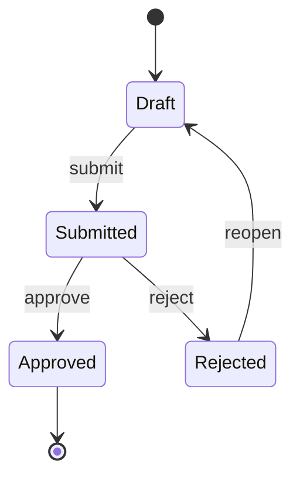

# Spec 模板（Spec Templates）

## 目录

- Purpose（目的）
- Spec Readiness（Spec 就绪）
- Spec Subtype Classification（Spec 子类型分类）
- Spec Freeze Confirmation（Spec 冻结确认）
- Section Review（章节评审）
- Layer Model（层模型）
- Light Spec（核心层精简）
- Standard Spec
- Verified Spec
- Tests Skeleton Rules（测试骨架规则）
- Spec Review（Spec 评审）
- No Auto Execution（不自动执行）

## 目的

只在用户请求或确认 Spec 工作后使用本文件。

Spec 是交接工件，不是执行许可。

## Spec 就绪

生成 Spec 工件前检查：

- 范围清晰。
- 验收标准可测试。
- 非目标明确。
- 风险与假设已点名。
- 推荐深度有论证。
- 工件清单可见。
- 已提议 Spec 子类型（见下）。

未就绪：从 `output-templates.md` 输出 Spec Readiness Check。

## Spec 子类型分类

每个 Spec 声明一个或多个子类型。子类型决定哪些扩展章节强制。可多子类型；其扩展章节的并集成为强制。

| 子类型 | 触发信号 | 扩展层 |
|---|---|---|
| Form/Data Heavy | 字段密集表单、结构化数据 CRUD、校验规则、数据模型是主要交付物 | A |
| Product/Frontend | 页面、UI 流程、交互组件、前端布局 | B |
| Event-Driven | 异步事件、消息代理、webhook、跨系统副作用、订阅者 | C |
| Infrastructure/Algorithm | 纯重构、性能、内部逻辑、无 UI 且无外部契约 | None — core layer only |

在 `proposal.md` 的 `## Spec Subtype` 记录所选子类型。都不适用时标 `Infrastructure/Algorithm` 并跳过扩展章节。

不确定时用此测试：*如果今天就冻结实现，哪些章节会迫使追问？* 每个会触发追问的章节都属于激活扩展层。

## Spec 冻结确认

写文件前使用：

```markdown
## Spec Freeze Confirmation

I recommend **[Light Spec / Standard Spec / Verified Spec]** because ...

### Freeze Items
| Item | Current Draft |
|---|---|
| Scope | ... |
| Acceptance Criteria | ... |
| Non-goals | ... |
| Risks / Assumptions | ... |
| Depth | ... |
| Spec Subtype(s) | Form/Data Heavy / Product/Frontend / Event-Driven / Infrastructure |
| Artifacts | ... |

Please confirm whether to generate these Spec artifacts.
```

## 章节评审

复杂 Spec 在冻结前验证章节：

```markdown
## Section Review: [Section Name]

**Current draft:** ...
**Why this section matters:** ...
**Potential ambiguity:** ...
**Question:** Does this section look right before I continue?
```

章节评审用于：

- 复杂架构。
- 多干系人。
- 多个工作流。
- 高风险验收标准。
- 一次性呈现可能被误解的任何设计。

## 层模型

Standard 与 Verified Spec 模板按两层组织：

- **Core Layer** — 每个 Standard/Verified Spec 强制。覆盖缺失时造成最多实施摩擦的 10 个维度：module goal、scope boundaries、actors and permissions、domain objects with state machines、entry and preconditions、main flow、exception flow、boundary cases、acceptance criteria、open questions。
- **Extension Layer** — 按声明子类型条件强制。Form/Data Heavy 的 Section A（Field Rules）；Product/Frontend 的 Section B（Page and Interaction）；Event-Driven 的 Section C（Events and Side Effects）。API and Data Mapping 是核心邻近章节，只要 Spec 暴露外部契约（REST/GraphQL/RPC/任务接口）就激活，无论子类型。

章节不适用时写 `N/A — <reason>`，不要删除。负空间也是契约的一部分。

## Light Spec（核心层精简）

用于小而清晰、低风险的改动。

工件：

```text
proposal.md
```

`proposal.md`：

```markdown
# Proposal: [Name]

## Context
...

## Module Goal
- Goal: ...
- Success metric (one): ...

## Scope
### In
- ...

### Out
- ...

## Actors and Permissions (one-line table)
| Actor | Permissions |
|---|---|

## Domain Objects (one-line table)
| Object | Key State |
|---|---|

## Main Flow (5–7 steps)
1. ...
2. ...

## Acceptance Criteria
- [ ] ...

## Open Questions
- ...

## Next Step
...
```

Light Spec 有意舍弃：exception flow（由验收标准覆盖）、boundary cases（并入验收标准）、状态机图（由 "Key State" 捕获）、完整字段规则、页面布局、事件目录。其中任何一项实质影响改动，就升级为 Standard Spec。

## Standard Spec

用于常规实施交接。

工件：

```text
proposal.md
design.md
tasks.md
test-cases.md
```

### Constitution Spec 工件

项目 constitution 存在并定义 `spec_artifacts` 时，把 constitution 定义的附加工件并入每个 Spec 深度的默认工件清单：

| Spec 深度 | 默认工件 | Constitution 附加工件（示例） |
|---|---|---|
| Standard Spec | `proposal.md`、`design.md`、`tasks.md`、`test-cases.md` | `verification.md` |
| Verified Spec | 默认 + `tests/` | `verification.md` |

精确附加工件在 constitution 的 Spec Artifacts 章节定义。上表展示 Loop Engineering 模式作为示例。

constitution 添加工件时：

1. 把附加工件纳入 Spec Freeze Confirmation 工件清单。
2. 读 constitution 的 Additional References 章节获取模板路径。
3. 指定了模板就用作附加工件内容的来源。
4. 用与核心工件相同的深度原则生成附加工件。

附加工件必须通过与核心工件相同的 Spec Review 门禁。不要跳过 constitution 定义工件的评审。

### `proposal.md`

```markdown
# Proposal: [Name]

## Spec Subtype
- [ ] Form/Data Heavy (Extension A)
- [ ] Product/Frontend (Extension B)
- [ ] Event-Driven (Extension C)
- [ ] Infrastructure/Algorithm (core layer only)

Rationale: ...

## Problem
...

## Module Goal
- Goal: ...
- Success metrics:
  - ...

## Scope
### In Scope
- ...

### Out of Scope
- ...

## Non-goals
- ...

## Acceptance Criteria
- [ ] ...

## Open Questions
| # | Question | Impact if Unanswered | Owner | Status |
|---|---|---|---|---|
| 1 | ... | ... | ... | Open / Answered / Waived |
```

### `design.md`

```markdown
# Design: [Name]

## Overview
...

## Actors and Permissions
| Actor | Description | Permissions | Constraints |
|---|---|---|---|

## Domain Objects
### Object List
| Object | Description | Key Attributes | Lifecycle Owner |
|---|---|---|---|

### State Machines
For each stateful object, draw the state machine. Mermaid preferred.



| Object | State | Entry Condition | Exit Condition | Allowed Transitions |
|---|---|---|---|---|

## Entry and Preconditions
### Entry Points
| Entry | Trigger | Actor |
|---|---|---|

### Preconditions
- ...

## Main Flow
| Step | Actor | Action | System Response | Postcondition |
|---|---|---|---|---|

(For complex flows, also include a Mermaid sequence/flow diagram.)

## Exception Flow
| Trigger | Detection | Handling | Recovery | User-visible Message |
|---|---|---|---|---|

## Boundary Cases
| Case | Expected Behavior | Rationale |
|---|---|---|

## Field Rules  *(Extension A — Form/Data Heavy)*
### Field List
| Object.Field | Type | Required | Source | Default |
|---|---|---|---|---|

### Display Rules
| Object.Field | Visible To | Condition | Format |
|---|---|---|---|

### Edit Rules
| Object.Field | Editable By | Condition | Side Effect |
|---|---|---|---|

### Validation Rules
| Object.Field | Rule | Error Code | Message |
|---|---|---|---|

## Page and Interaction  *(Extension B — Product/Frontend)*
### Page Inventory
| Page | Route / Path | Primary Actor | Purpose |
|---|---|---|---|

### Key Interactions
| Page | Trigger | Component Response | System Response | State Change |
|---|---|---|---|---|

(For complex UI flows, attach a Mermaid state or sequence diagram.)

## API and Data Mapping  *(Core when external contract exists)*
| Endpoint | Method | Request | Response | Permission | Side Effect | Error Codes |
|---|---|---|---|---|---|---|

If the Spec does not expose an external contract, write `N/A — internal-only`.

## Events and Side Effects  *(Extension C — Event-Driven)*
### Events Emitted
| Event | Payload | Emitter | Trigger | Subscriber(s) |
|---|---|---|---|---|

### Side Effects
| Side Effect | Trigger | Idempotency | Failure Handling |
|---|---|---|---|

### Subscribers
| Subscriber | Event | Action | Failure Handling |
|---|---|---|---|

## Key Decisions
| Decision | Choice | Reason | Alternatives Rejected |
|---|---|---|---|

## Risks
| Risk | Likelihood | Impact | Mitigation |
|---|---|---|---|
```

扩展章节不适用时写 `N/A — <reason>`，不要移除标题。评审者依赖标题确认该章节被考虑过。

### `tasks.md`

```markdown
# Tasks: [Name]

## Phase 1
- [ ] ...

## Phase 2
- [ ] ...

## Validation
- [ ] ...
```

任务应追溯回 `design.md` 章节（如 `[Domain Objects]`、`[Exception Flow]`），使缺失工作可检测。

### `test-cases.md`

```markdown
# Test Cases: [Name]

| Case | Given | When | Then | Priority |
|---|---|---|---|---|
```

测试用例必须覆盖：

- 每个 Main Flow 步骤。
- 每个 Exception Flow 行。
- 每个 Boundary Case 行。
- 每个状态机转换。
- 每个 Validation Rule（Extension A）。
- 每个 Page Interaction 错误态（Extension B）。
- 每个 Event 幂等与失败路径（Extension C）。

## Verified Spec

用于高风险、测试敏感或工程繁重的工作。

工件：

```text
proposal.md
design.md
tasks.md
test-cases.md
tests/
```

`tests/` 必须是真实的。技术栈不清时用伪代码或测试骨架；框架清晰时用可运行 stub。

建议结构：

```text
tests/
├── README.md
├── acceptance/
├── integration/
└── unit/
```

Verified Spec 还必须：

- 把每个验收标准映射到至少一个测试路径。
- 每个 Exception Flow 行至少一个负面测试。
- 每个 Boundary Case 行至少一个边界测试。

## 测试骨架规则

技术栈未知时：

- 用带期望行为的伪代码测试。
- 把必需测试框架标为显式缺口：`Missing: test framework is not confirmed`。
- 加确认测试框架所需的最小澄清问题。
- 不要编造包命令。

技术栈已知时：

- 匹配既有项目测试框架。
- 创建最小可运行骨架。
- 至少一个验收级测试。

## Spec 评审

起草 Standard Spec 或 Verified Spec 后，用 `spec-document-reviewer-prompt.md` 做 Spec 评审。

评审类别：

- 完整性。
- 一致性。
- 清晰度。
- 范围。
- YAGNI。
- 可测试性。
- 执行边界。
- 子类型覆盖（扩展层匹配声明子类型）。
- 状态机与异常覆盖。
- 权限/角色完整性。

发现阻塞问题：请用户批准前先修 Spec。

评审者批准不等于用户批准。

## 不自动执行

Spec 生成后问：

```text
Spec is drafted. Do you want me to prepare an execution plan? I will not execute until you confirm after seeing the plan and risks.
```

Spec 期间不要创建 `manifest.md`。`manifest.md` 只属于 Execution 可见性。
