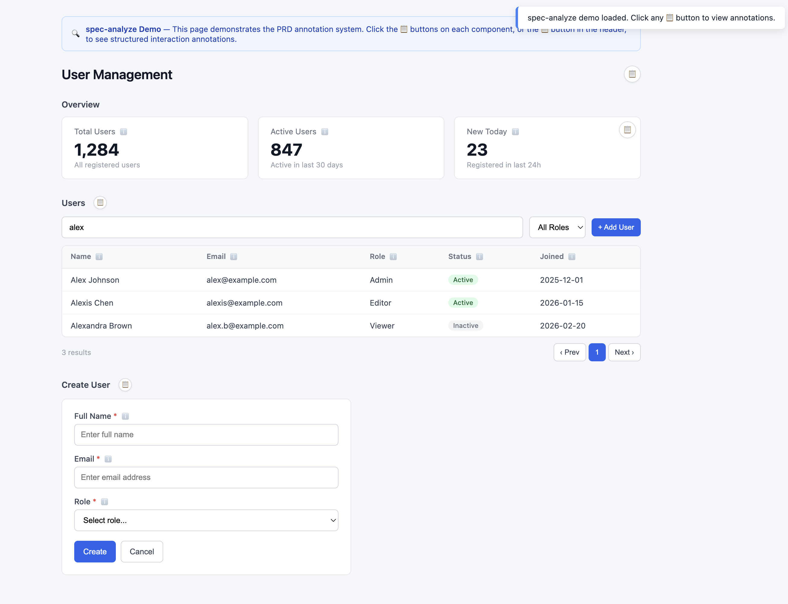

# spec-analyze

**Spec-Driven Development analysis engine — transform vague product requirements into developer-ready specification documents, and enrich prototype designs with structured interaction annotations.**

spec-analyze is an AI agent skill that guides large language models through a structured analysis pipeline: multi-perspective questioning → stress testing → solution convergence → annotated document output. The result is a set of three interconnected documents (proposal, design, tasks) with **machine-parseable annotations** that bridge the gap between product requirements and code implementation.

---

## Quick Start

See spec-analyze in action in 30 seconds:

```bash
# 1. Clone the repo
git clone https://github.com/SWUNwy/spec-analyze.git
cd spec-analyze

# 2. Open the demo page
open demo/index.html
```

The demo page shows a User Management UI with 3 annotated components — Stats Cards, Data Table, and a Create User Form. **Click any 📋 button** to open the annotation panel:



Each annotation block shows the component's trigger conditions, behavior rules, API contracts, state machine, and dismiss logic — the same format that spec-analyze generates for real projects.

---

## Why spec-analyze?

### The Core Use Case: Annotating Prototypes for Engineering Handoff

You've built a prototype — wireframes, Figma mockups, or even just sketched out an interaction flow. Now it needs to be handed off to development. The gap between "this is what it should look like" and "here's exactly how each component should behave" is where bugs, rework, and miscommunication live.

**spec-analyze fills this gap.** It takes your prototype/design concept and runs it through a structured analysis pipeline, then outputs every interactive component with precise annotations:

```
Before (prototype):      A login form with email and password fields

After (annotated spec):  @EmailPasswordForm L2 (T6 FormFill)
                         [Dev]   trigger:   input→blur validates single field
                                            click "Log in" → full validation + API
                         [Dev·Tester] behavior:  blur→error: red border + red text
                                            submit→POST /api/auth/login{email,password}
                                            →success: store token + redirect
                                            →failure: Toast with backend error
                         [API]      POST /api/auth/login
                                    →200: {token}  →401: "邮箱或密码错误"
                         [UI]   style:     border-radius 4px, height 40px
                         [Tester] state:    normal | fieldError | submitting | apiError
                         [Dev]   dismiss:   success→redirect / failure→restore normal
```

This is not a generic analysis report. It's a **developer-ready interaction spec** that an engineer (or AI coding agent) can implement directly.

### What Makes It Different

Most requirement analysis tools produce unstructured documents that leave a gap between "what to build" and "how to build it." spec-analyze fills this gap with an **annotation framework** — structured metadata attached to every interactive component in the design, covering triggers, behaviors, states, error handling, and UI copy. These annotations are precise enough for:

- **Developers** to implement without ambiguity
- **Testers** to generate test cases from state definitions
- **AI coding agents** to consume directly as implementation specs
- **Designers** to verify visual and interaction details

---

## Architecture

```
spec-analyze/
├── SKILL.md                 # Main skill definition — routing, workflow, quality gates
├── references/
│   ├── personas.md                   # 5 expert analysis personas
│   ├── scenario-stress-test.md       # 18 stress scenarios in 3 categories
│   ├── decision-log-format.md        # Structured decision recording
│   ├── output-templates.md           # Output templates + two-layer annotation framework
│   ├── quality-checklists.md         # QA checklists + type-specific checks
│   ├── web-research-guide.md         # Web research strategy guide
│   ├── annotation-templates.md       # 11 interaction pattern types (T1-T11)
│   └── html-annotation-system.md     # HTML annotation embedding system
└── .gitignore
```

### Modular design

The skill follows a **progressive disclosure** pattern:

1. **SKILL.md** — Entry point. Contains the workflow, routing logic, and references to deeper modules.
2. **`references/`** — Loaded on demand. Each file covers one domain (personas, stress testing, output formatting, type annotations, HTML embedding, etc.), keeping the main file focused while enabling deep dives when needed.

### Key Innovation: Two-Layer Annotation Framework

spec-analyze uses two complementary annotation layers:

| Layer | What It Controls | Mechanism |
|-------|-----------------|-----------|
| **L1/L2/L3 Tiers** | Annotation breadth — how many fields a component gets | Flat tier system |
| **T1-T11 Types** | Annotation depth — what fields a component *must* have based on its interaction pattern | Type system with mandatory fields + state machines |

The 11 interaction pattern types ensure that every component gets the right level of detail:

| Type | Pattern | Examples | States (min) |
|------|---------|---------|--------------|
| T1 | Static Display | Label, Badge, Avatar | normal |
| T2 | Data List | Table, CardList, LogList | normal / loading / empty / error |
| T3 | Action Trigger | Button, IconButton | normal / disabled / loading |
| T4 | Dropdown / Select | Dropdown, Select | normal / open / closed |
| T5 | Dialog / Modal | ConfirmModal, FormModal | normal / open / submitting / apiError |
| T6 | Form Fill | Form, InputGroup, Editor | normal / fieldError / submitting / success / apiError |
| T7 | Search / Filter | SearchInput, SearchableSelect | idle / focus / searching / selected / empty / error |
| T8 | Toggle / Switch | Toggle, Checkbox, Radio | normal / disabled / checked |
| T9 | Notification | Toast, Alert, Banner | hidden / show |
| T10 | Navigation | Tab, Breadcrumb, Pagination | normal / active / disabled |
| T11 | Inline Edit | EditableCell, InlineInput | normal / editing / submitting / apiError |

For full type definitions, see `references/annotation-templates.md`.

---

## Pipeline Overview

spec-analyze implements a **13-step pipeline** with **7 quality gates**:

```
User Input
    │
    ▼
┌─────────────────────────────┐
│ 1. Quick Assessment         │  ──  Discussion nature, complexity, expected output
└─────────────┬───────────────┘
              ▼
┌─────────────────────────────┐
│ 2. Route Confirmation       │  ──  Path-specific message declaring output & annotation scope
└─────────────┬───────────────┘
              │  + Continuous scope monitoring (see 2.5 Agent Role Dynamics)
              ▼
┌─────────────────────────────┐
│ 3-4. Context Explore        │  ──  Read project files, check docs,
│      (+ Web Research)       │      optionally search web for competitive intel
└─────────────┬───────────────┘
              │  G1: Context completeness gate
              ▼
┌─────────────────────────────┐
│ 5. Persona Questions        │  ──  5 expert roles probe from different angles
└─────────────┬───────────────┘  [skip Lightweight]
              ▼
┌─────────────────────────────┐
│ 6. Stress Testing           │  ──  "What if" scenarios push for edge cases
└─────────────┬───────────────┘  [skip Lightweight]
              ▼
┌─────────────────────────────┐
│ 7. Converge + Decision Log  │  ──  2-3 approaches, Architecture Cleanliness
│                             │      assessment, structured decision recording
└─────────────┬───────────────┘
              │  G2: Convergence completeness gate
              ▼
┌─────────────────────────────┐
│ 8. Design Presentation      │  ──  Section-by-section, user approves each
└─────────────┬───────────────┘
              │  G3: Output readiness gate
              ▼
┌─────────────────────────────┐
│ 8a-8b. Component Enumeration│  ──  Full path: list components → map to types
│        & Template Filling   │      (T1-T11) → fill annotation fields
└─────────────┬───────────────┘
              │  G3a: Enumeration completeness gate
              ▼
┌─────────────────────────────┐
│ 9. Output Generation        │  ──  Templates matched to routing path
│    (with annotation         │      If HTML prototype + ≥3 components:
│     decision sub-process)   │      → ask user whether to build-in annotation panel
└─────────────┬───────────────┘
              │  G3b: Output planning gate (HTML + ≥3 comps only)
              ▼
┌─────────────────────────────┐
│ 10. HTML Annotation Verify  │  ──  (Conditional) Verify annotations correctly
│                             │      built-in: triggers, ANNOTATIONS data, panel
└─────────────┬───────────────┘
              │  G3c: Annotation verification gate
              ▼
┌─────────────────────────────┐
│ 11. Quality Self-Check      │  ──  Run DoD checklist for current path
└─────────────┬───────────────┘
              │  G4: Self-review completion gate
              ▼
┌─────────────────────────────┐
│ 12. User Review             │  ──  Present output for final approval
└─────────────┬───────────────┘
              ▼
    ┌────────────────┐
    │ 13. Done /      │  ──  Full path → handoff to implementation planning
    │ writing-plans   │
    └────────────────┘
```

### Three Routing Paths

| Path | Complexity | Personas | Stress Test | Output | Use Case |
|------|-----------|----------|-------------|--------|----------|
| **Lightweight** | Quick question | None | No | Insight Brief (½ page) | Clarifying a requirement, quick feasibility check |
| **Standard** | Medium analysis | 2-3 most relevant | Yes | Analysis Report (1-2 pages) | Feature design, approach comparison, decision support |
| **Full** | Complete design | All 5 | Yes | proposal.md + design.md + tasks.md (+ user-decided HTML annotation panel) | Complex features needing complete spec-to-implementation handoff |

**Lightweight Upgrade Gate**: Before outputting a Lightweight result, the system auto-checks if the discussion crossed into implementation territory. If so, it proposes upgrading to Standard.

---

## The Annotation Framework (Full Path)

This is spec-analyze's core differentiator. Given a prototype or design concept, the system identifies every interactive component and attaches a structured annotation block:

```
Prototype                    Annotated Spec
┌─────────────────┐          ┌────────────────────────────┐
│  [Email input]  │   ──→   │  @EmailInput L2 (T6)       │
│  [Password inp]  │          │  trigger: blur/click       │
│  [Login button]  │          │  behavior: validate→API    │
└─────────────────┘          │  state: 5 variants         │
                             │  style: border-radius 4px  │
                             └────────────────────────────┘
```

### Two-Layer Framework

| Layer | Mechanism | Purpose |
|-------|-----------|---------|
| **L1/L2/L3 Tiers** | Flat tier system | Controls annotation breadth — how many fields |
| **T1-T11 Types** | Interaction pattern types | Controls annotation depth — mandatory fields + state machine per type |

### Three Annotation Tiers (Layer 1)

| Tier | When to Use | Fields |
|------|-------------|--------|
| **L1 Core** | Simple interactions (hover tooltip, static display) | trigger / behavior / dismiss |
| **L2 Standard** | Complex interactions (modal, dropdown, form validation) | L1 + placement / style / state / timing |
| **L3 Complete** | Global/reusable components (DatePicker, Table) | L2 + accessibility / responsive / i18n |

### Shared Blocks

In addition to tier fields and type-specific requirements, annotation blocks can include shared blocks that are reused across components:

| Block | Content | Applied To |
|-------|---------|------------|
| **Block A: Dialog Context** | ESC/overlay/Cancel close, timing | T4 (in dialog), T5, T6 (in dialog) |
| **Block B: API Call** | Endpoint, request/response structure | All API-calling components |
| **Block C: Permission** | Role-based access control | Restricted components |

### State Coverage Standards

State descriptions must cover two perspectives:

| Perspective | Requirement |
|-------------|-------------|
| **Dev perspective** | Describe component behavior in that state |
| **Tester perspective** | Describe full trigger-to-presentation path |

Each type has a minimum state machine. For example:
- T2 DataList: normal / loading / empty / error
- T6 FormFill: normal / fieldError / submitting / success / apiError
- T7 Search: idle / focus / searching / selected / empty / error

---

## HTML Annotation System

When the Full path generates (or modifies) an HTML prototype with 3+ components, the agent asks the user whether to **build-in** an interactive **PRD annotation sidebar**. If agreed, the annotation system is generated as part of the HTML from scratch (not retrofitted):

```
┌──────────────────────────────────────────────────┐
│  Prototype Page               ┌──────────────┐   │
│  ┌──────────────────┐  📋   │ PRD Annotations│   │
│  │ Stats Cards       │       │ C01 @StatsRow  │   │
│  └──────────────────┘       │──────────────│   │
│  ┌──────────────────┐  📋   │ [📊] [⚡] [📋] │   │
│  │ Publisher Table   │       │               │   │
│  └──────────────────┘       │ TRIGGER        │   │
│  ┌──────────────────┐       │ Page load →    │   │
│  │ Action Buttons   │       │ updateStats()  │   │
│  └──────────────────┘       │               │   │
│                              │ BEHAVIOR       │   │
│                              │ ...            │   │
│                              └──────────────┘   │
└──────────────────────────────────────────────────┘
```

Key features:
- **Slide-in panel** from right side, 400px width
- **Navigation tabs** for switching between component annotations
- **Inline trigger buttons** (📋) on each component section
- **Header toggle button** for global access
- **Keyboard shortcut**: ESC to close
- **back-propagation**: corrections found during verification sync back to design.md

See `references/html-annotation-system.md` for full implementation details.

---

## Triple-Document Output (Full Path)

When you bring a prototype for annotation, the Full path generates three interconnected documents that together form a complete engineering handoff package:

### 1. proposal.md — Functional Requirements

Contains requirement overview, functional requirement table with three annotation columns per feature:

| ID | Description | Priority | Acceptance Criteria | Data Annotation | Interaction Annotation | UI Text Annotation |
|----|-------------|----------|--------------------|-----------------|----------------------|-------------------|

**Data Annotation** specifies: API source + format rule + boundary values
**Interaction Annotation** specifies: interaction grade (L1/L2/L3) + type (T1-T11) + behavior description
**UI Text Annotation** specifies: all visible copy — placeholder, label, error, tooltip, button text

### 2. design.md — Component Design

Contains system architecture, interface design, data model, and component-level design with annotation blocks:

```
@EmailPasswordForm L2 (T6 FormFill)    ← proposal.md F001

[Trigger]   input → blur triggers field validation
            click "Log in" → triggers full validation + API call
[Behavior]  blur: validate single field, error→red border + red error text
            submit: POST /api/auth/login{email,password}
            → success: {token} → redirect to home
            → failure: Toast with backend error message
[Style]     border-radius 4px, height 40px; focus border highlight
[State]     normal: empty form; fieldError: red border + error text
            submitting: button loading + disabled; apiError: Toast
[Dismiss]   success→redirect; failure→restore normal
```

Includes a **Component Overview Table** (all components with IDs, types, levels) and a **Field Specification Table** that connects every field across proposal (UI labels) → design (format constraints) → implementation (API paths).

### 3. tasks.md — Implementation Tasks

Task breakdown with annotation references that point back to specific sections in design.md:

```
> **Annotation references:**
> - Annotation block → design.md §2.1 @EmailPasswordForm L2 (T6)
> - Field copy → design.md Appendix "Field Specification Table"
> - Data source → design.md §3
```

This design enables AI coding agents to read tasks.md, follow annotation references to design.md, and implement features without human translation.

---

## Quality Assurance System

Every output passes through checkpoints at each pipeline stage.

### Quality Gates (G1–G4, G3a, G3b, G3c)

| Gate | Location | What It Checks |
|------|----------|----------------|
| G1: Context completeness | Step 4 → 5 | Scope defined, project files read, web research done |
| G2: Convergence complete | Step 7 → 8 | ≥2 approaches compared, Architecture Cleanliness assessed, decisions logged |
| G3: Output readiness | Step 8 → 8a | All sections have data, output path set |
| G3a: Enumeration complete | Step 8a → 8b | All components enumerated, typed, no omissions |
| G3b: Output planning | Step 9 | If HTML + ≥3 components: user consulted, enumeration data complete |
| G3c: Annotation verify | Step 10 | Triggers placed, ANNOTATIONS data complete, back-propagation done |
| G4: Self-review complete | Step 11 → 12 | No placeholders, fact/inference distinguished, type compliance |

### Cross-Document Consistency Checks

- Proposal data annotation ↔ Design field specifications: field names match
- Proposal UI text ↔ Design field table: copy matches
- Proposal feature IDs ↔ Tasks: full coverage
- Task annotation references ↔ Design sections: one-to-one verified
- ANNOTATIONS keys (HTML) ↔ @ComponentName: all present
- data-annot attributes ↔ ANNOTATIONS keys: one-to-one match

### Type-Specific State Coverage

Each component type has required minimum states (see `references/annotation-templates.md` §5.3). The quality checklist verifies that every component's annotation block covers its type-specific state machine.

### Error Scenario Coverage

The system verifies coverage across 6 error categories: form validation, data format, business blocking, empty results, network exceptions, and server errors.

---

## Personas: Multi-Perspective Analysis

The 5 personas are activated based on the routing path (Standard: 2-3 relevant, Full: all 5):

| Persona | Focus | Sample Question |
|---------|-------|-----------------|
| **Product Strategist** | PMF, value prop, segmentation, priority | "What's the minimum version that still delivers value?" |
| **Growth & Market Analyst** | Competition, adoption, business impact | "What would make users switch from their current solution?" |
| **User Advocate** | Journey, pain points, usability, error experience | "What's the most confusing moment for a first-time user?" |
| **System Architect** | Feasibility, data model, API contracts, reusability | "Where does this data come from? What if the API format changes?" |
| **Risk Challenger** | Edge cases, failure modes, security, assumptions | "What assumption, if wrong, would break the entire design?" |

Each persona has red flags (warning signals) and escalation paths (when to hand off to another persona).

---

## Stress Testing

During the divergence phase, the system applies relevant stress scenarios from an 18-scenario library:

| Category | Examples |
|----------|----------|
| **Data & Input Extremes** | Empty response, malformed data, max-length input, special characters, file boundary, extreme volume |
| **User Behavior Extremes** | Rapid repeat clicks, tab chaos, mid-flow abandon, back/forward abuse, offline→online |
| **System & Environment Failure** | Network timeout, API partial failure, auth token expiry, rate limiting, third-party outage, concurrent edit |

---

## Web Research Integration

When triggered, web research is integrated using the **As-is → Gap → Edge** framework:

| Phase | Content | Purpose |
|-------|---------|---------|
| **As-is** | Current industry standard, common approach, or competitor solution | Grounding |
| **Gap** | Where our approach differs from or falls short | Risk awareness |
| **Edge** | Where we can differentiate or improve | Opportunity |

Trigger conditions: competitive benchmarking, component/UX pattern validation, technology evaluation, compliance checks.

---

## Installation

### As a Claude Code Skill

1. Clone this repository:
   ```bash
   git clone https://github.com/SWUNwy/spec-analyze.git
   ```

2. Install the skill:
   ```bash
   npx skills install spec-analyze -p /path/to/spec-analyze
   ```

3. The skill is now available. Claude Code will automatically trigger it when you describe product requirements, feature designs, or functional specs.

### Manual Setup

Copy or symlink the `SKILL.md` and `references/` directory to your Claude Code skills directory:

```bash
cp -r spec-analyze ~/.claude/skills/spec-analyze
```

---

## Usage

### Primary Workflow: Prototype → Annotated Spec

This is what spec-analyze was built for. You have a prototype or design concept, and you need it annotated for engineering delivery:

1. **Describe your prototype** — explain what you've designed (upload wireframes, describe screens, list components)
2. **Analysis pipeline runs** — spec-analyze assesses complexity, routes to the right path, asks targeted questions about interaction details
3. **Annotated output generated** — every interactive component receives structured annotation blocks (trigger/behavior/dismiss/state/style/timing) classified by type (T1-T11)
4. **User decides on annotations** — if an HTML prototype is involved, the agent asks whether to build in the interactive annotation sidebar
5. **Engineering consumes directly** — developers or AI coding agents read the annotations and implement

**Example session:**

> You: *"I have a prototype for a two-step checkout flow. First step is address form, second is payment. The address form has 5 fields and a 'Continue' button. The payment step has card number, expiry, CVV, and a 'Pay' button. Can you add interaction annotations?"*
>
> spec-analyze: (assesses → Full path → runs analysis → outputs proposal.md + design.md + tasks.md with each component annotated and typed)

### Quick Reference

| You Say | What Happens |
|---------|-------------|
| "I need a login page with email and password validation" | Full path → proposal + design + tasks with typed annotations |
| "I have a prototype for user profile editing, can you annotate it for dev handoff?" | Full path → analyzes prototype → annotated component specs → optional HTML embed |
| "How should we handle the user profile edit flow?" | Standard path → Analysis Report with approach comparison |
| "What's the best way to display this data?" | Lightweight path → Insight Brief (upgradable) |

The system will assess the complexity, confirm the path with you, and walk through the pipeline step by step.

---

## Integration with Other Skills

spec-analyze is designed as the **second stage** in a larger workflow:

```
                  ┌─────────────┐
                  │ deep-analyze │ ← Exploration & brainstorming (Stage 1)
                  └──────┬──────┘
                         │ Requirements clarified
                         ▼
                  ┌─────────────┐
                  │ spec-analyze │ ← Requirement analysis + annotated output (Stage 2)
                  └──────┬──────┘
                         │ Proposal + Design + Tasks ready
                         ▼
                  ┌─────────────┐
                  │ writing-plans│ ← Implementation planning (Stage 3)
                  └─────────────┘
```

- **deep-analyze** (predecessor): Multi-perspective analysis without the annotation framework. Use for early exploration.
- **spec-analyze**: The annotated output system. Use when the output needs to be developer-ready.
- **writing-plans** (external skill): Consumes spec-analyze's Full path output to generate implementation plans.

---

## Project Structure Philosophy

The skill follows Claude Code skill best practices:

- **SKILL.md** stays focused (<300 lines) — it's the entry point and workflow definition
- **`references/`** contains domain-specific deep dives, loaded on demand
- Each reference file has a single responsibility — personas, stress testing, output formats, quality checks, web research, type templates, HTML embedding

This modular structure enables progressive disclosure: the system only loads what it needs for the current pipeline step.

---

## Reference Files

| File | Purpose |
|------|---------|
| `SKILL.md` | Main workflow definition, routing, quality gates |
| `references/personas.md` | 5 expert analysis personas with red flags |
| `references/scenario-stress-test.md` | 18 stress scenarios in 3 categories |
| `references/decision-log-format.md` | Structured decision recording format |
| `references/output-templates.md` | Output templates + two-layer annotation framework |
| `references/quality-checklists.md` | Quality checklists with type-specific and HTML checks |
| `references/web-research-guide.md` | Web research trigger conditions and strategy |
| `references/annotation-templates.md` | 11 interaction pattern types (T1-T11) with state machines |
| `references/html-annotation-system.md` | HTML annotation build-in system with full templates |

---

## License

MIT
