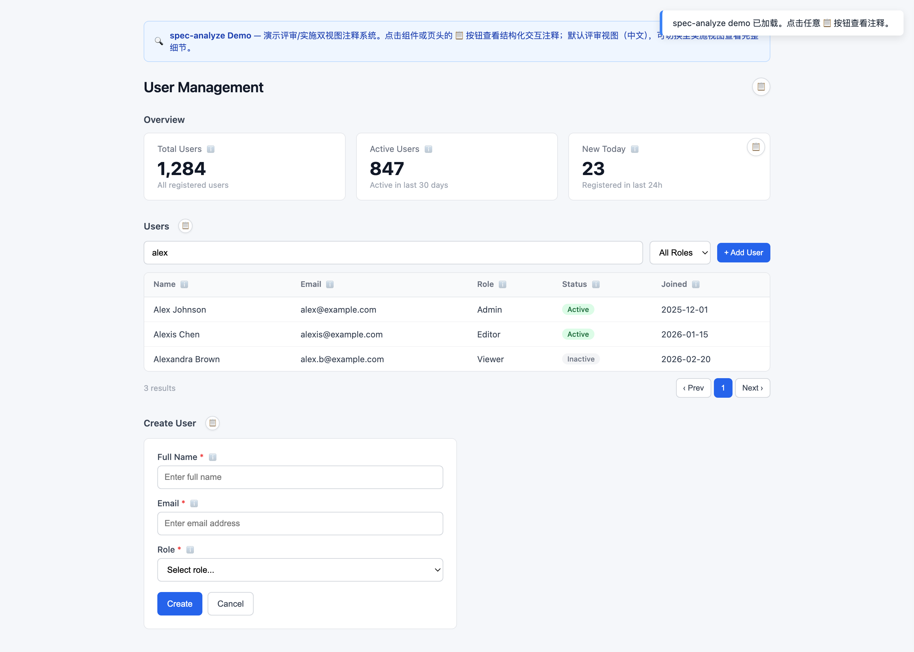

# spec-analyze

**规格驱动开发分析引擎——把模糊的产品需求转化为研发可直接实施的规格文档，并给原型设计加上结构化交互注释。**

spec-analyze 是一个 AI 代理 skill，引导大语言模型走完结构化分析流水线：多视角提问 → 压力测试 → 方案收敛 → 带注释的文档输出。产出是三份相互关联的文档（proposal、design、tasks），内含**机器可解析的注释**，弥合产品需求与代码实现之间的鸿沟。

---

## 快速开始

30 秒看 spec-analyze 的实际效果：

```bash
# 1. 克隆仓库
git clone https://github.com/SWUNwy/spec-analyze.git
cd spec-analyze

# 2. 打开演示页
open demo/index.html
```

演示页展示一个用户管理界面，含 3 个带注释的组件——统计卡片、数据表格与创建用户表单。**点击任意 📋 按钮**打开注释面板：



每个注释块展示组件的触发条件、行为规则、API 契约、状态机与关闭逻辑——与 spec-analyze 为真实项目生成的格式一致。

---

## 为什么用 spec-analyze？

### 核心用例：为工程交接注释原型

你已经有了原型——线框、Figma 稿，甚至只是画出的交互流程。现在要交接给开发。"这是它应该长什么样"和"这是每个组件应该如何行为"之间的差距，正是 bug、返工与沟通误差的滋生地。

**spec-analyze 填补这个差距。** 它把你的原型/设计概念送入结构化分析流水线，然后为每个交互组件输出精确注释：

```
Before (prototype):      A login form with email and password fields

After (annotated spec):  @EmailPasswordForm L2 (T6 FormFill)
                         [Dev]   trigger:   input→blur validates single field
                                            click "Log in" → full validation + API
                         [Dev·Tester] behavior:  blur→error: red border + red text
                                            submit→POST /api/auth/login{email,password}
                                            →success: store token + redirect
                                            →failure: Toast with backend error
                         [API]      POST /api/auth/login
                                    →200: {token}  →401: "邮箱或密码错误"
                         [UI]   style:     border-radius 4px, height 40px
                         [Tester] state:    normal | fieldError | submitting | apiError
                         [Dev]   dismiss:   success→redirect / failure→restore normal
```

这不是泛化的分析报告。它是**研发可直接实施**的交互规格——工程师（或 AI 编码代理）可以照着直接开发。

### 与通用分析工具的区别

大多数需求分析工具产出非结构化文档，在"做什么"与"怎么做"之间留下缺口。spec-analyze 用**注释框架**填补这一缺口——把结构化元数据挂到设计中每个交互组件上，覆盖触发、行为、状态、错误处理与 UI 文案。这些注释精确到足以：

- **开发**无歧义地实施
- **测试**从状态定义生成测试用例
- **AI 编码代理**直接作为实施规格消费
- **设计师**验证视觉与交互细节

---

## 闭环能力（v3.0）

v3.0 起，spec-analyze 升级为**可恢复、有证据、有门禁**的闭环分析引擎（由 analyze 能力迁移而来），在保留原有标注引擎（三层研发注释 + proposal/design/tasks 三文档）的同时，新增：

- **闭环状态机** — `run-state.cjs`：intake → scoped → discovering → synthesizing → verifying → repairing → completed/stopped/blocked，非法流转被确定性拒绝。
- **门禁体系** — G1 目标契约 / G2 证据-综合 / G3 完成 + 条件门禁（G-Decompose / G-Explore / G-Architecture / G-Spec / G-Section / G-Human）；与原有 S1–S4 标注质量门禁作用域互补。
- **证据台账** — 追加式 `evidence.jsonl`，HMAC 签名链，入库前 `--auto-detect` 矛盾检测。
- **检查点与恢复** — checkpoint 随状态流转自动同步，中断后从最近已验证检查点恢复，不重复初始化。
- **实施交接** — 版本绑定交接包（哈希校验）+ 下游 Plan → Execute → Verify 工作流控制器。
- **回归测试** — 93 项自动化测试（状态机 / 门禁 / 交接 / 工作流 / 混沌），`node scripts/test-automated.cjs`。
- **输出语言** — 默认中文。

完整协议见 [SKILL.md §闭环协议](SKILL.md) 与 `references/`（router、closed-loop、gates、verification-rubric、handoff-format 等）。

## 架构

```
spec-analyze/
├── SKILL.md                 # 主 skill 定义 — 路由、工作流、门禁
├── scripts/                 # 闭环引擎（run-state/workflow-state/handoff）+ 注释校验器
├── assets/                  # 交接 / 结果 / companion 模板
├── tests/                   # 88 项回归测试 + 场景用例
├── agents/                  # OpenAI Codex 接口
├── references/
│   ├── personas.md                   # 5 个专家分析角色
│   ├── divergence-frameworks.md      # 18 个发散框架 + 压力场景
│   ├── decision-log-format.md        # 结构化决策记录
│   ├── annotation-output-templates.md # 三文档输出模板 + 两层标注框架
│   ├── output-templates.md           # 闭环轨道输出模板（分析/决策/降级）
│   ├── quality-checklists.md         # QA 检查清单 + 类型化检查
│   ├── web-research-guide.md         # Web 研究策略指南
│   ├── annotation-templates.md       # 11 种交互模式类型（T1-T11）
│   ├── html-annotation-system.md     # HTML 注释内嵌系统
│   ├── test-cases.md                 # 从 ANNOTATIONS 状态生成测试用例
│   ├── closed-loop.md                # 状态机 / 证据 / 检查点协议
│   ├── gates.md                      # G1/G2/G3 + 条件门禁标准
│   └── …（其余闭环参考文档，见 SKILL.md 文件索引）
└── .gitignore
```

### 模块化设计

skill 遵循**渐进披露**模式：

1. **SKILL.md** — 入口。包含工作流、路由逻辑与指向深层模块的引用。
2. **`references/`** — 按需加载。每个文件覆盖一个领域（角色、压力测试、输出格式、类型注释、HTML 内嵌等），保持主文件聚焦，同时支持按需深潜。

### 核心创新：两层标注框架

spec-analyze 使用两个互补的标注层：

| 层 | 控制什么 | 机制 |
|---|----------|------|
| **L1/L2/L3 等级** | 标注广度——组件获得多少字段 | 扁平等级系统 |
| **T1-T11 类型** | 标注深度——组件按其交互模式**必须**有哪些字段 | 带强制字段 + 状态机的类型系统 |

11 种交互模式类型确保每个组件获得正确的细节量：

| 类型 | 模式 | 示例 | 状态（最小） |
|------|------|------|--------------|
| T1 | 静态展示 | Label、Badge、Avatar | normal |
| T2 | 数据列表 | Table、CardList、LogList | normal / loading / empty / error |
| T3 | 动作触发 | Button、IconButton | normal / disabled / loading |
| T4 | 下拉 / 选择 | Dropdown、Select | normal / open / closed |
| T5 | 弹窗 / 对话框 | ConfirmModal、FormModal | normal / open / submitting / apiError |
| T6 | 表单填写 | Form、InputGroup、Editor | normal / fieldError / submitting / success / apiError |
| T7 | 搜索 / 筛选 | SearchInput、SearchableSelect | idle / focus / searching / selected / empty / error |
| T8 | 开关 / 切换 | Toggle、Checkbox、Radio | normal / disabled / checked |
| T9 | 通知 | Toast、Alert、Banner | hidden / show |
| T10 | 导航 | Tab、Breadcrumb、Pagination | normal / active / disabled |
| T11 | 行内编辑 | EditableCell、InlineInput | normal / editing / submitting / apiError |

完整类型定义见 `references/annotation-templates.md`。

---

## 流水线概览

spec-analyze 实现**13 步流水线**，带**7 道质量门禁**：

```
User Input
    │
    ▼
┌─────────────────────────────┐
│ 1. Quick Assessment         │  ──  讨论性质、复杂度、预期输出
└─────────────┬───────────────┘
              ▼
┌─────────────────────────────┐
│ 2. Route Confirmation       │  ──  按路径声明输出与注释范围
└─────────────┬───────────────┘
              │  + 持续范围监控（见 2.5 Agent 角色动态）
              ▼
┌─────────────────────────────┐
│ 3-4. Context Explore        │  ──  读项目文件、查文档，
│      (+ Web Research)       │      可选搜索竞争情报
└─────────────┬───────────────┘
              │  S1: 上下文完备门禁
              ▼
┌─────────────────────────────┐
│ 5. Persona Questions        │  ──  5 个专家角色多角度提问
└─────────────┬───────────────┘  [Lightweight 跳过]
              ▼
┌─────────────────────────────┐
│ 6. Stress Testing           │  ──  "What if" 场景逼出边界情况
└─────────────┬───────────────┘  [Lightweight 跳过]
              ▼
┌─────────────────────────────┐
│ 7. Converge + Decision Log  │  ──  2-3 个方案、架构清洁度
│                             │      评估、结构化决策记录
└─────────────┬───────────────┘
              │  S2: 收敛完备门禁
              ▼
┌─────────────────────────────┐
│ 8. Design Presentation      │  ──  逐节呈现，用户逐节确认
└─────────────┬───────────────┘
              │  S3: 输出就绪门禁
              ▼
┌─────────────────────────────┐
│ 8a-8b. Component Enumeration│  ──  Full 路径：列组件 → 映射类型
│        & Template Filling   │      (T1-T11) → 填充注释字段
└─────────────┬───────────────┘
              │  S3a: 枚举完备门禁
              ▼
┌─────────────────────────────┐
│ 9. Output Generation        │  ──  模板匹配路由路径；
│    (with annotation         │      若 HTML 原型 + ≥3 组件：
│     decision sub-process)   │      → 询问用户是否内建注释面板
└─────────────┬───────────────┘
              │  S3b: 输出规划门禁（仅 HTML + ≥3 组件）
              ▼
┌─────────────────────────────┐
│ 10. HTML Annotation Verify  │  ──  （条件）验证注释正确内建：
│                             │      trigger、ANNOTATIONS 数据、面板
└─────────────┬───────────────┘
              │  S3c: 注释验证门禁
              ▼
┌─────────────────────────────┐
│ 11. Quality Self-Check      │  ──  对当前路径运行 DoD 检查清单
└─────────────┬───────────────┘
              │  S4: 自审完成门禁
              ▼
┌─────────────────────────────┐
│ 12. User Review             │  ──  呈现输出供最终确认
└─────────────┬───────────────┘
              ▼
    ┌────────────────┐
    │ 13. Done /      │  ──  Full 路径 → 交接给实施规划
    │ writing-plans   │
    └────────────────┘
```

### 三条路由路径

| 路径 | 复杂度 | 角色 | 压力测试 | 输出 | 适用场景 |
|------|--------|------|----------|------|----------|
| **Lightweight** | 快速问答 | 无 | 否 | Insight Brief（半页） | 澄清需求、快速可行性判断 |
| **Standard** | 中等分析 | 2-3 个最相关 | 是 | Analysis Report（1-2 页） | 功能设计、方案对比、决策支持 |
| **Full** | 完整设计 | 全部 5 个 | 是 | proposal.md + design.md + tasks.md（+ 用户决定的 HTML 注释面板） | 需要完整规格到实施交接的复杂功能 |

**Lightweight 升级门禁**：输出 Lightweight 结果前，系统自动检查讨论是否已进入实施领域；若是，则建议升级到 Standard。

---

## 标注框架（Full 路径）

这是 spec-analyze 的核心差异化。给定原型或设计概念，系统识别每个交互组件并挂上结构化注释块：

```
Prototype                    Annotated Spec
┌─────────────────┐          ┌────────────────────────────┐
│  [Email input]  │   ──→   │  @EmailInput L2 (T6)       │
│  [Password inp]  │          │  trigger: blur/click       │
│  [Login button]  │          │  behavior: validate→API    │
└─────────────────┘          │  state: 5 variants         │
                             │  style: border-radius 4px  │
                             └────────────────────────────┘
```

### 两层框架

| 层 | 机制 | 目的 |
|---|------|------|
| **L1/L2/L3 等级** | 扁平等级系统 | 控制标注广度——字段数量 |
| **T1-T11 类型** | 交互模式类型 | 控制标注深度——每种类型的强制字段 + 状态机 |

### 三个注释等级（层 1）

| 等级 | 何时使用 | 字段 |
|------|----------|------|
| **L1 基础** | 简单交互（hover tooltip、静态展示） | trigger / behavior / dismiss |
| **L2 详细** | 复杂交互（modal、dropdown、表单校验） | L1 + placement / style / state / timing |
| **L3 完整** | 全局/复用组件（DatePicker、Table） | L2 + accessibility / responsive / i18n |

### 共享块

除等级字段与类型专属要求外，注释块可包含跨组件复用的共享块：

| 块 | 内容 | 应用于 |
|----|------|--------|
| **Block A：对话框上下文** | ESC/遮罩/取消关闭、时序 | T4（对话框内）、T5、T6（对话框内） |
| **Block B：API 调用** | Endpoint、请求/响应结构 | 所有调用 API 的组件 |
| **Block C：权限** | 基于角色的访问控制 | 受限组件 |

### 状态覆盖标准

状态描述必须覆盖两个视角：

| 视角 | 要求 |
|------|------|
| **开发视角** | 描述组件在该状态下的行为 |
| **测试视角** | 描述从触发到呈现的完整路径 |

每种类型有最小状态机。例如：
- T2 DataList：normal / loading / empty / error
- T6 FormFill：normal / fieldError / submitting / success / apiError
- T7 Search：idle / focus / searching / selected / empty / error

---

## HTML 注释系统

Full 路径生成（或修改）含 3+ 组件的 HTML 原型时，代理询问用户是否**内建**交互式 **PRD 注释侧边栏**。同意后，注释系统随 HTML 从零生成（不是事后改造）：

```
┌──────────────────────────────────────────────────┐
│  Prototype Page               ┌──────────────┐   │
│  ┌──────────────────┐  📋   │ PRD Annotations│   │
│  │ Stats Cards       │       │ C01 @StatsRow  │   │
│  └──────────────────┘       │──────────────│   │
│  ┌──────────────────┐  📋   │ [📊] [⚡] [📋] │   │
│  │ Publisher Table   │       │               │   │
│  └──────────────────┘       │ TRIGGER        │   │
│  ┌──────────────────┐       │ Page load →    │   │
│  │ Action Buttons   │       │ updateStats()  │   │
│  └──────────────────┘       │               │   │
│                              │ BEHAVIOR       │   │
│                              │ ...            │   │
│                              └──────────────┘   │
└──────────────────────────────────────────────────┘
```

关键特性：
- 右侧**滑入面板**，宽 400px
- **导航标签页**切换组件注释
- 每个组件区块上的**行内触发按钮**（📋）
- 头部**开关按钮**提供全局访问
- **键盘快捷键**：ESC 关闭
- **反向传播**：验证中发现的修正同步回 design.md

完整实现细节见 `references/html-annotation-system.md`。

---

## 三文档输出（Full 路径）

带原型来注释时，Full 路径生成三份相互关联的文档，共同构成完整的工程交接包：

### 1. proposal.md — 功能需求

包含需求概览、功能需求表（每个功能带三个注释列）：

| ID | 描述 | 优先级 | 验收标准 | 数据注释 | 交互注释 | UI 文案注释 |
|----|------|--------|----------|----------|----------|-------------|

**数据注释**指定：API 来源 + 格式规则 + 边界值
**交互注释**指定：交互等级（L1/L2/L3）+ 类型（T1-T11）+ 行为描述
**UI 文案注释**指定：全部可见文案——placeholder、label、error、tooltip、按钮文本

### 2. design.md — 组件设计

包含系统架构、接口设计、数据模型与带注释块的组件级设计：

```
@EmailPasswordForm L2 (T6 FormFill)    ← proposal.md F001

[Trigger]   input → blur triggers field validation
            click "Log in" → triggers full validation + API call
[Behavior]  blur: validate single field, error→red border + red error text
            submit: POST /api/auth/login{email,password}
            → success: {token} → redirect to home
            → failure: Toast with backend error message
[Style]     border-radius 4px, height 40px; focus border highlight
[State]     normal: empty form; fieldError: red border + error text
            submitting: button loading + disabled; apiError: Toast
[Dismiss]   success→redirect; failure→restore normal
```

包含**组件总览表**（所有组件带 ID、类型、等级）与**字段规格表**——把 proposal（UI 标签）→ design（格式约束）→ 实施（API 路径）的每个字段串起来。

### 3. tasks.md — 实施任务

带注释引用的任务拆解，指向 design.md 的具体章节：

```
> **Annotation references:**
> - Annotation block → design.md §2.1 @EmailPasswordForm L2 (T6)
> - Field copy → design.md Appendix "Field Specification Table"
> - Data source → design.md §3
```

该设计让 AI 编码代理读 tasks.md、跟随注释引用到 design.md，无需人工转译即可实施功能。

---

## 质量保障体系

每个输出在流水线各阶段都经过检查点。

### 质量门禁（S1–S4、S3a、S3b、S3c）

| 门禁 | 位置 | 检查内容 |
|------|------|----------|
| S1：上下文完备 | Step 4 → 5 | 范围已定义、项目文件已读、web 研究已完成 |
| S2：收敛完备 | Step 7 → 8 | ≥2 方案已对比、架构清洁度已评估、决策已记录 |
| S3：输出就绪 | Step 8 → 8a | 所有章节有数据、输出路径已定 |
| S3a：枚举完备 | Step 8a → 8b | 所有组件已枚举、已类型化、无遗漏 |
| S3b：输出规划 | Step 9 | 若 HTML + ≥3 组件：已咨询用户、枚举数据完整 |
| S3c：注释验证 | Step 10 | trigger 已放置、ANNOTATIONS 数据完整、反向传播已完成 |
| S4：自审完成 | Step 11 → 12 | 无占位符、事实/推理已区分、类型合规 |

### 跨文档一致性检查

- Proposal 数据注释 ↔ Design 字段规格：字段名匹配
- Proposal UI 文案 ↔ Design 字段表：文案匹配
- Proposal 功能 ID ↔ Tasks：全覆盖
- Task 注释引用 ↔ Design 章节：一一验证
- ANNOTATIONS 键（HTML）↔ @组件名：全部存在
- data-annot 属性 ↔ ANNOTATIONS 键：一一匹配

### 类型专属状态覆盖

每种组件类型有强制最小状态（见 `references/annotation-templates.md` §5.3）。质量检查清单验证每个组件的注释块覆盖其类型专属状态机。

### 错误场景覆盖

系统验证覆盖 6 类错误：表单校验、数据格式、业务阻断、空结果、网络异常与服务器错误。

---

## 角色：多视角分析

5 个角色按路由路径激活（Standard：2-3 个相关角色；Full：全部 5 个）：

| 角色 | 焦点 | 示例提问 |
|------|------|----------|
| **Product Strategist** | PMF、价值主张、细分、优先级 | "仍然交付价值的最小版本是什么？" |
| **Growth & Market Analyst** | 竞争、采纳、商业影响 | "什么会让用户从现有方案切换？" |
| **User Advocate** | 旅程、痛点、可用性、错误体验 | "新用户最容易困惑的时刻是什么？" |
| **System Architect** | 可行性、数据模型、API 契约、可复用性 | "数据从哪来？API 格式变了会怎样？" |
| **Risk Challenger** | 边界情况、失效模式、安全、假设 | "哪个假设若错误会破坏整个设计？" |

每个角色有红旗（预警信号）与升级路径（何时交接给另一角色）。

---

## 压力测试

发散阶段，系统从 18 场景库应用相关压力场景：

| 类别 | 示例 |
|------|------|
| **数据与输入极端** | 空响应、畸形数据、最大长度输入、特殊字符、文件边界、极端量 |
| **用户行为极端** | 快速连点、标签页混乱、中途放弃、前进/后退滥用、离线→在线 |
| **系统与环境故障** | 网络超时、API 部分失败、auth token 过期、限流、第三方宕机、并发编辑 |

---

## Web 研究集成

触发时，web 研究按 **As-is → Gap → Edge** 框架整合：

| 阶段 | 内容 | 目的 |
|------|------|------|
| **As-is** | 当前行业标准、常见做法或竞品方案 | 接地 |
| **Gap** | 我们的方法差异或落后之处 | 风险意识 |
| **Edge** | 我们能差异化或改进之处 | 机会 |

触发条件：竞争基准、组件/UX 模式验证、技术评估、合规检查。

---

## 业务知识热插拔

spec-analyze 支持从 `knowledge/` 目录注入业务领域上下文。

```
spec-analyze/
├── SKILL.md
├── references/
├── knowledge/              ← 创建此目录
│   └── your-domain-knowledge.md
└── .gitignore
```

工作原理：

1. 在 skill 目录创建 `knowledge/`
2. 放入包含业务知识的 `.md` 文件（行业术语、系统架构、业务流程）
3. 运行 spec-analyze 时，它检测到文件并询问是否作为分析上下文加载
4. 加载的知识在分析期间被引用——决策记录可引用来源章节

`knowledge/` 目录默认被 gitignore，让专有知识不进开源仓库。

---

## 安装

### 作为 Claude Code skill

1. 克隆本仓库：
   ```bash
   git clone https://github.com/SWUNwy/spec-analyze.git
   ```

2. 安装 skill：
   ```bash
   npx skills install spec-analyze -p /path/to/spec-analyze
   ```

3. skill 立即可用。当你描述产品需求、功能设计或功能规格时，Claude Code 会自动触发它。

### 手动安装

把 `SKILL.md` 与 `references/` 目录复制或软链到 Claude Code skills 目录：

```bash
cp -r spec-analyze ~/.claude/skills/spec-analyze
```

---

## 使用

### 主工作流：原型 → 注释规格

这是 spec-analyze 的定位所在。你有原型或设计概念，需要为工程交付做注释：

1. **描述原型** — 说明你设计的内容（上传线框、描述界面、列出组件）
2. **分析流水线运行** — spec-analyze 评估复杂度、路由到正确路径、就交互细节提出定向问题
3. **生成注释输出** — 每个交互组件获得结构化注释块（trigger/behavior/dismiss/state/style/timing），按类型（T1-T11）分类
4. **用户决定注释形态** — 若涉及 HTML 原型，代理询问是否内建交互注释侧边栏
5. **工程直接消费** — 开发或 AI 编码代理读注释并实施

**示例会话：**

> 你：*"我有一个两步结账流程的原型。第一步是地址表单，第二步是支付。地址表单有 5 个字段和一个"继续"按钮。支付步骤有卡号、有效期、CVV 和一个"支付"按钮。能加交互注释吗？"*
>
> spec-analyze：（评估 → Full 路径 → 运行分析 → 输出 proposal.md + design.md + tasks.md，每个组件都带类型化注释）

### 快速参考

| 你说 | 发生什么 |
|------|----------|
| "我需要一个带邮箱和密码校验的登录页" | Full 路径 → proposal + design + tasks，带类型化注释 |
| "我有一个用户资料编辑的原型，能注释后交接给开发吗？" | Full 路径 → 分析原型 → 注释组件规格 → 可选 HTML 内嵌 |
| "用户资料编辑流程应该怎么处理？" | Standard 路径 → 带方案对比的 Analysis Report |
| "展示这些数据的最佳方式是什么？" | Lightweight 路径 → Insight Brief（可升级） |

系统会评估复杂度、与你确认路径，并逐步走完流水线。

---

## 与其他 skill 的集成

spec-analyze 被设计为更大工作流的**第二阶段**：

```
                  ┌─────────────┐
                  │ deep-analyze │ ← 探索与头脑风暴（阶段 1）
                  └──────┬──────┘
                         │ 需求已澄清
                         ▼
                  ┌─────────────┐
                  │ spec-analyze │ ← 需求分析 + 注释输出（阶段 2）
                  └──────┬──────┘
                         │ Proposal + Design + Tasks 就绪
                         ▼
                  ┌─────────────┐
                  │ writing-plans│ ← 实施规划（阶段 3）
                  └─────────────┘
```

- **deep-analyze**（前身）：无注释框架的多视角分析。用于早期探索。
- **spec-analyze**：注释输出系统。当输出需要研发可直接实施时使用。
- **writing-plans**（外部 skill）：消费 spec-analyze 的 Full 路径输出生成实施计划。

---

## 项目结构理念

skill 遵循 Claude Code skill 最佳实践：

- **SKILL.md** 是入口与工作流定义（含闭环协议与标注流程，当前约 1400 行；领域深潜放在 `references/`，按需加载）
- **`references/`** 承载领域专项深潜文档
- 每个 reference 文件单一职责——角色、压力测试、输出格式、质量检查、web 研究、类型模板、HTML 内嵌

这种模块化结构支持渐进披露：系统只加载当前流水线步骤需要的内容。

---

## 参考文件

| 文件 | 用途 |
|------|------|
| `SKILL.md` | 主工作流定义、路由、门禁 |
| `references/personas.md` | 5 个专家分析角色（含红旗） |
| `references/divergence-frameworks.md` | 3 类 18 个压力场景 |
| `references/decision-log-format.md` | 结构化决策记录格式 |
| `references/annotation-output-templates.md` | 三文档输出模板 + 两层标注框架（三条路径） |
| `references/output-templates.md` | 闭环轨道输出模板（分析/决策/降级） |
| `references/quality-checklists.md` | 类型化与 HTML 检查的质量清单 |
| `references/web-research-guide.md` | Web 研究触发条件与策略 |
| `references/annotation-templates.md` | 11 种交互模式类型（T1-T11）与状态机 |
| `references/html-annotation-system.md` | HTML 注释内建系统与完整模板 |

---

## License

MIT — 见 [LICENSE](LICENSE)。
