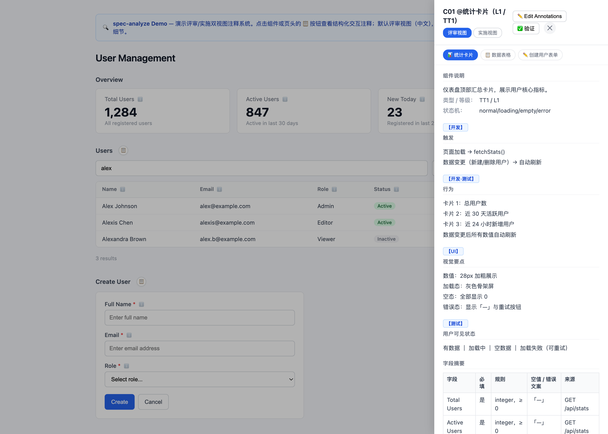
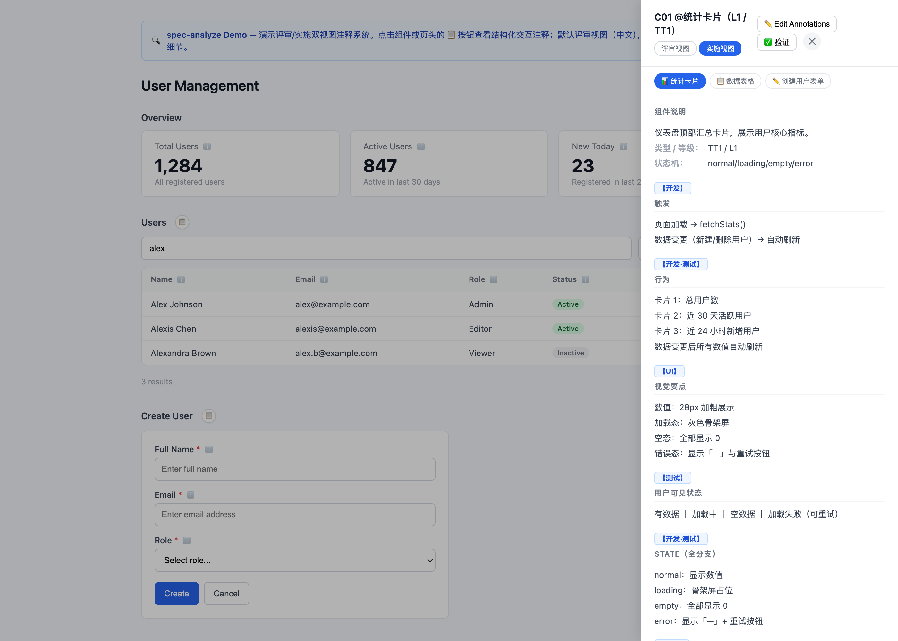

# spec-analyze

**规格驱动开发分析引擎——把模糊的产品需求转化为研发可直接实施的规格文档，并给原型设计加上结构化交互注释。**

spec-analyze 是一个 AI 代理 skill，引导大语言模型走完结构化分析流水线：多视角提问 → 压力测试 → 方案收敛 → 带注释的文档输出。产出是三份相互关联的文档（proposal、design、tasks），内含**机器可解析的注释**，弥合产品需求与代码实现之间的鸿沟。

当前版本：**v3.6.0**（完整变更见 [CHANGELOG.md](CHANGELOG.md)）。

---

## 快速开始

30 秒看 spec-analyze 的实际效果：

```bash
# 1. 克隆仓库
git clone https://github.com/SWUNwy/spec-analyze.git
cd spec-analyze

# 2. 打开演示页（默认评审视图，中文注释）
open demo/index.html
```

演示页展示一个用户管理界面，含 3 个带注释的组件——统计卡片、数据表格与创建用户表单。点击任意 **📋** 按钮打开注释面板：



评审视图按**中文角色标签**输出触发、行为、视觉要点与用户可见状态，并以**字段摘要表**整表扫读字段契约；点按面板头部可切换**实施视图**，展开 state 全分支、API、Permission、timing、accessibility 等完整细节：



每个注释块与 spec-analyze 为真实项目生成的格式一致，研发（或 AI 编码代理）可以直接照着实施。

---

## 为什么用 spec-analyze？

### 核心用例：为工程交接注释原型

你已经有了原型——线框、Figma 稿，甚至只是画出的交互流程。现在要交接给开发。"这是它应该长什么样"和"这是每个组件应该如何行为"之间的差距，正是 bug、返工与沟通误差的滋生地。

**spec-analyze 填补这个差距。** 它把你的原型/设计概念送入结构化分析流水线，然后为每个交互组件输出精确注释：

```
Before (prototype):      一个带邮箱与密码字段的登录表单

After (annotated spec):  @登录表单（T6 表单填写，L2）
                         【开发】触发
                         · 邮箱输入框失焦 → 校验该字段
                         · 点击「登录」→ 校验全部字段并提交
                         【开发·测试】行为
                         · 邮箱格式错误 → 输入框红框 +「请输入有效邮箱」
                         · 校验通过 → 提交登录请求；成功 → 进入首页
                         · 登录失败 → 顶部提示错误原因，表单保留已填内容
                         【UI】视觉要点
                         · 输入框：圆角 4px、高 40px；聚焦时边框高亮
                         · 登录按钮：主色；提交中置灰并显示「登录中…」
                         【测试】用户可见状态
                         · 空表单 ｜ 校验错误 ｜ 提交中 ｜ 成功（跳转）｜ 失败（可重试）
                         字段摘要
                         | 字段     | 必填 | 规则             | 空值 / 错误文案          | 来源     |
                         |----------|------|------------------|--------------------------|----------|
                         | email    | 是   | string，邮箱格式 | 「请输入邮箱」/「请输入有效邮箱」 | 登录接口 |
                         | password | 是   | string，6–32 位  | 「请输入密码」/「密码至少 6 位」 | 登录接口 |
```

这不是泛化的分析报告。它是**研发可直接实施**的交互规格——工程师（或 AI 编码代理）可以照着直接开发。

### 与通用分析工具的区别

大多数需求分析工具产出非结构化文档，在"做什么"与"怎么做"之间留下缺口。spec-analyze 用**注释框架**填补这一缺口——把结构化元数据挂到设计中每个交互组件上，覆盖触发、行为、状态、错误处理与 UI 文案。这些注释精确到足以：

- **开发**无歧义地实施
- **测试**从状态定义生成测试用例
- **AI 编码代理**直接作为实施规格消费
- **设计师**验证视觉与交互细节

---

## 核心能力

### 1. 交互注释引擎

- **三层注释等级** — L1（trigger/behavior/dismiss）→ L2（+placement/style/state/timing）→ L3（+accessibility/responsive/i18n）。
- **11 种交互模式类型（T1–T11）** — 静态展示、数据列表、动作触发、下拉选择、弹窗、表单填写、搜索筛选、开关切换、通知、导航、行内编辑；每种类型强制要求特定状态覆盖。
- **双视图显示模型（v3.2）** — 默认**评审视图**（中文角色标签【开发】【开发·测试】【UI】【测试】；展示触发、行为、关闭、用户可见状态、视觉要点、UI 文案、字段摘要表），按需展开**实施视图**（追加 state 全枚举、timing、API、Permission、i18n、accessibility）。字段级注释在评审视图用表格、实施视图用 ℹ️ 逐字段弹窗。

### 2. 闭环分析引擎（v3.0）

复杂、高杠杆任务进入**可恢复、有证据、有门禁**的闭环状态机（intake → scoped → discovering → synthesizing → verifying → repairing → completed/stopped/blocked）：

- **门禁体系** — 闭环门禁 G1 目标契约 / G2 证据-综合 / G3 完成 + 条件门禁（G-Decompose / G-Explore / G-Architecture / G-Spec / G-Section / G-Human）；标注质量门禁 S1–S4。G* 管流程与证据，S* 管产物质量。
- **证据台账** — 追加式 `evidence.jsonl`，HMAC 签名链，入库前 `--auto-detect` 矛盾检测。
- **检查点与恢复** — 中断后从最近已验证检查点恢复，不重复初始化。
- **实施交接** — 版本绑定交接包（哈希校验）+ 下游 Plan → Execute → Verify 工作流控制器。

### 3. 输出硬约束（v3.3）

输出文档默认中文，并接受**自动校验**：`references/chinese-writing-style.md` 定义「必须遵守」规则（英文大小写、确定错词、直角引号、数量逻辑、术语一致、机器内容保护），零依赖脚本 `scripts/lint-output-text.js` 三级校验（error / warning / style），**error 清零**才通过 S4 门禁；PR/push 由 CI（`.github/workflows/spec-lint.yml`）强制。

### 4. 术语覆盖（v3.4 / v3.5）

- **通用技术术语** — ID/API/JSON/URL/AI/LLM/RAG、GitHub/JavaScript/TypeScript/gRPC 等大小写硬约束。
- **营销与增长领域** — Affiliate / Social / Influencer Marketing 常用品牌（TikTok、Google Ads、AppsFlyer、SKAdNetwork、小红书官方英文名 rednote 等）、缩写（CPA/CPM/CTR/ROAS/LTV/KOL/MCN/eCPM 等）、常见错词（affliate→affiliate、influenzer→influencer 等）。

### 5. 回归测试

93 项自动化测试（状态机 / 门禁 / 交接 / 工作流 / 混沌 / 输出 lint），`node scripts/test-automated.cjs`。

---

## 架构

```
spec-analyze/
├── SKILL.md                 # 主 skill 定义 — 路由、工作流、门禁、版本
├── scripts/                 # 闭环引擎（run-state/workflow-state/handoff）+ lint-output-text.js 输出校验器
├── assets/                  # 交接 / 结果 / companion 模板
├── tests/                   # 93 项回归测试 + 场景用例
├── agents/                  # OpenAI Codex 接口
├── references/
│   ├── personas.md                   # 5 个专家分析角色
│   ├── divergence-frameworks.md      # 18 个发散框架 + 压力场景
│   ├── decision-log-format.md        # 结构化决策记录
│   ├── annotation-output-templates.md # 三文档输出模板 + 两层标注框架
│   ├── annotation-templates.md       # 11 种交互模式类型（T1-T11）
│   ├── annotation-example.md         # 注释约束示例（评审视图 / 实施视图）
│   ├── html-annotation-system.md     # HTML 注释内嵌系统
│   ├── chinese-writing-style.md      # 中文技术写作规范（硬约束 + 术语表）
│   ├── controlled-operations-writing.md # 操作文档与故障排查受控写作
│   ├── test-cases.md                 # 从 ANNOTATIONS 状态生成测试用例
│   ├── closed-loop.md                # 状态机 / 证据 / 检查点协议
│   ├── gates.md                      # G1/G2/G3 + 条件门禁标准
│   ├── handoff-format.md             # 版本绑定交接包协议
│   ├── glossary.md                   # 术语对照表
│   └── …（其余参考文档，见 SKILL.md 文件索引）
├── demo/                    # 交互演示页 + 截图（评审 / 实施视图）
└── .github/workflows/       # CI：测试套件 + lint 自测 + evaluate
```

### 模块化设计

skill 遵循**渐进披露**模式：

1. **SKILL.md** — 入口。包含工作流、路由逻辑与指向深层模块的引用。
2. **`references/`** — 按需加载。每个文件覆盖一个领域（角色、压力测试、输出格式、类型注释、HTML 内嵌、中文写作规范等），保持主文件聚焦，同时支持按需深潜。

### 核心创新：两层标注框架

spec-analyze 使用两个互补的标注层：

| 层 | 控制什么 | 机制 |
|---|----------|------|
| **L1/L2/L3 等级** | 标注广度——组件获得多少字段 | 扁平等级系统 |
| **T1-T11 类型** | 标注深度——组件按其交互模式**必须**有哪些字段 | 带强制字段 + 状态机的类型系统 |

11 种交互模式类型确保每个组件获得正确的细节量：

| 类型 | 模式 | 示例 | 状态（最小） |
|------|------|------|--------------|
| T1 | 静态展示 | Label、Badge、Avatar | normal |
| T2 | 数据列表 | Table、CardList、LogList | normal / loading / empty / error |
| T3 | 动作触发 | Button、IconButton | normal / disabled / loading |
| T4 | 下拉 / 选择 | Dropdown、Select | normal / open / closed |
| T5 | 弹窗 / 对话框 | ConfirmModal、FormModal | normal / open / submitting / apiError |
| T6 | 表单填写 | Form、InputGroup、Editor | normal / fieldError / submitting / success / apiError |
| T7 | 搜索 / 筛选 | SearchInput、SearchableSelect | idle / focus / searching / selected / empty / error |
| T8 | 开关 / 切换 | Toggle、Checkbox、Radio | normal / disabled / checked |
| T9 | 通知 | Toast、Alert、Banner | hidden / show |
| T10 | 导航 | Tab、Breadcrumb、Pagination | normal / active / disabled |
| T11 | 行内编辑 | EditableCell、InlineInput | normal / editing / submitting / apiError |

完整类型定义见 `references/annotation-templates.md`。

---

## 版本历史

| 版本 | 要点 |
|------|------|
| **v3.5.1** | `xiaohongshu`（拼音）→ `rednote`（小红书海外官方英文名，全小写） |
| **v3.5.0** | 营销术语覆盖第二轮扩充（社交 / 联盟 / 达人 / 程序化 / 合规） |
| **v3.4.0** | 营销/增长领域术语覆盖 + 大小写误报修复 |
| **v3.3.0** | 输出硬约束 + 零依赖 lint 校验器 + CI 强制 |
| **v3.2.0** | 注释评审视图 / 实施视图双显示模型 + 字段级双形态 |
| **v3.1.0** | 中文技术写作规范 + 全仓库零第三方痕迹原创重写 |
| **v3.0.0** | 可恢复、有证据、有门禁的闭环分析引擎 |

完整变更见 [CHANGELOG.md](CHANGELOG.md)。
