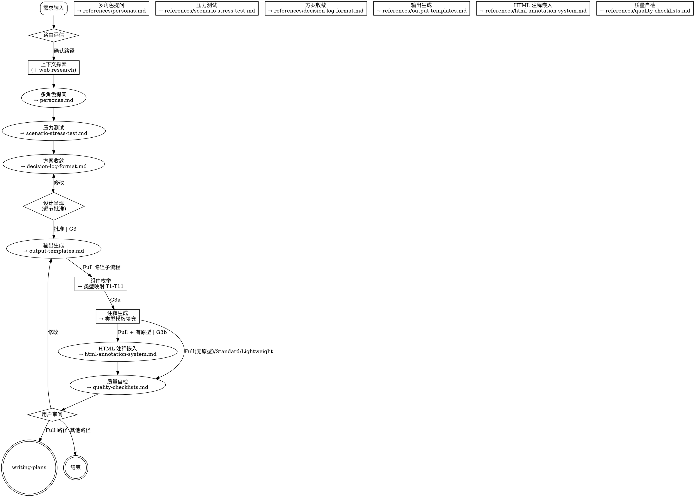

# Spec Analyze — 需求分析与带注释方案输出

将模糊的产品需求，通过多视角分析、压力测试、方案收敛，最终输出为**带研发注释**的 proposal / design / tasks 规范文档，让研发和 AI Agent 拿到文档即可开发。

<HARD-GATE>
在获得用户设计确认之前，不得调用任何实现 skill、编写代码或搭建项目。
</HARD-GATE>

---

## Step 0: 智能路由

在提问前先做三维评估：

| 维度 | 取值 |
|------|------|
| 讨论性质 | 纯业务 / 需求分析 / 技术设计 |
| 复杂度 | Lightweight / Standard / Full |
| 预期产出 | Insight Brief / Analysis Report / 带注释的方案文档 |

> "这属于 [讨论性质] 类型，[复杂度] 复杂度。我会使用 [路径] 路径——[路径说明]。可以吗？"

### 三条路径

| 路径 | 流程 | 产出 |
|------|------|------|
| **Lightweight** | 快速提问 → 讨论 → 升级门评估 | Insight Brief |
| **Standard** | 2-3 角色视角 → 方案比对 → 报告 | Analysis Report |
| **Full** | 5 角色全视角 + 压力测试 + 方案收敛 → 带注释提案 | proposal + design + tasks → (可选) HTML 注释嵌入 → `writing-plans` |

### Lightweight 升级门

输出前自动评估：需求涉及编码/用户要实施/含技术选型？任一为"是" → 提议升级到 Standard。

---

## Checklist

1. **快速评估** — 讨论性质、复杂度、预期产出
2. **路由确认** — 推荐路径，等待用户确认
3. **视觉伴侣邀请** — 见 Visual Companion 章节
4. **上下文探索** — 项目文件、文档、最近提交；提议 web research（见 Web Research 章节）。**→ 检查 G1**
5. **多角色提问** — 一次一个问题（见 `references/personas.md`）[skip Lightweight]
6. **发散阶段** — 场景压力测试（见 `references/scenario-stress-test.md`）[skip Lightweight]
7. **收敛阶段** — 2-3 方案 + 决策记录（见 `references/decision-log-format.md`）。**→ 检查 G2**
8. **设计呈现** — 分节呈现，逐节获取批准。**→ 批准后检查 G3**
9. **输出生成** — 按路径产生对应文档（见 `references/output-templates.md`）。**Lightweight 先评估升级门**
10. **HTML 注释嵌入** — 如果项目已有 HTML 原型且组件数 ≥ 3，按 `references/html-annotation-system.md` 将 design.md 的 Annotation Blocks 转换为 HTML 交互式注释面板。**→ 检查 G3b**
11. **质量自检** — 运行 references/quality-checklists.md 中对应路径的自检
12. **用户审阅** — 输出文档让用户确认
13. **交接** — Full 路径 → 调用 `writing-plans`；其他 → 结束

> **注**：Full 路径下，输出生成（Step 9）包含一个内部子流程：**Step 9a 组件枚举** → 检查 G3a → **Step 9b 注释生成**。详见 `references/annotation-templates.md` §8。

---

## 质量门禁与 Definition of Done

| 门禁 | 位置 | Lightweight | Standard | Full |
|------|------|:-----------:|:--------:|:----:|
| G1 | 步骤 4 → 5 | 跳过 | 需要 | 需要 |
| G2 | 步骤 7 → 8 | 跳过 | 需要 | 需要 |
| G3 | 步骤 8 → 9 | 跳过 | 需要 | 需要 |
| G3a | 步骤 9a → 9b（Full 路径子流程） | 跳过 | 跳过 | 需要 |
| G3b | 步骤 9 → 10（HTML 注释嵌入前） | 跳过 | 跳过 | 需要* |
| G4 | 步骤 11 → 12 | 需要 | 需要 | 需要 |

> *G3b 仅当项目有 HTML 原型且组件数 ≥ 3 时执行。否则跳过。

### G1: 上下文完备

- [ ] 上下文边界清晰：scope 内 / 外已明确
- [ ] 项目文件/文档已查阅
- [ ] Web research（如触发）已完成
- [ ] 当前状态足以进入深入分析

### G2: 收敛完成

- [ ] 至少 2-3 方案已对比，列明 trade-off
- [ ] Architecture Cleanliness 四维度已评估（模式一致性 / 职责分离 / 最小变更 / 抗补丁性）
- [ ] 每个决策记录了 rationale + 被拒方案
- [ ] 范围已锁定——明确声明**不包含**的内容

### G3: 输出准备（Full 路径特有）

- [ ] proposal 注释列有足够数据填充
- [ ] design 交互组件已识别
- [ ] 每个输出章节有分析数据支撑
- [ ] 文件输出路径已确定

### G3a: 组件枚举完整性（Full 路径子流程特有关卡）

在输出生成的内部子流程中，Step 9a（组件枚举）完成后必须检查：

- [ ] 页面上所有交互组件已列出
- [ ] 每个组件映射到类型（T1-T11）
- [ ] 每个组件有唯一编号（C01, C02, ...）
- [ ] 嵌套关系已声明（父子组件）
- [ ] 组件数已确认：无遗漏、无幽灵项
- [ ] 每个组件引用源需求（F00X）

### G3b: HTML 注释准备（条件性，仅 Full 路径 + 有 HTML 原型时）

- [ ] 项目已有 HTML 原型且组件数 ≥ 3（满足嵌入条件）
- [ ] design.md 中的 Annotation Blocks 数据完整，可映射为 JS ANNOTATIONS 对象
- [ ] 每个组件有唯一 key（英文简短标识）
- [ ] 触发按钮放置策略已确定（inline / header / nav 三种机制）
- [ ] 导航标签的图标 + 短名已确定
- [ ] ANNOTATIONS keys ↔ @ComponentName ↔ data-annot 属性：一对一匹配

### G4: 自检完成

- [ ] 无占位文本（`{占位符}` 均已替换）
- [ ] 所有声明已区分 Fact / Inference / Hypothesis
- [ ] 没有 scope creep
- [ ] Full 路径：注释符合类型模板要求（见 `references/annotation-templates.md` §5）
- [ ] Full 路径：proposal / design / tasks 引用链一致
- [ ] Full 路径：API 调用组件已声明 Block B（API Call Declaration）
- [ ] Full 路径：状态覆盖符合类型最低要求

### 失败处理

- 任一 DoD 不满足 → 回溯对应步骤补齐
- 用户否决输出 → 回到设计呈现重新迭代
- 同一门禁连续阻塞 2 次 → 暂停，评估路径选择

---

## 分析流程

### 2.1 上下文探索

- 先查阅项目状态（文件、文档、最近提交）
- 如果需求涉及多个独立子系统 → 立即标记，拆分为子项目
- 每个消息只问一个问题，优先选择题

### 2.2 多角色驱动提问

激活的角色视角引导提问（见 `references/personas.md`）。**每个角色至少问 1-2 个问题。** 切换视角时说明来源：

> "从增长角度来看——用户今天怎么发现这个功能的？"
> "风险挑战者要问——如果这个假设是错的会怎样？"

### 2.3 发散阶段

从 `references/scenario-stress-test.md` 中选择 2-3 个相关场景进行 what-if 探测。

### 2.4 收敛阶段

1. 提出 2-3 方案，带显式 trade-off（推荐方案放首位）
2. 每个方案在 Architecture Cleanliness 四维度评估（模式一致性 / 职责分离 / 最小变更 / 抗补丁性）
3. 记录每个决策（见 `references/decision-log-format.md`）
4. 锁定范围——声明**不包含**的内容

### 2.5 Agent 角色动态

| 阶段 | 角色 | 行为 |
|------|------|------|
| 早期探索 | 引导者 (Socratic) | 提问式探索、理清思路 |
| 发散 | 挑战者 | 推边界、问 what-if、暴露盲点 |
| 收敛 | 顾问 | 推荐方案、做 trade-off 决策 |
| 设计呈现 | 协作者 | 分节呈现、按反馈迭代 |

---

## 注释框架（Full 路径独有）

分析完成后，Full 路径的文档使用两层注释体系：

| 层 | 控制 | 机制 |
|----|------|------|
| **L1/L2/L3** | 注释广度（覆盖多少字段） | 平面层级系统 |
| **T1-T11 类型** | 注释深度（每个组件必须含什么） | 交互模式类型系统 |

详见 `references/annotation-templates.md`（类型系统）和 `references/output-templates.md`（层级定义）。

| 等级 | 适用场景 | 字段 |
|------|----------|------|
| **L1 核心** | 简单交互（hover、静态展示） | trigger / behavior / dismiss |
| **L2 标准** | 复杂交互（弹窗、表单联动） | L1 + placement / style / state / timing |
| **L3 完整** | 全局通用组件（DatePicker, Modal） | L2 + accessibility / responsive / i18n |

---

## Web Research

详见 `references/web-research-guide.md`。

---

## Visual Companion

当涉及可视化内容（架构图、页面布局、流程图表）时，提供浏览器伴侣。

**触发条件**：Full 路径的设计呈现阶段，或文字表达不足时。

**邀请方式**（独立消息，不含其他内容）：

> "有些内容用浏览器展示会更直观——我可以画架构图、流程图或页面布局。要试试吗？（需要打开本地 URL）"

---

## 关键原则

- **一次一个问题** — 不一次性抛多个问题
- **选择题优先** — 比开放题更容易回答
- **YAGNI** — 从所有设计中移除不必要的功能
- **先发散再收敛** — 先拓宽思路再收窄
- **增量验证** — 分节呈现设计，逐节获取批准
- **记录决策** — 不只记录结论，还要记录"为什么"

---

## 文件索引

| 文件 | 用途 |
|------|------|
| `references/personas.md` | 5 个专家角色的定义、核心问题、红旗信号、升级路径 |
| `references/scenario-stress-test.md` | 压力测试场景库：数据/用户/系统三大类 |
| `references/decision-log-format.md` | 决策记录的结构化格式与示例 |
| `references/output-templates.md` | 三条路径的输出模板 + 两层注释框架 + 全链路工作流 |
| `references/quality-checklists.md` | 质量自检清单 + 跨文档一致性检查 + 各角色评审清单 + 类型特定检查 + HTML 注释检查 |
| `references/web-research-guide.md` | Web research 触发条件、搜索策略、信息整合框架 |
| `references/annotation-templates.md` | 类型注释模板：11 种交互模式（T1-T11）、共享块、嵌套规则、内容质量规则、生成流程 |
| `references/html-annotation-system.md` | HTML 注释嵌入：何时使用、架构、数据格式、组件映射、集成步骤、完整 CSS/JS/HTML 模板 |
