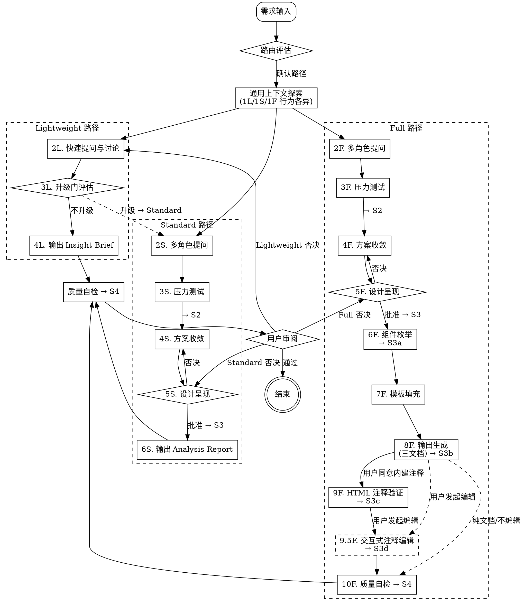

# Spec Analyze — 需求分析与带注释方案输出

将模糊的产品需求，通过多视角分析、压力测试、方案收敛，最终输出为**带研发注释**的 proposal / design / tasks 规范文档，让研发和 AI Agent 拿到文档即可开发。

<HARD-GATE>
在获得用户设计确认之前，不得调用任何实现 skill、编写代码或搭建项目。
</HARD-GATE>

---

## Session State

本 skill 在每次 session 中维护以下状态，每完成一个步骤更新一次：

```yaml
spec_analyze_state:
  current_path: null              # lightweight | standard | full
  current_step: null              # 当前步骤名称
  confirmed_findings: []          # 已确认的分析发现
  unconfirmed_assumptions: []     # 待确认的假设
  risk_level: low                 # low | medium | high
  knowledge_loaded: false         # 是否已加载 knowledge/
  personas_activated: []          # 已激活的角色
  output_generated: false         # 是否已生成输出
  gate_status:                    # 门禁通过状态
    S1: pending                   # pending | passed | blocked
    S2: pending
    S3: pending
    S3a: pending
    S3b: pending
    S3c: pending
    S3d: pending
    S4: pending
  interactive_annotation:         # 交互式注释编辑状态
    mode: null                     # inline | standalone
    document_path: null            # 当前操作的目标文档路径
    component_manifest: []         # 从文档解析的组件清单
    edit_history: []               # 本次编辑操作记录（用于 undo）
  interrupt_recovery:             # 中断恢复信息
    last_step: null
    progress_summary: null
```

**状态更新规则：**
- 每完成一个步骤 → 更新 `current_step` 和相关字段
- 门禁检查通过 → 更新对应 `gate_status`
- 每 5 轮或模式切换时 → 输出 Stage Summary（conversation only）

**状态持久化（默认 conversation-based）：**
- 同 session 内直接使用 conversation state 恢复
- 用户要求"下次继续"时 → 保存到 `docs/spec-analyze/.session-state.json`（ask before write）
- 新 session + 有持久化文件 → 询问是否恢复
- 新 session + 无持久化文件 → 正常开始

**状态展示格式：**
```
[spec-analyze] Full | Step 9.5F 交互式注释编辑 | S3d: pending | 知识: 已加载
```

---

## Step 0: 智能路由

在提问前先做两维评估：

| 维度 | 取值 |
|------|------|
| 复杂度 | Lightweight / Standard / Full |
| 预期产出 | Insight Brief / Analysis Report / 带注释的方案文档 |

每次路由确认时必须使用路径对应的消息模板，声明产出物和注释覆盖范围：

**Lightweight 路径：**
> "评估为 Lightweight 复杂度，产出 **Insight Brief**（不含交互注释）。
> 如果需求最终需要交付研发，后续会评估是否升级到 Standard 路径。可以吗？"

**Standard 路径：**
> "评估为 Standard 复杂度，产出 **Analysis Report + proposal.md**，含 Data / Interaction / UI Text 三列注释。可以吗？"

**Full 路径：**
> "评估为 Full 复杂度，产出 **proposal.md + design.md + tasks.md** 三文档，含逐组件 Annotation Block（L1-L3 类型化模板）。可以吗？"

### 三条路径

| 路径 | 流程 | 产出 | 注释覆盖 |
|------|------|------|:--------:|
| **Lightweight** | 轻量扫描 → 快速提问 → 升级门评估 → 输出 | Insight Brief | 无 |
| **Standard** | 完整探索 → 2-3 角色 → 压力测试 → 收敛 → 呈现 → 输出 | Analysis Report | proposal 三列注释 |
| **Full** | 完整探索 → 5 角色 → 压力测试 → 收敛 → 呈现 → 枚举 → 填充 → 输出 → 验证 → 交互编辑 | proposal + design + tasks | proposal 三列 + design Annotation Block + (经用户决策) HTML 注释面板 |

---

## 通用上下文探索（Step 1 — 行为因路径而异）

**入口：** 路由确认后执行。

**Step 1 行为因路径而异：**

| 行为 | Lightweight (1L) | Standard (1S) | Full (1F) |
|------|:----------------:|:-------------:|:---------:|
| 项目文件/文档查阅 | 仅表层（README/文件名级） | 完整查阅 | 完整查阅 |
| knowledge/ 检测与加载 | **跳过**（不加载） | 检测 → 列出 → 询问加载 | 检测 → 列出 → 询问加载 |
| Web research 提议 | **不提议** | 按条件提议 | 按条件提议 |
| 视觉伴侣邀请 | **不邀请** | 按条件邀请 | 按条件邀请 |

### knowledge/ 检测与加载（仅 Standard/Full 路径）

在 Step 1 中完成 knowledge/ 目录的检测与加载（同 session 仅 1 次）：

- **目录不存在** → 静默跳过，不输出任何提示
- **目录存在但为空** → 静默跳过
- **目录存在且包含 `.md` 文件** → 列出文件名和行数，然后询问：
  > "检测到 `knowledge/` 目录包含：X.md（N行）。当前需求是否需要加载这些知识作为分析上下文？"
  - 用户同意 → 加载所有 `.md` 文件内容，输出声明：
    > "[knowledge] 已加载 X.md（N行），后续分析将引用该领域上下文。"
  - 用户拒绝 → 跳过，当前 session 不再重复询问

### 上下文探索通用规则

- 先查阅项目状态（文件、文档、最近提交）
- 如果需求涉及多个独立子系统 → 立即标记，拆分为子项目
- 每个消息只问一个问题，优先选择题

**→ Standard/Full 路径检查 S1 门禁**

---

## 三路径流程

路径确认后，按以下流程执行。**Step 1 已在通用上下文探索中执行。**

### Lightweight 路径

| 步骤 | 名称 | 行为 | 门禁 |
|------|------|------|------|
| 0 | 路由确认 | 用户确认 Lightweight 路径 | — |
| 1L | 轻量上下文扫描 | 仅扫描项目表层（README/文件名级）；不加载 knowledge/；不提议 web research；不邀请视觉伴侣 | — |
| 2L | 快速提问与讨论 | 自由提问，不激活角色视角 | — |
| **3L** | **升级门评估** | 评估 4 条件（见升级门章节），监控始于 Step 1L，在 Step 3L 统一评估 | — |
| 4L | 输出 Insight Brief | 输出核心洞察简报（conversation only，不写文件） | S4 |
| — | 用户审阅 | 用户确认 → 结束；用户否决 → 回到 2L | — |

### Standard 路径

| 步骤 | 名称 | 行为 | 门禁 |
|------|------|------|------|
| 0 | 路由确认 | 用户确认 Standard 路径 | — |
| 1S | 完整上下文探索 | 项目文件/文档查阅 + knowledge/ 加载 + web research + 视觉伴侣 | S1 |
| 2S | 多角色提问 | 激活 2-3 最相关的角色视角（见 `references/personas.md`），每个角色至少 1-2 个问题 | — |
| 3S | 多框架发散 | 按意图选择发散框架，做多维度 what-if 探测（见 `references/divergence-frameworks.md`） | — |
| 4S | 方案收敛 | 2-3 方案对比 + 决策记录（见 `references/decision-log-format.md`）+ 范围锁定 | S2 |
| 5S | 设计呈现 | 分节呈现，逐节获取批准 → **批准 → 继续；否决 → 回到 4S** | S3 |
| 6S | 输出 Analysis Report | 输出 Analysis Report + proposal.md 到 `docs/spec-analyze/reports/` | S4 |
| — | 用户审阅 | 用户确认 → 结束；用户否决 → 回到 5S | — |

### Full 路径

| 步骤 | 名称 | 行为 | 门禁 |
|------|------|------|------|
| 0 | 路由确认 | 用户确认 Full 路径 | — |
| 1F | 完整上下文探索 | 项目文件/文档查阅 + knowledge/ 加载 + web research + 视觉伴侣 | S1 |
| 2F | 多角色提问 | 激活全部 5 角色（见 `references/personas.md`），Risk Challenger 全程参与 | — |
| 3F | 多框架发散 | 按意图选择发散框架 + 组合，做多层次 what-if 探测（见 `references/divergence-frameworks.md`） | — |
| 4F | 方案收敛 | 2-3 方案对比 + 决策记录（见 `references/decision-log-format.md`）+ 范围锁定 | S2 |
| 5F | 设计呈现 | 分节呈现，逐节获取批准 → **批准 → 继续；否决 → 回到 4F** | S3 |
| 6F | 组件枚举 | 列出页面所有交互组件，映射到 `references/annotation-templates.md` 的类型（T1-T11） | S3a |
| 7F | 模板填充 | 按类型模板逐组件填充注释字段（见 `references/annotation-templates.md` §4） | — |
| 8F | 输出生成 | 生成 proposal + design + tasks 三文档（见 `references/output-templates.md`）；design.md 末尾需包含 Component Manifest（§8）；组件≥3 时询问是否内建 HTML 注释 | S3b |
| 9F | HTML 注释验证 | 按 `references/html-annotation-system.md` 验证注释正确内建 + back-propagation（仅当用户同意内建时） | S3c |
| 9.5F | 交互式注释编辑 | 用户指定组件和字段目标，AI 按模板规则执行编辑 → 跨文档同步 → 输出 diff 摘要。详见下方「Step 9.5F: 交互式注释编辑」章节 | S3d |
| 10F | 质量自检 | 运行质量自检清单（见 `references/quality-checklists.md`） | S4 |
| — | 用户审阅 | 用户确认 → 结束；用户否决 → 回到 5F | — |

---

## Step 9.5F: 交互式注释编辑

在 Step 9F（HTML 注释验证 + back-propagation）完成后，用户可以对产出文档中的任意组件注释进行定向编辑。也支持作为独立模式调用（用户拿到已产出的文档后要求补充注释）。

### 模式入口

| 模式 | 触发条件 | 初始状态 |
|------|---------|---------|
| **流程内（inline）** | Step 9F 完成后，用户发起注释编辑请求 | 已有完整 session 上下文，文档路径已知 |
| **独立（standalone）** | 用户在无 session 上下文的场景下要求编辑已有文档的注释 | 需要先发现文档 |

### 9.5F-P1: 文档发现（仅独立模式）

```
用户发起独立调用
  │
  ├─ ① 当前项目扫描 ──────────────────
  │   扫描 docs/spec-analyze/specs/ 下所有 R0XX-* 目录
  │   读取每个 design.md 头部信息（标题、日期）
  │   → 找到 0 个 → 提示用户提供路径
  │   → 找到 1 个 → 自动选中
  │   → 找到 ≥2 个 → 按修改时间排序，展示列表让用户选
  │
  └─ ② 确认 → 进入 P2
```

"当前项目"判定：流程内调用使用 session 上下文；独立调用使用当前 working directory；不在项目目录时询问用户路径。

### 9.5F-P2: 组件定位

```
读取 design.md 的 Component Manifest（§8）
  │
  ├─ Manifest 存在 → 直接匹配
  │   ├─ 匹配唯一 → 确认后进入 P3
  │   ├─ 匹配多个 → 列出候选 + 位置上下文 → 用户选择
  │   └─ 匹配不到 → ③
  │
  ├─ Manifest 不存在 → fallback 按 @ComponentName 正则匹配
  │   （同上三种结果）
  │
  └─ ③ 匹配不到 → "未找到组件「xxx」，是否新增？"
        ├─ 是 → 进入 9.5F-Add 新增子流程
        └─ 否 → 返回
```

### 9.5F-P3: 操作解析与执行

**入口声明：** 进入 P3 时，AI 输出 scope 边界声明：

> "已定位到组件「@ComponentName」（T{N}-{Type}，L{level}）。
>
> **支持的操作：** 追加 / 修改 / 删除注释字段；新增或删除组件；批处理。
> **不支持的操作：** 修改需求优先级、scope、F00X 条目；修改非注释内容（架构、数据模型、接口设计）；修改 HTML 原型布局。这些请走正常审阅迭代。
>
> 当前可用字段：[列出组件类型模板定义的字段]
>
> 请指定要编辑的字段和内容。"

#### 字段目标引导

当用户未提供字段目标时，AI 按组件类型提示可用字段：

> "当前可编辑字段：
> - **trigger**：[当前值摘要]
> - **behavior**：[当前值摘要]
> - **dismiss**：[当前值摘要]
> - **style**：[当前值摘要]
> - **state**：[当前值摘要]
> - **+新增字段**
>
> 请指定要修改的字段和内容。例如：
> > "在 behavior 追加：确认后发送 POST /api/batch/delete""

#### 操作类型

| 操作 | 行为 | 示例 |
|------|------|------|
| **追加字段** | 在现有字段末尾追加内容 | "在 behavior 追加：确认后 10s 内可撤回" |
| **修改字段** | 替换现有字段全文 | "把 style 改成：弹窗宽度 480px，圆角 8px" |
| **删除字段** | 移除字段；必填字段不可删（trigger/behavior） | "把 style 删掉" |
| **删除状态** | 从 states 列表移除指定条目；不能低于类型最低状态数 | "去掉 loading 状态" |
| **新增组件** | 走 9.5F-Add 子流程 | "新增一个「撤回确认」弹窗" |
| **删除组件** | 移除 Annotation Block + Manifest + HTML 对应内容 | "把 C03 删掉" |
| **批处理** | 按类型/关键词/ID 列表匹配多个组件，执行同一操作 | "给所有弹窗加 ESC 关闭" |
| **撤回** | 单级 undo，恢复上一次操作前的状态 | "撤回刚才的修改" |

#### 编辑执行流程

```
用户指令 → 解析(组件 + 字段 + 操作 + 内容)
         → 校验(字段是否存在于该类型模板、必填字段保护)
         → 备份原值到 edit_history（用于 undo）
         → 执行编辑（追加/修改/删除/新增）
         → 更新 design.md Annotation Block
         → 更新 proposal.md 对应三列注释（如有对应 F00X）
         → 更新 HTML ANNOTATIONS 对象（如有 HTML 原型）
         → 输出变更摘要（diff 格式）
```

#### 批处理执行流程

```
用户指令 → 匹配组件（按类型/关键词/ID列表）
         → 展示匹配结果让用户确认
         → 逐个备份 → 逐个执行
         → 输出变更摘要
```

**约束：** 批处理只支持同字段的追加/修改；不支持批量新增组件。

#### Undo 流程

```
用户发起撤回
  ├─ 检查 edit_history 是否为空 → 空则提示无可撤回操作
  ├─ 读取最近一条操作记录，展示给用户确认
  ├─ 用户确认 → 遍历 affected_docs，逐个恢复备份
  │   ├─ append → 从备份恢复原文（删除追加内容）
  │   ├─ modify → 用备份原文覆盖
  │   ├─ delete → 用备份原文恢复
  │   └─ add_component → 从 Manifest 移除 + 删除 Annotation Block + 清理 HTML
  ├─ 从 edit_history 移除该记录
  └─ 输出"已撤回：xxx"
```

**约束：** 单级 undo（不保留 redo 栈）；撤回后执行新操作则覆盖旧历史；跨 session 不可撤回。

### 9.5F-Add: 新增组件子流程

当用户要求新增一个组件时，走轻量版 6F→8F 流程：

```
9.5F-Add.1 类型映射 ── 用户确认新组件的类型映射
9.5F-Add.2 模板填充 ── 按类型模板逐字段填充
9.5F-Add.3 插入定位 ── 确定在 design.md 中的插入位置
9.5F-Add.4 写入文档 ── 插入 Annotation Block + 更新 Manifest
9.5F-Add.5 同步     ── 同步 proposal + HTML（如有）
9.5F-Add.6 验证     ── 确认位置、Manifest、HTML trigger
```

### 9.5F-P4: 变更摘要输出

每次编辑完成后输出 diff 格式的变更摘要：

```
━━━ 变更摘要 ━━━━━━━━━━━━━━━━━━━━━━━━━━━━━━━━━

📄 design.md §5.2 @BatchConfirmModal (T5 · L2)

  [behavior] 追加 1 行:
    + 确认后 10s 内可撤回（显示撤回按钮）

📄 proposal.md F003: 批量删除流量主

  [Interaction Annotation] 追加:
    + L2: 确认后 10s 内可撤回

📄 HTML index.html

  [ANNOTATIONS.batch.blocks] behavior 追加 1 行

━━━━━━━━━━━━━━━━━━━━━━━━━━━━━━━━━━━━━━━
```

| 变更类型 | 前缀 |
|---------|------|
| 追加内容 | `+ ` |
| 删除内容 | `- ` |
| 修改内容 | `- ` + `+ ` |
| 新增组件 | `+ ` 全文 |

用户要求保存变更记录时 → 输出到 `docs/spec-analyze/specs/R0XX-<topic>/changelog.md`。

### Standard 路径适配

当 Standard 路径下的用户发起注释编辑时：

- 通过 proposal.md 的 Description 列匹配组件名 → 定位到对应 F00X 行
- 追加到对应注释列（Data / Interaction / UI Text）
- **不生成** Annotation Block，不升级路径
- 匹配多个 F00X 时列出候选让用户选择

### 组件注册表（Component Manifest）

在每个 Full 路径产出的 design.md 末尾追加 Component Manifest 区块：

```markdown
## 8. Component Manifest

| ID | Name | Type | Location | L-level |
|----|------|------|----------|---------|
| C01 | @StatsCardRow | T1-DisplayMetric | §5.1 | L2 |
| C02 | @BatchAction | T4-ActionMenu | §5.2 | L1 |
| C03 | @PublisherTable | T2-DataList | §5.3 | L2 |
```

**作用：** 独立调用时快速定位组件；编辑后同步更新 Manifest。
**旧文档兼容：** Manifest 不存在时 fallback 到 `@ComponentName` 正则匹配。

---

## 升级门设计（Lightweight Step 3L）

### 监控范围

升级门监控**始于 Step 1L**（用户接触项目文件时就可能表达开发意图），持续到 Step 2L，在 Step 3L 统一评估。

```
Step 1L 开始 → 启动监听
    │
    ├── 用户提到"做/开发/implement" → 标记"开发意图"
    ├── 用户询问具体技术选型 → 标记"技术选型"
    ├── 用户需要交付研发 → 标记"编码实现"
    ├── 用户需要交互注释 → 标记"注释需求"
    │
Step 2L 全程 → 持续监听（同上 4 个信号）
    │
Step 3L → 统一评估：任一标记触发 → 提议升级
```

### 提议模板

> "检测到以下信号：[列出触发的条件]
> 当前路径(Lightweight)产出 Insight Brief，不含交互注释和开发文档。
> 提议升级到 Standard 路径，产出 Analysis Report + proposal.md（含三列注释）。
> 需要升级吗？"

### 升级路径

- Lightweight → Standard：用户同意即升级（从 Standard 的 Step 1S 或 2S 继续）
- Lightweight → Full：仅当用户表达了"需要逐组件注释"或"需要交付研发"时才提议跳级
- 拒绝升级：继续 Lightweight 路径，当前 session 不再重复提议

---

## 质量门禁与 Definition of Done

| 门禁 | 位置 | Lightweight | Standard | Full |
|------|------|:-----------:|:--------:|:----:|
| S1 | Step 1 → 2 | 跳过 | 需要 | 需要 |
| S2 | Step 4 → 5 | 跳过 | 需要 | 需要 |
| S3 | Step 5 → 6 | 跳过 | 需要 | 需要 |
| S3a | Step 6F → 7F（组件枚举 → 模板填充） | 跳过 | 跳过 | 需要 |
| S3b | Step 8F（内建注释决策） | 跳过 | 跳过 | 需要* |
| S3c | Step 9F（注释验证 + back-propagation） | 跳过 | 跳过 | 需要† |
| S3d | Step 9.5F（交互式注释编辑验证） | 跳过 | 跳过 | 条件性‡ |
| S4 | 质量自检 → 用户审阅 | 需要 | 需要 | 需要 |

> *S3b 仅当 Full 路径 + 涉及 HTML 原型 + 组件数 ≥ 3 时执行。否则跳过。
> †S3c 仅当用户同意内建注释时执行。否则跳过。
> ‡S3d 仅在用户发起注释编辑时执行。未发起则跳过，从 9F 直接到 10F。

### S1: 上下文完备

- [ ] 上下文边界清晰：scope 内/外已明确
- [ ] 项目文件/文档已查阅
- [ ] Web research（如触发）已完成
- [ ] knowledge/ 目录已检查，知识资产（如有）已加载
- [ ] 当前状态足以进入深入分析

### S2: 收敛完成

- [ ] 至少 2-3 方案已对比，列明 trade-off
- [ ] 每个决策记录了 rationale + 被拒方案
- [ ] 范围已锁定——明确声明**不包含**的内容

### S3: 输出准备（Standard / Full 路径特有）

- [ ] proposal 注释列有足够数据填充
- [ ] 设计交互组件已识别
- [ ] 每个输出章节有分析数据支撑
- [ ] 文件输出路径已确定

### S3a: 组件枚举完备（Full 路径特有）

- [ ] 页面所有交互组件完整列举，无遗漏
- [ ] 每个组件已映射到 `references/annotation-templates.md` 的类型（T1-T11）
- [ ] 类型选择合理（同交互模式用同类型）
- [ ] 嵌套关系已声明（context 引用指向父组件）
- [ ] 组件清单中无重复项、无幽灵项

### S3b: 输出规划审核（条件性，Full 路径 + 涉及 HTML 原型 + 组件数 ≥ 3）

- [ ] 本次产出涉及 HTML 原型（新生成或修改已有）
- [ ] 组件枚举（Step 6F）数据完备，ANNOTATIONS 数据可完整构建
- [ ] 已征得用户同意/拒绝内建注释系统

### S3c: HTML 注释验证（条件性，仅用户同意内建注释时）

- [ ] 每个组件已有触发按钮，在其可视边界内（≤ 8px）
- [ ] ANNOTATIONS 对象的数据完整，keys ↔ design.md @ComponentName 一一对应
- [ ] 注释面板可正常渲染，无空白 block、无占位符
- [ ] 导航标签齐全，图标 + 短名已确定
- [ ] Back-propagation 已完成：HTML 注释中的任何修正已同步回 design.md

### S3d: 注释编辑验证（条件性，仅用户发起注释编辑时）

**基础检查（所有操作）：**
- [ ] 目标组件已定位（歧义已消解，用户确认匹配）
- [ ] 字段目标已明确（用户提供或 AI 引导后用户确认）
- [ ] 编辑内容符合对应类型模板的内容规则
- [ ] design.md 已更新
- [ ] proposal.md 已同步更新（如有对应 F00X）
- [ ] HTML ANNOTATIONS 已同步更新（如有 HTML 原型）
- [ ] 变更摘要已输出（diff 格式）

**新增组件额外检查：**
- [ ] 类型映射已确认
- [ ] 插入位置已确认
- [ ] Component Manifest 已更新
- [ ] HTML 触发按钮已放置（如有 HTML）

**批处理额外检查：**
- [ ] 匹配列表已展示给用户并确认
- [ ] 每个组件的编辑已独立验证
- [ ] 变更摘要已输出

**删除操作额外检查：**
- [ ] 用户已确认删除
- [ ] 必填字段未被删除（trigger / behavior）
- [ ] Manifest 编号已重新排序

### S4: 自检完成

- [ ] 无占位文本（`{占位符}` 均已替换）
- [ ] 所有声明已区分 Fact / Inference / Hypothesis
- [ ] 没有 scope creep
- [ ] Full 路径：注释符合质量自检清单全部标准
- [ ] Full 路径：proposal / design / tasks 引用链一致
- [ ] Full 路径：注释内容符合 `annotation-templates.md` §6 内容规则（使用产品语言、无模糊词、无"N/A"）
- [ ] Full 路径：跨组件一致性已验证（同类型实例深度一致，术语统一）
- [ ] 如果 knowledge/ 中的知识已加载，确认在分析过程中已被实际引用（不仅仅是加载了但没有使用）

### 失败处理

- 任一 DoD 不满足 → 回溯对应步骤补齐
- 用户否决输出 → 回到设计呈现重新迭代
- 同一门禁连续阻塞 2 次 → 暂停，评估路径选择
- context 超限 → 输出 Stage Summary → 询问是否继续或下次继续（触发状态持久化）

---

## 分析流程



---

## 注释框架（Full 路径独有）

分析完成后，Full 路径的文档使用两层框架叠加：

**类型化模板（`references/annotation-templates.md`）** — 按交互模式选择模板，决定字段结构：
- 11 种组件类型（T1-T11），每种有专属的必填字段 + 内容规则
- 3 个共享块（DialogContext / APICall / Permission）减少重复定义
- 三级嵌套引用规则（同层共享 / 向上覆盖 / 跨级禁止）

**注释等级（`references/output-templates.md`）** — 按组件复杂度选择深度：
| 等级 | 适用场景 | 字段 |
|------|----------|------|
| **L1 核心** | 简单交互（hover、静态展示） | trigger / behavior / dismiss |
| **L2 标准** | 复杂交互（弹窗、表单联动） | L1 + placement / style / state / timing |
| **L3 完整** | 全局通用组件（DatePicker, Modal） | L2 + accessibility / responsive / i18n |

**叠加规则：** 先选类型模板确定字段结构，再选注释等级确定字段深度。

---

## 输出路径

| 路径 | 产出物 | 默认输出位置 |
|------|--------|-------------|
| Lightweight | Insight Brief | Conversation only（不写文件） |
| Standard | Analysis Report + proposal.md | `docs/spec-analyze/reports/YYYY-MM-DD-<topic>-report.md` |
| Full | proposal.md + design.md + tasks.md (+ HTML 原型) | `docs/spec-analyze/specs/R0XX-<topic>/` |

用户偏好覆盖默认路径。生成前展示路径并确认。生成时自动创建目标目录。

---

## Agent 角色动态

| 阶段 | 角色 | 行为 |
|------|------|------|
| 路由 | 引导者 | 评估输入、推荐路径、等待确认 |
| 上下文探索 | 调查者 | 查阅文件、检查 knowledge/、提议 web research |
| 发散（多框架路由） | 挑战者 | 按意图选框架、多维度 what-if、暴露盲点 |
| 收敛 | 顾问 | 推荐方案、做 trade-off 决策 |
| 设计呈现 | 协作者 | 分节呈现、按反馈迭代 |
| **▸ 全程** | **范围监听者** | ① Lightweight 路径监听升级信号（Step 1L 起）<br>② 知识已加载但后续需求偏离知识领域 → 询问是否忽略知识上下文 |

---

## Web Research

详见 `references/web-research-guide.md`。

---

## Visual Companion

当涉及可视化内容（架构图、页面布局、流程图表）时，提供浏览器伴侣。

**触发条件**：Standard/Full 路径的上下文探索阶段，或文字表达不足时。

**邀请方式**（独立消息，不含其他内容）：

> "有些内容用浏览器展示会更直观——我可以画架构图、流程图或页面布局。要试试吗？（需要打开本地 URL）"

---

## 核心行为原则

| 原则 | 说明 |
|------|------|
| **一次一个问题** | 不一次性抛多个问题，优先用选择题 |
| **YAGNI** | 从所有设计中移除不必要的功能 |
| **先发散再收敛** | 先拓宽思路再收窄 |
| **增量验证** | 分节呈现设计，逐节获取批准 |
| **记录决策** | 不只记录结论，还要记录"为什么" |
| **路径自适应** | 同一编号的步骤在不同路径下行为不同 |

---

## 文件索引

| 文件 | 用途 |
|------|------|
| `references/personas.md` | 5 个专家角色的定义、核心问题、红旗信号、升级路径 |
| `references/divergence-frameworks.md` | 发散框架库：18 个框架 + 场景压力测试 + 组合规则 |
| `references/decision-log-format.md` | 决策记录的结构化格式与示例 |
| `references/output-templates.md` | 三条路径的输出模板 + 三层注释框架 + 全链路工作流 |
| `references/html-annotation-system.md` | HTML 注释系统：何时使用、架构、数据格式、组件映射、集成步骤、完整 CSS/JS/HTML 模板 |
| `references/annotation-templates.md` | **类型化注释模板系统：11 种组件类型 + 3 个共享块 + 内容规则 + 质量验证方法（Full 路径使用）** |
| `references/quality-checklists.md` | 质量自检清单 + 跨文档一致性检查 + 各角色评审清单 + S3d 检查项 |
| `references/web-research-guide.md` | Web research 触发条件、搜索策略、信息整合框架 |
| `SKILL.md §Step 9.5F` | 交互式注释编辑模式完整定义（P1-P4 + Add 子流程 + Standard 适配 + Component Manifest） |
