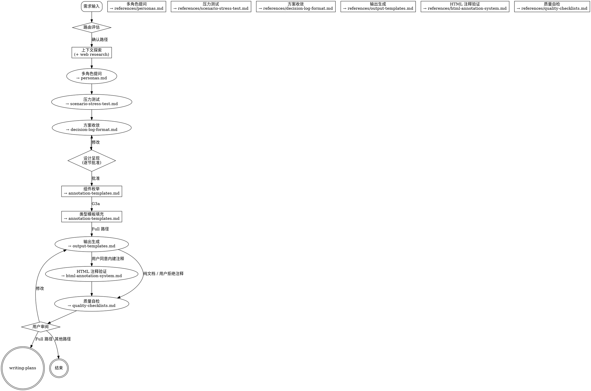

# Spec Analyze — 需求分析与带注释方案输出

将模糊的产品需求，通过多视角分析、压力测试、方案收敛，最终输出为**带研发注释**的 proposal / design / tasks 规范文档，让研发和 AI Agent 拿到文档即可开发。

<HARD-GATE>
在获得用户设计确认之前，不得调用任何实现 skill、编写代码或搭建项目。
</HARD-GATE>

---

## Step 0: 智能路由

在提问前先做三维评估：

| 维度 | 取值 |
|------|------|
| 讨论性质 | 纯业务 / 需求分析 / 技术设计 |
| 复杂度 | Lightweight / Standard / Full |
| 预期产出 | Insight Brief / Analysis Report / 带注释的方案文档 |

每次路由确认时必须使用路径对应的消息模板，声明产出物和注释覆盖范围：

**Lightweight 路径：**
> "这属于 [类型]，Lightweight 复杂度。产出 **Insight Brief** 核心洞察简报（不含交互注释）。
> 如果需求最终需要交付研发开发，建议升级到 Standard 或 Full 路径以获得带注释的方案文档。可以吗？"

**Standard 路径：**
> "这属于 [类型]，Standard 复杂度。产出 **Analysis Report + proposal.md**，含 Data / Interaction / UI Text 三列注释。
> 注意：不含逐组件的 design.md Annotation Block 和 HTML 交互式注释面板。可以吗？"

**Full 路径：**
> "这属于 [类型]，Full 复杂度。产出 **proposal.md + design.md + tasks.md** 三文档。
> 注释覆盖：proposal 三列注释 + design 逐组件 Annotation Block（L1-L3 类型化模板）。
> 如果涉及 HTML 原型，输出时会与你确认是否需要内建交互式 PRD 注释面板。
> 可以吗？"

### 三条路径

| 路径 | 流程 | 产出 | 注释覆盖 |
|------|------|------|:--------:|
| **Lightweight** | 快速提问 → 讨论 → 升级门评估 | Insight Brief | 无 |
| **Standard** | 2-3 角色视角 → 方案比对 → 报告 | Analysis Report | proposal 三列注释 |
| **Full** | 5 角色全视角 + 压力测试 + 方案收敛 → 带注释提案 | proposal + design + tasks → [输出生成 → `writing-plans`] | proposal 三列 + design Annotation Block + (经用户决策) HTML 注释面板 |

### Lightweight 升级门

输出前自动评估以下条件，任一为"是" → 提议升级到 Standard：
- 需求涉及编码实现
- 用户表达了实施意图（"做"/"开发"/"implement"）
- 涉及具体技术选型
- 用户表达了需要交互注释/开发文档/研发交接的需求

---

## Checklist

1. **快速评估** — 讨论性质、复杂度、预期产出
2. **路由确认** — 推荐路径，使用路径对应的消息模板（含产出物和注释覆盖声明），等待用户确认
   > 路由后 agent 持续监听用户意图变化（见 2.5 Agent 角色动态），如用户中途提出 demo/原型/注释需求且当前路径产出不含对应内容，主动提议升级路径
2a. **知识目录检测** — 检查 `knowledge/` 目录是否存在（同 session 仅触发 1 次）：
  - **目录不存在** → 输出一次提示（非阻塞）：
    > "本技能支持从 `knowledge/` 目录热加载业务上下文（行业术语、系统架构、业务流程等）。如需注入，创建 `knowledge/` 并放入 `.md` 文件即可，后续步骤会引导你加载。"
  - **目录存在但为空** → 静默跳过，不输出任何内容
  - **目录存在且包含 `.md` 文件** → 列出文件名和行数（仅文件名，不加载内容）：
    > "检测到 `knowledge/` 目录包含：marketing-system-knowledge.md（920行，营销系统领域知识）"
    > 不在此处询问是否加载，推迟到 Step 4
3. **视觉伴侣邀请** — 见 Visual Companion 章节
4. **上下文探索** — 项目文件、文档、最近提交；提议 web research（见 Web Research 章节）。**→ 检查 G1**
5. **多角色提问** — 一次一个问题（见 `references/personas.md`）[skip Lightweight]
6. **发散阶段** — 场景压力测试（见 `references/scenario-stress-test.md`）[skip Lightweight]
7. **收敛阶段** — 2-3 方案 + 决策记录（见 `references/decision-log-format.md`）。**→ 检查 G2**
8. **设计呈现** — 分节呈现，逐节获取批准。**→ 批准后检查 G3**
8a. **组件枚举**（Full 路径）— 列出页面所有交互组件，映射到 `references/annotation-templates.md` 的类型（T1-T11）。**→ 检查 G3a**
8b. **类型模板填充**（Full 路径）— 按类型模板逐组件填充注释字段
9. **输出生成** — 按路径产生对应文档（见 `references/output-templates.md`）。
  **如果涉及 HTML 原型且组件数 ≥ 3：**
    → 询问用户："本次产出包含 HTML 原型。是否在 demo 中内建交互式 PRD 注释系统？（📋 触发按钮 + 侧边面板；约 +200 行 CSS/JS/HTML）"
    → 用户同意 → HTML 必须在生成时**一次性内建**注释系统（CSS + JS + HTML 结构 + ANNOTATIONS 数据 + 触发按钮 + 导航标签），不得事后修补
    → 用户拒绝 → 生成纯 HTML 原型（不含注释系统）
  **如果涉及 HTML 原型但组件数 < 3：直接生成纯 HTML（注释系统收益低，跳过）**
  **如果不涉及 HTML 原型（纯文档输出）：直接生成文档**
  **Lightweight 先评估升级门**
  **→ 检查 G3b（涉及 HTML + 组件 ≥ 3 时）**
10. **HTML 注释验证** — 如果上一步用户同意内建注释系统，验证注释已正确内建：
  - 验证：每个组件已有 📋 触发按钮（在可视边界内 ≤ 8px）
  - 验证：ANNOTATIONS 数据完整，keys ↔ design.md @ComponentName 一一对应
  - 验证：注释面板可正常渲染，无空白 block、无占位符
  - 验证：导航标签齐全，图标 + 短名已确定
  - 执行 back-propagation（annotation-templates.md §9.1）：如果验证中发现注释相对 design.md 的修正，同步回 design.md
  **→ 检查 G3c**
11. **质量自检** — 运行 references/quality-checklists.md 中对应路径的自检
12. **用户审阅** — 输出文档让用户确认
13. **交接** — Full 路径 → 调用 `writing-plans`；其他 → 结束

---

## 质量门禁与 Definition of Done

| 门禁 | 位置 | Lightweight | Standard | Full |
|------|------|:-----------:|:--------:|:----:|
| G1 | 步骤 4 → 5 | 跳过 | 需要 | 需要 |
| G2 | 步骤 7 → 8 | 跳过 | 需要 | 需要 |
| G3 | 步骤 8 → 8a | 跳过 | 需要 | 需要 |
| G3a | 步骤 8a → 8b（组件枚举 → 模板填充） | 跳过 | 跳过 | 需要 |
| G3b | 步骤 9（内建注释决策） | 跳过 | 跳过 | 需要* |
| G3c | 步骤 10（注释验证 + back-propagation） | 跳过 | 跳过 | 需要† |
| G4 | 步骤 11 → 12 | 需要 | 需要 | 需要 |

> *G3b 仅当 Full 路径 + 涉及 HTML 原型 + 组件数 ≥ 3 时执行（Step 9 询问用户前完成检查）。否则跳过。
> †G3c 仅当用户同意内建注释时执行。否则跳过。

### G1: 上下文完备

- [ ] 上下文边界清晰：scope 内 / 外已明确
- [ ] 项目文件/文档已查阅
- [ ] Web research（如触发）已完成
- [ ] 当前状态足以进入深入分析
- [ ] knowledge/ 目录已检查，知识资产（如有）已加载

### G2: 收敛完成

- [ ] 至少 2-3 方案已对比，列明 trade-off
- [ ] Architecture Cleanliness 四维度已评估（模式一致性 / 职责分离 / 最小变更 / 抗补丁性）
- [ ] 每个决策记录了 rationale + 被拒方案
- [ ] 范围已锁定——明确声明**不包含**的内容

### G3: 输出准备（Full 路径特有）

- [ ] proposal 注释列有足够数据填充
- [ ] design 交互组件已识别
- [ ] 每个输出章节有分析数据支撑
- [ ] 文件输出路径已确定

### G3a: 组件枚举完备（Full 路径特有）

- [ ] 页面所有交互组件完整列举，无遗漏
- [ ] 每个组件已映射到 `references/annotation-templates.md` 的类型（T1-T11）
- [ ] 类型选择合理（同交互模式用同类型）
- [ ] 嵌套关系已声明（context 引用指向父组件）
- [ ] 组件清单中无重复项、无幽灵项（无法对应到页面上实际组件的条目）

### G3b: 输出规划审核（条件性，仅 Full 路径 + 涉及 HTML 原型 + 组件数 ≥ 3 时）

- [ ] 本次产出涉及 HTML 原型（新生成或修改已有）
- [ ] 组件枚举（Step 8a/8b）数据完备，ANNOTATIONS 数据可完整构建
- [ ] 已征得用户同意/拒绝内建注释系统

### G3c: HTML 注释验证（条件性，仅用户同意内建注释时）

- [ ] 每个组件已有触发按钮，在其可视边界内（≤ 8px）
- [ ] ANNOTATIONS 对象的数据完整，keys ↔ design.md @ComponentName 一一对应
- [ ] 注释面板可正常渲染，无空白 block、无占位符
- [ ] 导航标签齐全，图标 + 短名已确定
- [ ] Back-propagation 已完成：HTML 注释中的任何修正已同步回 design.md

### G4: 自检完成

- [ ] 无占位文本（`{占位符}` 均已替换）
- [ ] 所有声明已区分 Fact / Inference / Hypothesis
- [ ] 没有 scope creep
- [ ] Full 路径：注释符合质量自检清单全部标准
- [ ] Full 路径：proposal / design / tasks 引用链一致
- [ ] Full 路径：注释内容符合 `annotation-templates.md` §6 内容规则（使用产品语言、无模糊词、无"N/A"）
- [ ] Full 路径：跨组件一致性已验证（同类型实例深度一致，术语统一）
- [ ] 如果 knowledge/ 中的知识已加载，确认在分析过程中已被实际引用（不仅仅是加载了但没有使用）

### 失败处理

- 任一 DoD 不满足 → 回溯对应步骤补齐
- 用户否决输出 → 回到设计呈现重新迭代
- 同一门禁连续阻塞 2 次 → 暂停，评估路径选择

---

## 分析流程

### 2.1 上下文探索

- 先查阅项目状态（文件、文档、最近提交）
- 如果需求涉及多个独立子系统 → 立即标记，拆分为子项目
- 每个消息只问一个问题，优先选择题
- [ ] **知识资产加载** — 如果在 Step 2a 检测到知识文件，在此处询问用户：
  - 列出所有 `.md` 文件（文件名 + 行数）
  - 询问："当前需求是否需要加载这些知识作为分析上下文？"
  - 用户同意 → 加载所有 `.md` 文件内容，输出声明：
    > "[knowledge] 已加载 X.md（N行），后续分析将引用该领域上下文。"
  - 用户拒绝 → 跳过，不加载
  - 用户拒绝后在当前 session 不再重复询问
- [ ] **知识引用提示** — 如果知识已加载，在分析过程中引用知识库内容时，建议在决策记录中标注来源章节，保持输出可追溯

### 2.2 多角色驱动提问

激活的角色视角引导提问（见 `references/personas.md`）。**每个角色至少问 1-2 个问题。** 切换视角时说明来源：

> "从增长角度来看——用户今天怎么发现这个功能的？"
> "风险挑战者要问——如果这个假设是错的会怎样？"

### 2.3 发散阶段

从 `references/scenario-stress-test.md` 中选择 2-3 个相关场景进行 what-if 探测。

### 2.4 收敛阶段

1. 提出 2-3 方案，带显式 trade-off（推荐方案放首位）
2. 每个方案在 Architecture Cleanliness 四维度评估（模式一致性 / 职责分离 / 最小变更 / 抗补丁性）
3. 记录每个决策（见 `references/decision-log-format.md`）
4. 锁定范围——声明**不包含**的内容

### 2.5 Agent 角色动态

| 阶段 | 角色 | 行为 |
|------|------|------|
| 早期探索 | 引导者 (Socratic) | 提问式探索、理清思路 |
| 发散 | 挑战者 | 推边界、问 what-if、暴露盲点 |
| 收敛 | 顾问 | 推荐方案、做 trade-off 决策 |
| 设计呈现 | 协作者 | 分节呈现、按反馈迭代 |
| **▸ 全程** | **范围监听者** | 触发条件（任一满足即可）： ① 用户提出 demo/注释/开发需求且超出当前路径产出范围 → 提议升级路径（同会话最多 1 次） ② 知识已加载但用户后续需求明显偏离知识领域 → 询问是否需忽略知识上下文以节省空间 |

---

## 注释框架（Full 路径独有）

分析完成后，Full 路径的文档使用两层框架叠加：

**类型化模板（`references/annotation-templates.md`）** — 按交互模式选择模板，决定字段结构：
- 11 种组件类型（T1-T11），每种有专属的必填字段 + 内容规则
- 3 个共享块（DialogContext / APICall / Permission）减少重复定义
- 三级嵌套引用规则（同层共享 / 向上覆盖 / 跨级禁止）

**注释等级（`references/output-templates.md`）** — 按组件复杂度选择深度：
| 等级 | 适用场景 | 字段 |
|------|----------|------|
| **L1 核心** | 简单交互（hover、静态展示） | trigger / behavior / dismiss |
| **L2 标准** | 复杂交互（弹窗、表单联动） | L1 + placement / style / state / timing |
| **L3 完整** | 全局通用组件（DatePicker, Modal） | L2 + accessibility / responsive / i18n |

**叠加规则：** 先选类型模板确定字段结构，再选注释等级确定字段深度。

---

## Web Research

详见 `references/web-research-guide.md`。

---

## Visual Companion

当涉及可视化内容（架构图、页面布局、流程图表）时，提供浏览器伴侣。

**触发条件**：Full 路径的设计呈现阶段，或文字表达不足时。

**邀请方式**（独立消息，不含其他内容）：

> "有些内容用浏览器展示会更直观——我可以画架构图、流程图或页面布局。要试试吗？（需要打开本地 URL）"

---

## 关键原则

- **一次一个问题** — 不一次性抛多个问题
- **选择题优先** — 比开放题更容易回答
- **YAGNI** — 从所有设计中移除不必要的功能
- **先发散再收敛** — 先拓宽思路再收窄
- **增量验证** — 分节呈现设计，逐节获取批准
- **记录决策** — 不只记录结论，还要记录"为什么"

---

## 文件索引

| 文件 | 用途 |
|------|------|
| `references/personas.md` | 5 个专家角色的定义、核心问题、红旗信号、升级路径 |
| `references/scenario-stress-test.md` | 压力测试场景库：数据/用户/系统三大类 |
| `references/decision-log-format.md` | 决策记录的结构化格式与示例 |
| `references/output-templates.md` | 三条路径的输出模板 + 三层注释框架 + 全链路工作流 |
| `references/html-annotation-system.md` | HTML 注释系统：何时使用、架构、数据格式、组件映射、集成步骤、完整 CSS/JS/HTML 模板 |
| `references/annotation-templates.md` | **类型化注释模板系统：11 种组件类型 + 3 个共享块 + 内容规则 + 质量验证方法（Full 路径使用）** |
| `references/quality-checklists.md` | 质量自检清单 + 跨文档一致性检查 + 各角色评审清单 |
| `references/web-research-guide.md` | Web research 触发条件、搜索策略、信息整合框架 |
