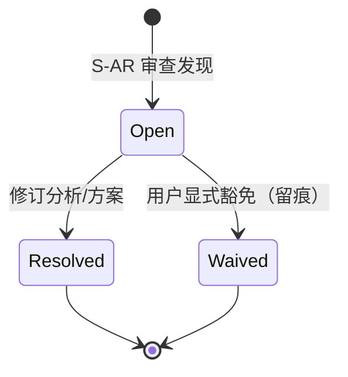

# S-AR 对抗性审查手册（Adversarial Review）

> v3.7 新增门禁。分析综合完成后、方案输出前触发；本手册是触发位、角色配置、发现分级、阻断/豁免规则与 review-log 工件的唯一权威定义。

## 1. 触发位

**S3（输出准备）通过后、8F（输出生成）之前**；独立命名，不并入 S 编号。

定位逻辑：**S 系门禁查产物质量**（注释格式、数据结构、文档完整性）；**S-AR 查方案本身**的完整性、边界、背景。二者对象不同，不可合并——并入 S3a-d 会混淆审查对象，放在 8F 之后则产出已生成、阻断失去意义。

## 2. 角色配置

**Risk Challenger 主导**（见 `references/personas.md`），按分析类型选 1-2 个辅助角色：

| 分析类型 | 辅助角色 |
|---------|---------|
| 需求分析 | User Advocate |
| 方案设计 | System Architect |
| 战略分析 | Product Strategist |
| 混合 | 按主导类型选择，至多 2 个 |

Risk Challenger 负责组织审查、汇总发现、判定严重级别；辅助角色只在其视角内提出发现，不参与定级。

## 3. 审查维度

- **完整性**：Intake Audit 六维度（背景与问题/目标与价值/用户与场景/功能边界/成功指标/约束与依赖）在方案中是否都有落点？哪些维度被静默丢弃（含 Waived 的维度——豁免过的不等于不用审查，它们是天然优先挑战对象）？
- **边界**：异常流、降级路径、空态、并发/重复操作、恶意或意外输入是否有设计？
- **背景**：方案依赖的关键假设是否有证据支撑（用户事实/本地证据/外部事实），还是仅凭推测？

## 4. 发现分级与门禁

每条发现为一个 ARFinding：`{id, severity: blocking | advisory, claim, persona, resolution}`。

- **blocking**：若不解决，方案在评审或实施中大概率失败（关键假设无证据、边界缺失影响核心流程、与既有系统冲突未处理）。
- **advisory**：值得改进但不阻断（次要边界、可后续迭代项）。

**门禁规则**：存在 `Open` 且 `severity=blocking` 的发现 → 产出步骤被阻断，run 转 `awaiting_user`；advisory 不阻断。

**状态机**：



阻断时用户可见消息模板：

> S-AR 存在 N 条未解决的阻断级发现：{发现摘要列表}。解决或豁免后才能产出。

## 5. review-log.md 工件模板

S-AR 完成后，落盘 `review-log.md`（与三文档同目录）。字段：id / severity / persona / claim / resolution；阻断与豁免留痕可追溯。

```markdown
# S-AR 审查日志

- **审查对象**：{方案/分析主题}
- **审查日期**：{日期}
- **角色配置**：Risk Challenger（主导）+ {辅助角色}

## 发现清单

| id | severity | persona | claim（发现主张） | resolution（处置） |
|----|----------|---------|------------------|-------------------|
| AR-1 | blocking | Risk Challenger | 库存口径未定义：批次总量 vs 单券累加，两种口径数据层不兼容 | Resolved：业务确认按批次总量，已更新方案 §3.2 |
| AR-2 | advisory | User Advocate | 核销失败后的重试入口较深（3 步） | Open：列入下迭代 |
| AR-3 | blocking | System Architect | 券过期后已发放未核销的存量处理未设计 | Waived：豁免原因——本期仅内测范围，存量可控（用户 2026-xx-xx 裁决） |

## 结论

阻断级发现：{N} 条（Resolved {a} / Waived {b}）；advisory：{M} 条。
门禁状态：{通过 / 阻断（待解决 AR-x）}
```

## Lightweight 降级

Lightweight 路径下，S-AR 降级为**单条提示性检查**（不阻断）：

> Lightweight 路径：已跳过 S-AR 对抗审查。若方案将进入正式评审，建议补跑完整审查（完整性/边界/背景三维度）。

**不静默跳过**：门禁的可见性必须保留，只是从阻断降级为提示。

## 6. 恢复语义

run 在 S-AR 阻断期间被中断后恢复时：

- **run 状态（evidence / check）是 S-AR 通过情况的权威恢复源**——以 run 状态判定门禁是否已过。
- **review-log.md 是用户可见工件**（与三文档同目录），供评审会直接引用；它不是恢复依据。两者职责分离，与既有闭环恢复机制一致。
