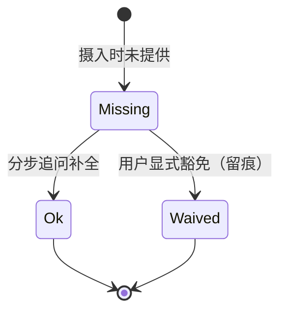

# Intake Audit（需求摄入审计）操作手册

> v3.7 新增门禁。SKILL.md Step 0 摄入阶段触发；本手册是六维度计分卡、分步追问、豁免留痕与 Lightweight 降级的唯一权威定义。

## 1. 触发条件

- **仅需求类输入触发**：新需求、功能变更。这是 PM 日常最高频的输入类型。
- **非需求任务跳过**：调研、竞品对比、方案对比、知识问答等不触发审计，但**必须在 run 记录中留痕跳过原因**（如"输入类型=竞品调研，六维度审计不适用"），不得静默消失。
- **判定不确定时**：按需求类触发，并向用户确认一次（"这看起来是一个功能变更需求，需要做摄入审计吗？"），确认结果留痕。

## 2. 六维度计分卡

对需求输入依次审计以下六个维度，每个维度产出 `{dim, status: ok | missing | waived, note}`：

| 维度 | 审计问题 | 判定 Ok 的最低标准 |
|------|---------|------------------|
| **背景与问题** | 为什么要做？现在发生了什么问题？ | 有一句可追溯的业务背景或问题描述 |
| **目标与价值** | 做成什么样算达成了？给谁带来什么价值？ | 有可指认的目标受益方与价值方向 |
| **用户与场景** | 谁在什么场景下用？ | 有明确的用户角色 + 触发场景 |
| **功能边界** | 做什么、不做什么？范围到哪里？ | 有明确的 in-scope / out-of-scope 边界 |
| **成功指标** | 怎么衡量效果？ | 有至少一个可观测的指标或验收信号 |
| **约束与依赖** | 有什么限制和前提？ | 已知约束（技术/法务/排期/依赖系统）已列出，或显式声明"无已知约束" |

**维度状态机**：



## 3. 与 M0-M3 成熟度模型的吸收关系

v3.7 起，原 Layer 2 M0-M3 的**内容清点职责**被本计分卡吸收取代：

| 原 M0-M3 清点项 | 并入维度 |
|----------------|---------|
| scope 边界 | 功能边界 |
| 优先级 | 功能边界 |
| 排期 | 约束与依赖 |
| 约束条件 | 约束与依赖 |

M0-M3 分级标签**保留但仅用于路径选择**（判断走 Lightweight/Standard/Full），不再作为内容是否齐备的判定清单。双清单并存会导致重复提问与口径冲突，故只留一套。

## 4. 分步追问流程

存在 `missing` 维度时，按计分卡的维度顺序逐个追问：

1. **每轮只问一个维度的问题**——多维度打包提问会显著降低 PM 回答质量。
2. PM 回答后立即填入计分卡（`missing → ok`，note 记录答案摘要），再问下一个。
3. 全部维度为 `ok` 或 `waived` 后，展示最终计分卡并进入分析主流程。
4. PM 长期不回应：计分卡保持 `missing`，分析暂停于摄入阶段；恢复后从缺失清单继续。

## 5. 豁免机制

- 用户显式表示某维度暂无法提供（如"成功指标现在定不了，上线后再看"）→ 该维度记 `waived`，note 必须记录豁免原因与原话要点。
- 豁免不是失败：`waived` 与 `ok` 同等放行。区别只在留痕——豁免维度在后续 S-AR 对抗审查中是天然的优先挑战对象。
- 拒绝补全且不豁免 → 门禁未过，停止并声明原因（见第 6 节）。

## 6. 通过条件

- **通过**：六维度全部为 `ok` 或 `waived` → 进入分析。
- **未通过**：任一维度为 `missing` 且用户拒绝补全、拒绝豁免 → 停止，输出：

> Intake Audit 未通过：维度「{dim}」缺失且未豁免，无法进入分析。请补全该维度，或明确声明豁免。

## 7. Lightweight 降级

Lightweight 路径下，Intake Audit 降级为**单条提示性检查**（不阻断）：

- 在进入分析前输出一条提示："Lightweight 路径：已跳过六维度摄入审计。若需求涉及功能变更，建议补全 背景与目标 / 边界 / 成功指标 后再深入。"
- **不静默跳过**：门禁的可见性必须保留，只是从阻断降级为提示。

## 8. Intake Scorecard 输出模板

```markdown
## Intake Audit 计分卡

| 维度 | 状态 | 说明 |
|------|------|------|
| 背景与问题 | ok | （一句话摘要） |
| 目标与价值 | ok | （一句话摘要） |
| 用户与场景 | missing | — |
| 功能边界 | ok | （in/out scope 摘要） |
| 成功指标 | waived | 豁免原因：（用户原话要点） |
| 约束与依赖 | ok | （约束摘要） |

**结论**：1 个维度缺失（用户与场景），进入分步追问。
```

补全完成后重发同一表格，结论行变为"**通过**：六维度全部 ok/waived，进入分析。"
