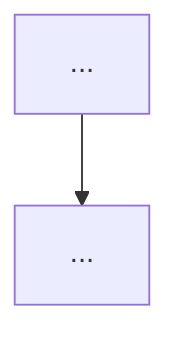

# 评审就绪 PRD 模板（Review-Ready PRD）

> 用途：Full 路径 / 需求分析路径的「评审交付」主产物。形态为**一份文档走评审**（对齐公司 PRD 模板与 demo PRD 页），proposal/design/tasks 仍可生成，但研发评审以本模板为准。
> 内容规范：遵循 `references/chinese-writing-style.md` 硬约束（输出须通过 `scripts/lint-output-text.js`，error 清零）。
> 完整性校验：产出后必须运行 `scripts/validate-prd.js <path>`，阻断缺失（error）清零；判定规则见 `references/review-readiness-checklist.md`。
> **HTML 原型首屏规则**：当生成 HTML 原型交付物时，评审就绪 PRD 作为原型**第一个视图（首屏）**，默认展示；其余功能页按原型结构排列。注释注入见 `references/html-annotation-system.md`。
> **注释规范**：注释全部使用中文展示；注释体系不含 API（API 仅存于 §7 接口需求），减少评审时的误导与信息摩擦。

---

# {功能/页面名} · 研发交付文档

> 版本 v{1.0} · 负责人：{PM} · 关联需求：{Jira/需求号} · 更新：{本次迭代变更摘要}

## 1. 需求概要

### 1.1 背景
{现状痛点，回答"为什么做"。}

### 1.2 目标
{一句话可衡量目标。}

### 1.3 方案
{方案一句话。}

### 1.4 竞品/现状对比（RC-13）
### 1.5 预期收益（RC-12，可量化）
### 1.6 成本测算（RC-14，如适用）

## 2. 文档信息

| 项目 | 内容 |
|------|------|
| 页面/功能名称 | {名称} |
| 业务对象 | {一条记录 = 什么} |
| 数据入口 | {入口列表，各入口预筛选条件} |
| 权限 | {本期权限；无则写"全量可见"} |
| 版本/密级/归属 | {如适用} |

## 3. 页面结构

```
{页面名}
├── {区域 1}      {组件枚举 + 选项全列}
├── {区域 2}
└── {区域 n}
```

## 4. 状态流转

{状态机：状态名（含英文枚举）/ 迁移条件 / 终态 / 不可逆标记。}

## 5. 业务流程

````markdown

````

{分支详述：与流程图节点一一对应。}

## 6. 数据字段

| 字段 | 类型 | 必填 | 说明 |
|------|------|:----:|------|
| {field} | {type} | 是/否 | {一句话含义 + 边界} |

{业务对象语义、枚举值、默认值、唯一性约束在此表或表下说明。}

## 7. 接口需求

### 7.1 {接口名}

| 项 | 内容 |
|----|------|
| Endpoint | `{method} {path}` |
| 参数 | {参数名 + 类型 + 必填 + 边界} |
| 返回 | `{code, data: {...}}` 结构 |
| 错误场景 | {错误码 + 触发条件 + 前端处理} |
| 幂等/约束 | {如适用} |

## 8. 验收标准

- AC-01 {可执行描述：操作 → 预期结果}
- AC-02 ...

规则：一条一测；覆盖正常、边界、异常三类场景。

## 9. 开发注意事项

- {性能 / 幂等 / 枚举严格一致 / mock 替换点 / 分页语义 / 协议约束}

## 10. 数据需求（RC-32~33，如适用）

### 10.1 埋点需求
### 10.2 数据报表需求

## 11. 上线/下线需求（RC-41~42，如适用）

### 11.1 上线需求
### 11.2 下线需求

## 12. 运营计划（RC-50，如适用）

## 13. 风险分析（RC-51）

| 风险 | 影响 | 应对 |
|------|------|------|
| {风险} | {影响} | {应对} |

## 14. 相关文档（RC-52）

- {关联 PRD / 设计 / 接口文档}

---

## 模板与三文档的关系

| 评审就绪 PRD 章节 | 来源 |
|------------------|------|
| §1 需求概要 | proposal §Problem/Module Goal |
| §2 文档信息 / §3 页面结构 / §4 状态流转 / §5 业务流程 | 新增（design 承载） |
| §6 数据字段 / §7 接口 | design Domain Objects + Interface |
| §8 验收标准 | proposal Acceptance Criteria 汇聚 |
| §9-14 | 新增（proposal 扩展章节） |
