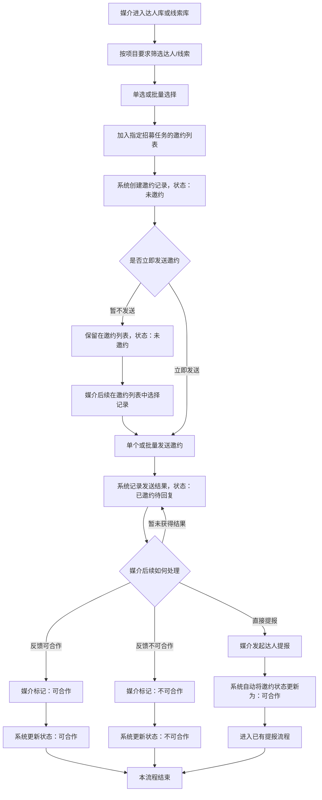

# 邀约合作 · 研发交付文档

> 版本 v1.2 · 负责人：产品经理 · 关联需求：Jira-1234 · 更新：V1.2 新增筛选栏 / 社交 URL 透出 / SOP

## 0. 文档信息

| 项目 | 内容 |
|------|------|
| 页面/功能名称 | 达人邀约合作页面 |
| 版本号 | v1.2 |
| 负责人 | 产品经理 |
| 关联需求 | Jira-1234 |
| 密级/归属 | 内部 / 营销系统 |

### 修订记录

| 版本号 | 修订人 | 修订类型 | 修订日期 | 修订描述 |
|--------|--------|---------|---------|---------|
| v1.0 | 产品经理 | A（ADDED） | 2026-08-01 | PRD 初稿 |
| v1.1 | 产品经理 | M（MODIFIED） | 2026-08-08 | 根据产品委员会评审修订，落实为执行版本 |
| v1.2 | 产品经理 | A（ADDED） | 2026-08-14 | 新增筛选栏 / 社交 URL 透出 / SOP |

## 1. 需求概要

### 1.1 背景
在品效项目的达人招募流程中，媒介通常从达人库中筛选达人并提报给 BD。部分达人在被 BD 选中后，才发现存在失联或无合作意向的情况，导致筛选结果无法继续推进，增加了无效提报和沟通成本。

### 1.2 目标
提高达人提报通过后的可推进率，减少因达人失联或合作意向不足导致的无效筛选。

### 1.3 方案
在正式提报前增加合作邀约环节。媒介针对具体招募任务向达人发送邀约，确认达人可以正常联系且有初步合作意向后，再将达人提报给 BD。

### 1.4 竞品/现状对比
现状：媒介直接筛选并提报，BD 选中后才暴露达人失联或无意向的问题，无效提报和沟通成本高。方案：邀约前置，先确认可联系、有初步意向，再进入提报流程，从源头减少无效提报。

### 1.5 预期收益
估算：无效提报比例降低约 30%，媒介单次任务筛选提报周期缩短约 2 个工作日（假设：达人邮箱触达率 ≥ 80%，详见假设清单）。

### 1.6 成本测算
本期仅前端页面 + 邀约记录接口，无新增外部服务采购；邮件发送复用既有 Betty 发信系统（零新增成本）。

## 2. 文档信息补充

| 项目 | 内容 |
|------|------|
| 业务对象 | 一条邀约记录 = 一个达人（或线索）× 一个招募任务；同一达人可针对多个任务分别有不同状态 |
| 数据入口 | 招募任务详情 / 线索库-待我跟进 / 我的达人库（各入口自动预筛选） |
| 权限 | 本期全量可见；操作栏仅当前达人负责人可操作（原型当前用户=张三，owner≠张三 的行操作栏显示 —，不可勾选/批量操作） |

## 3. 页面结构

```
邀约合作页面
├── 筛选栏（11 项）     文本×5：达人姓名/招募任务/URL/邮箱/邀约ID；下拉×6：邀约状态/业务跟踪/任务状态/提报状态/平台/达人线索 + 清空
├── 批量操作栏          下拉：发送邀约邮件/标记可合作/标记不可合作 + 已选条数
├── Tab 切换栏          全部/未邀约/已邀约待回复/可合作/不可合作（含计数）
├── 数据表格（任务分组） 组头：任务名称+编号+任务状态+提报状态+达人数量+状态摘要（可展开/收起）
│                       组内行：复选框/达人信息(头像+姓名+类型+平台·邮箱+社交URL)/邀约状态徽章/业务跟踪(已提报+自申请)/所属媒介/操作
└── 分页                按任务组数分页，每页 5/10/20
```

## 4. 状态流转

| 状态 | 迁移条件 | 终态 | 不可逆 |
|------|---------|:----:|:------:|
| pending 未邀约 | 创建记录 / 暂不发送 | 否 | — |
| inquired 已邀约待回复 | 发送邮件成功 | 否 | — |
| accept 可合作 | 标记可合作 / 直接提报时系统自动置为 | 否 | — |
| reject 不可合作 | 标记不可合作 | 是 | 是 |

流转规则：pending → inquired（发邮件）；pending/inquired → accept / reject（标记，reject 不可逆）；inquired 暂未获得结果可保持 inquired 循环跟进。

## 5. 业务流程



分支详述：① 进入（达人库/线索库 → 筛选 → 单选/批量 → 加入邀约列表）；② 邀约列表（建记录=未邀约，可立即/暂缓发送）；③ 发送（单个/批量 → 已邀约待回复）；④ 反馈处理（可合作/不可合作/直接提报/暂未获得结果 → 回到已邀约待回复循环）。

## 6. 数据字段

### 6.1 前端记录字段（InvitationRecord）

| 字段 | 类型 | 必填 | 说明 |
|------|------|:----:|------|
| `id` | string | 是 | 邀约记录唯一 ID，展示为邀约 ID |
| `talent` | string | 是 | 达人名称/ID |
| `platform` | enum | 是 | 抖音 / 小红书 / B站 |
| `contact` | string | 是 | 联系邮箱，作为邮件收件地址 |
| `talentType` | enum | 是 | 达人 / 线索 |
| `owner` | string | 是 | 负责人，仅负责人可操作记录 |
| `taskId` | string | 是 | 关联招募任务 ID，分组依据 |
| `taskName` | string | 是 | 招募任务名称（组头展示） |
| `status` | enum | 是 | pending / inquired / accept / reject |
| `submitted` | boolean | 是 | 是否已提报（静态标签，是=绿 否=灰，不可编辑） |
| `selfApplied` | boolean | 是 | 是否自申请（静态标签，不可编辑） |
| `socialUrl` | string | 否 | 社交主页 URL，需完整协议 https://，可点击新开 |

### 6.2 后端映射（DmInviteRegister）

| 后端字段 | 说明 |
|---------|------|
| `ads_id` | 关联招募任务 ID |
| `member_audit_status` | 0 待审核 / 1 同意 / 2 拒绝 / 3 终止 |

## 7. 接口需求

### 7.1 邀约列表

| 项 | 内容 |
|----|------|
| Endpoint | `GET /api/invitation/list` |
| 参数 | `talent/task/status/taskStatus/submitStatus/platform/talentType/submitted/selfApplied/socialUrl/contact/id/page/pageSize` |
| 返回 | `{ code, data: { total, page, pageSize, list } }` |
| 错误场景 | 参数非法返回 400；无权限返回 403；服务异常返回 500 并展示错误占位 |

### 7.2 状态变更（批量）

| 项 | 内容 |
|----|------|
| Endpoint | `PUT /api/invitation/status` |
| 参数 | body: `{ ids: [], status: 'inquired'\|'accept'\|'reject' }` |
| 返回 | `{ code, data: { updated, failed } }` |
| 错误场景 | reject 不可逆需前端二次确认；需幂等处理（重复提交不重复计数） |

### 7.3 单条动作

| 项 | 内容 |
|----|------|
| Endpoint | `PUT /api/invitation/{id}/action` |
| 参数 | body: `{ action: 'sendEmail'\|'markAccept'\|'markReject' }` |
| 返回 | `{ code, data }` |
| 说明 | sendEmail→inquired；markAccept→accept；markReject→reject |

### 7.4 创建邀约

| 项 | 内容 |
|----|------|
| Endpoint | `POST /api/invitation/create` |
| 参数 | body: `{ talents: [{talent,platform,contact,talentType,owner}], taskId, sendEmail: bool }` |
| 返回 | `{ code, data: { created } }` |
| 说明 | 从达人/线索库批量邀约；sendEmail=true 时创建后立即发送 |

## 8. 验收标准

- AC-01 进入页面即按任务分组展示，组头含任务名称/编号/达人数量/状态摘要，所有组默认展开
- AC-02 筛选栏输入 300ms 防抖，多条件 AND 叠加，空结果显示空状态占位
- AC-03 Tab 切换后仅显示对应状态记录，页码重置到第 1 页，计数 badge 正确
- AC-04 未邀约记录点「发送邀约邮件」→ 确认 → 状态变「已邀约待回复」+ Toast
- AC-05 勾选 3 条批量发邮件 → 3 条均变「已邀约待回复」
- AC-06 未勾选点批量操作 → Toast「请先选择需要操作的达人」，不执行
- AC-07 达人库勾选 → 批量邀约 → 选任务+方式 → 确认 → 跳邀约合作页出现新记录
- AC-08 业务跟踪「已提报/自申请」为静态标签（是=绿，否=灰），不可编辑
- AC-09 达人信息列透出社交 URL（蓝色 11px），可点击新开
- AC-10 点击组头展开/收起组内行，箭头旋转
- AC-11 owner≠当前用户（张三）的记录：操作栏显示 —，复选框不可勾选、批量操作自动忽略

## 9. 开发注意事项

- 分页以「任务组」为单位（每页 5 个组），避免同一任务被分页拆散——有意设计
- 批量操作需幂等；状态枚举 pending/inquired/accept/reject 与后端严格一致
- 社交 URL 需完整协议 https://，渲染直接 `<a href>`，target=_blank
- 纯前端原型数据为 mock；对接时替换 initialData 为 API 请求
- 文本筛选 300ms 防抖；下拉即时触发；记录 >1000 条时建议改后端过滤
- 「发送邀约邮件」弹窗完全复用【我的达人库】邮箱选择弹窗（REUSE-EML）：组件/交互/字段校验/发送逻辑/后端接口整体复用、零改动，仅带入当前邀约记录作为收件上下文
- 「提报」/「批量提报」复用已有提报功能与提报弹窗，达人信息自动带入、招募任务自动回填

## 10. 数据需求

### 10.1 埋点需求
建议埋点（后续版本确认）：邀约发送成功数、标记可合作/不可合作数、批量操作使用率、筛选条件分布（本期可先不埋，按运营需求再排期）。

### 10.2 数据报表需求
本期无新增报表；邀约状态分布可在现有营销数据看板按需扩展（未排期）。

## 11. 上线/下线需求

### 11.1 上线需求
与招募任务详情 Tab「邀约合作」一并发布；后端接口与前端联调后灰度（内部账号先行），观察 1 个迭代周期。

### 11.2 下线需求
如邀约环节下线：存量记录保留，状态不再流转；页面入口隐藏，接口停用需与下游提报流程确认无引用。

## 12. 运营计划
上线后运营侧引导媒介在正式提报前使用邀约功能；每周同步邀约→提报转化率，异常（触达率 < 60%）时评估补充触达方式。

## 13. 风险分析

| 风险 | 影响 | 应对 |
|------|------|------|
| 达人邮箱触达率低 | 邀约反馈慢，目标收益打折 | 上线后监控触达率；后续迭代补充短信/站内信触达 |
| 批量操作并发/重复提交 | 状态被重复标记、数据不一致 | 接口幂等 + 终态锁定 + 前端提交中禁用 |
| 邮件弹窗复用被破坏 | 影响既有达人库流程 | 复用约束写入开发注意事项，评审时检查零改动 |
| reject 误操作不可逆 | 达人被误标不可合作无法恢复 | 二次确认弹窗强调不可逆；后续可评估人工恢复能力 |

## 14. 相关文档

- 招募任务原型（V7719 版本内审，邀约合作-原型.html）
- 标准产品需求说明文档模板（公司 PRD 模板）
- 我的达人库（邮件弹窗 REUSE-EML 来源）

---

## 附录 A：假设清单（前向验证用）

| # | 假设 | 依据/说明 |
|---|------|----------|
| A1 | 预期收益数字（30%、2 个工作日）为估算示例 | 原型未提供量化指标，标记为估算待运营确认 |
| A2 | 埋点/报表为「建议-未排期」 | 模板 Optional 章节按适用性标注 |
| A3 | 上线灰度策略为建议 | 原型未定义，按营销系统惯例假设 |
| A4 | 后端字段映射（`ads_id` / `member_audit_status`）来自原型研发注释 | 原型「数据模型」行原文 |
